# Registro de Prompts - Práctica 1

## Prompt 1: Generación de Repositorio (Acceso a Datos)
**Objetivo:** Generar la capa de base de datos utilizando el driver `pg` nativo, implementando consultas parametrizadas para prevenir inyección SQL y aplicando el principio de Responsabilidad Única (SRP).

**Prompt utilizado:

```xml
  <rol>
    Actúa como un desarrollador experto en backend utilizando TypeScript, Node.js y principios SOLID.
  </rol>

  <contexto>
    Estoy construyendo una API REST y necesito implementar la capa de acceso a datos (Repositorio) 
    utilizando el driver nativo pg para PostgreSQL, sin ningún ORM.

    El objetivo es gestionar una tabla llamada solicitudes_operativas con los siguientes atributos:
    - id (identificador único, tipo serial o UUID)
    - titulo (string)
    - area_solicitante (string)
    - prioridad (entero del 1 al 5)
    - costo_estimado (decimal)
    - estado (string: registrada, en_proceso, finalizada)
  </contexto>

  <tarea>
    Genera el código para una clase llamada SolicitudRepository que contenga los 5 métodos 
    necesarios para los endpoints CRUD: obtener todas, registrar nueva, actualizar completa, 
    eliminar, y actualizar exclusivamente el estado.
  </tarea>

  <instrucciones>
    <seguridad>
      - Es obligatorio prevenir la inyección SQL utilizando consultas parametrizadas de la 
        librería pg (ej. $1, $2).
      - El método de actualización de estado (PATCH) no debe construir la consulta mediante 
        concatenación de strings ni permitir campos dinámicos sin validar; debe limitarse 
        estrictamente a actualizar la columna estado mediante parámetro.
      - Implementa un manejo de errores robusto que distinga entre:
        a) Registro no encontrado (id inexistente en update/delete), para poder devolver 404.
        b) Errores reales de conexión o ejecución de la consulta, para devolver 500.
    </seguridad>

    <codigo_limpio>
      - Aplica el Principio de Responsabilidad Única (SRP): la clase solo debe encargarse del 
        acceso a datos, sin lógica de negocio.
      - Utiliza nombres de variables y métodos explícitos y descriptivos.
      - No dupliques lógica de conexión en cada método.
    </codigo_limpio>

    <inversion_de_dependencias>
      - El SolicitudRepository debe recibir la instancia de Pool de pg por constructor 
        (inyección de dependencias), en lugar de crear la conexión internamente, para evitar 
        acoplamiento directo con la configuración de la base de datos (Principio DIP).
    </inversion_de_dependencias>

    <tipado>
      - Genera las interfaces de TypeScript correspondientes para los datos de entrada y salida 
        de cada método.
    </tipado>

    <documentacion_interna>
      - Agrega comentarios breves explicando por qué cada decisión de seguridad (parametrización, 
        separación de responsabilidades, inyección de dependencias) previene un riesgo o mejora 
        la mantenibilidad del código.
    </documentacion_interna>
  </instrucciones>
```

**Resumen de la respuesta generada:**
La IA generó exitosamente los modelos de interfaces (`solicitud.interface.ts`), la configuración del pool de conexiones (`db.ts`) y la clase `SolicitudRepository`. Cumplió con la inyección de dependencias al solicitar el `Pool` por constructor e implementó un manejo de errores personalizado (`DatabaseOperationError`) para ocultar detalles sensibles de la base de datos al cliente.

**Evidencia de Respuesta generada**
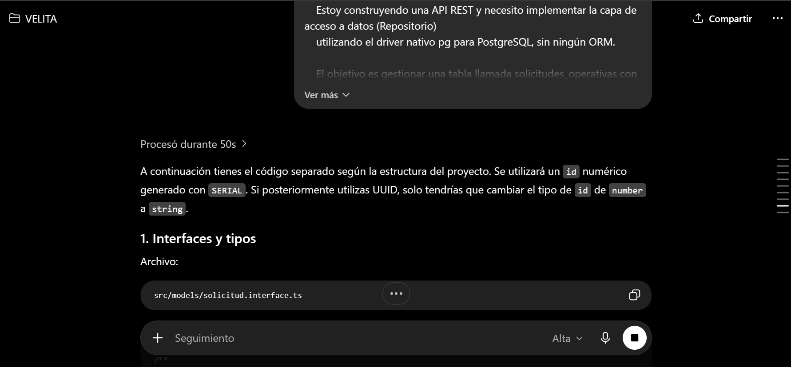
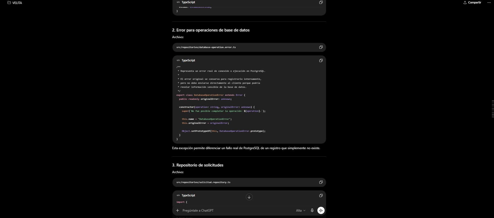
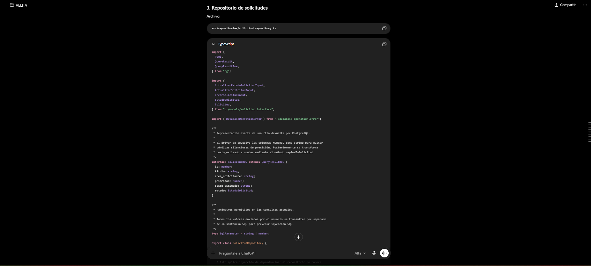
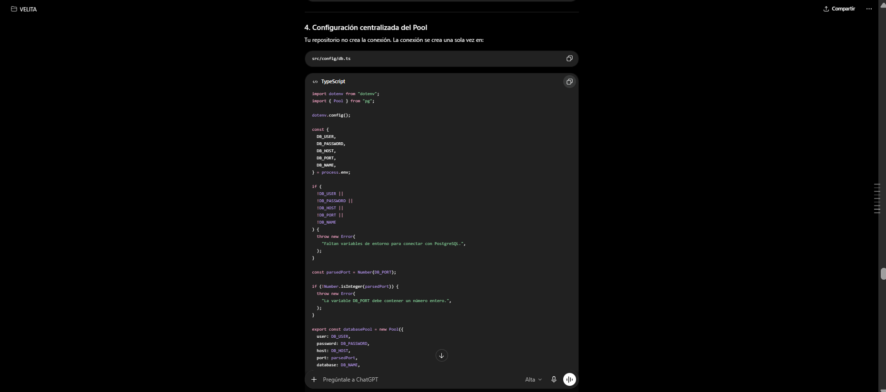
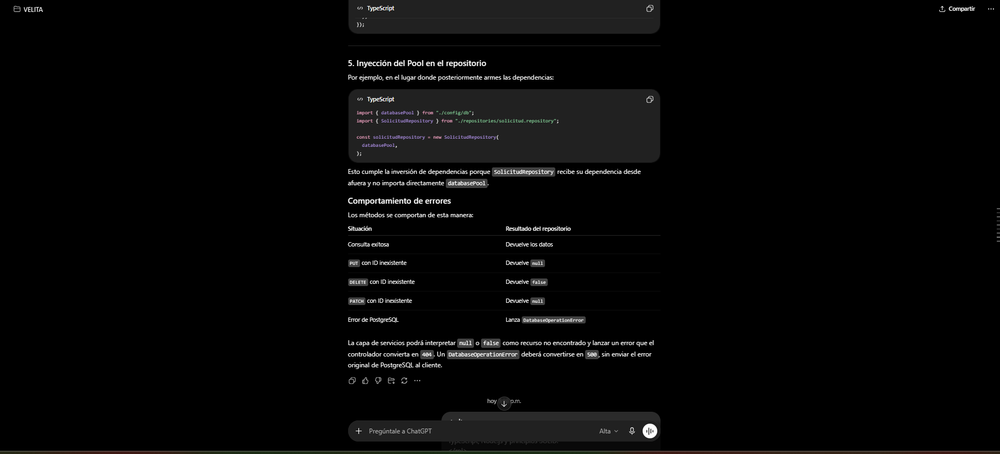

**Análisis y ajustes:**
La respuesta generada fue revisada antes de integrarse al proyecto, principalmente en los aspectos de seguridad, separación de responsabilidades y manejo de errores. Se verificó que las operaciones `INSERT`, `UPDATE`, `DELETE` y `PATCH` utilizaran consultas parametrizadas con `$1`, `$2`, etc., evitando concatenar valores recibidos desde el cliente. Esto fue importante para prevenir inyección SQL y cumplir con el requisito de código seguro.

También se validó que el método encargado de actualizar el estado no construyera SQL dinámico ni permitiera seleccionar columnas desde el cuerpo de la petición. Se mantuvo la consulta fija `SET estado = $1`, por lo que el endpoint PATCH solo puede modificar el campo permitido.

Como ajuste de diseño, se separó el error de base de datos en una clase `DatabaseOperationError`, conservando el error original únicamente para registro interno. Posteriormente se decidió mover este error a la carpeta `errors/` y hacerlo parte de la jerarquía de errores de la aplicación, extendiendo de `AppError`, para mantener un manejo más uniforme y alineado con el principio de Abierto/Cerrado (OCP).

Además, se revisó la conversión del campo `costo_estimado`, ya que PostgreSQL puede devolver los campos `NUMERIC` como texto mediante el driver `pg`. Por ello, se mantuvo un método privado `mapRowToSolicitud`, encargado de transformar la fila de PostgreSQL al formato usado por la aplicación. Esto evita repetir lógica de mapeo en cada método del repositorio y mantiene el código más limpio.

Finalmente, se confirmó que el repositorio no contiene lógica de negocio, validaciones HTTP ni reglas propias del controlador. Su responsabilidad quedó limitada al acceso a datos, cumpliendo con el principio de Responsabilidad Única (SRP).

## Prompt 2: Generación de la Capa de Servicios (Lógica de Negocio)
**Objetivo:** Implementar la lógica de negocio y las validaciones del sistema antes de interactuar con la base de datos, garantizando la separación de responsabilidades (SRP) y la Inversión de Dependencias (DIP).

**Prompt utilizado:**
```xml
<rol>
  Actúa como un desarrollador experto en backend utilizando TypeScript, Node.js y principios SOLID.
</rol>

<contexto>
  Ya hemos implementado la capa de acceso a datos con la clase `SolicitudRepository` y las interfaces en `solicitud.interface.ts`. 
  Ahora necesito implementar la capa de lógica de negocio (Servicios).
</contexto>

<tarea>
  Genera el código para una clase llamada `SolicitudService`. Esta clase debe contener los métodos equivalentes para procesar las operaciones CRUD, actuando como intermediario entre los futuros Controladores y el Repositorio.
</tarea>

<instrucciones>
  <inversion_de_dependencias>
    - El `SolicitudService` debe recibir una instancia de `SolicitudRepository` a través de su constructor, evitando instanciar el repositorio internamente (Principio DIP).
  </inversion_de_dependencias>

  <logica_y_validaciones>
    - Implementa validaciones de negocio antes de llamar al repositorio para la creación y actualización completa:
      a) La `prioridad` debe ser estrictamente un número entero entre 1 y 5.
      b) El `costo_estimado` debe ser un número mayor o igual a 0.
      c) El `estado` debe ser uno de los valores válidos: "registrada", "en_proceso", o "finalizada".
    - Los campos de texto (`titulo` y `area_solicitante`) no deben estar vacíos.
    - IMPORTANTE: Para el método de actualización exclusiva de estado (PATCH), asegúrate de validar ÚNICAMENTE el campo `estado`, sin exigir ni validar los demás atributos del objeto completo.
  </logica_y_validaciones>

  <manejo_de_errores_de_negocio>
    - Crea una clase base llamada `AppError` (o `DomainError`) de la cual hereden los errores específicos. Esto permitirá que el controlador maneje los errores genéricamente sin modificarse si agregamos nuevos tipos (Principio de Abierto/Cerrado - OCP).
    - Crea las siguientes clases que extiendan de la clase base:
      a) `ValidationError`: Para cuando fallen las validaciones de datos (para mapear a HTTP 400).
      b) `NotFoundError`: Para cuando el repositorio retorne `null` o `false` al intentar actualizar, eliminar o buscar un ID inexistente (para mapear a HTTP 404).
    - El servicio debe lanzar estos errores personalizados en lugar de devolver null o false.
  </manejo_de_errores_de_negocio>

  <codigo_limpio_y_tipado>
    - Mantén el Principio de Responsabilidad Única (SRP): el servicio no debe saber nada sobre peticiones HTTP (req, res), ni sobre consultas SQL directas.
    - Usa métodos privados si necesitas extraer lógica de validación repetitiva (DRY).
    - Define explícitamente el tipo de retorno en todos los métodos del servicio (ej. `Promise<Solicitud>`, `Promise<void>`).
  </codigo_limpio_y_tipado>
</instrucciones>

```
**Resumen de la respuesta generada:**
La IA construyó la clase `SolicitudService` inyectando `SolicitudRepository` por constructor. Además, implementó una jerarquía de errores personalizados (`AppError`, `ValidationError`, `NotFoundError`) para el manejo de excepciones de dominio, desvinculando la lógica de negocio de los códigos de estado HTTP.

**Evidencia de Respuesta generada**
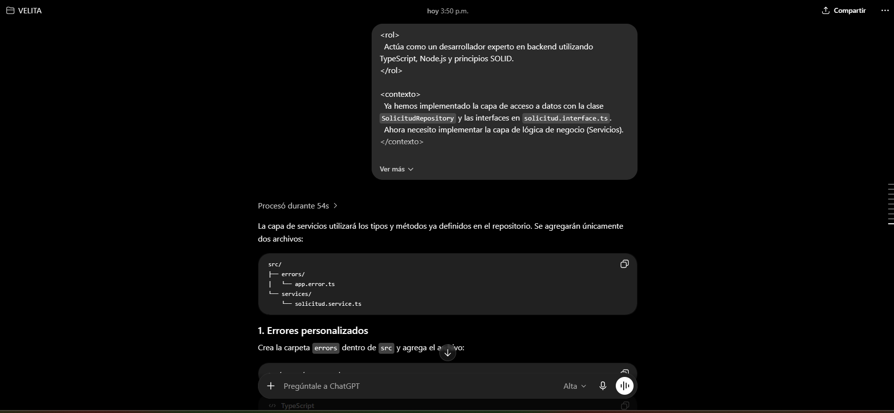
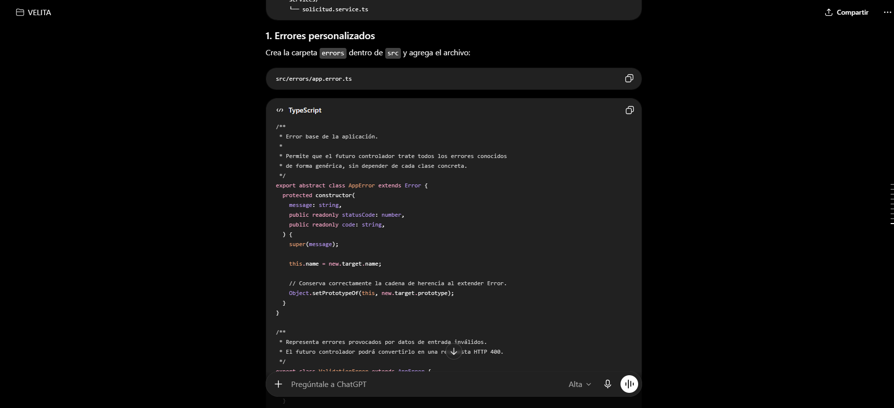
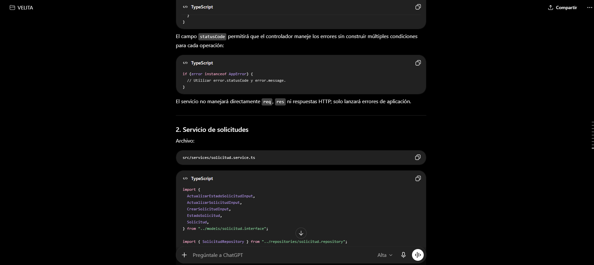
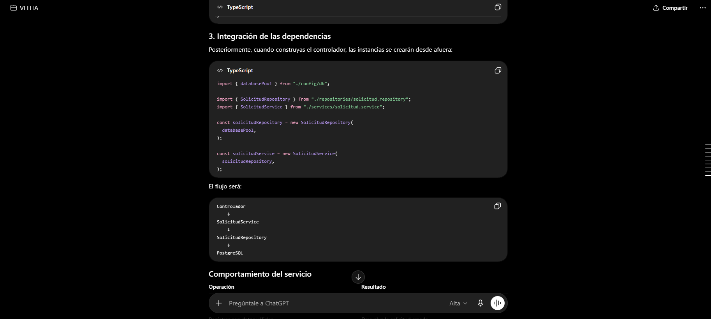
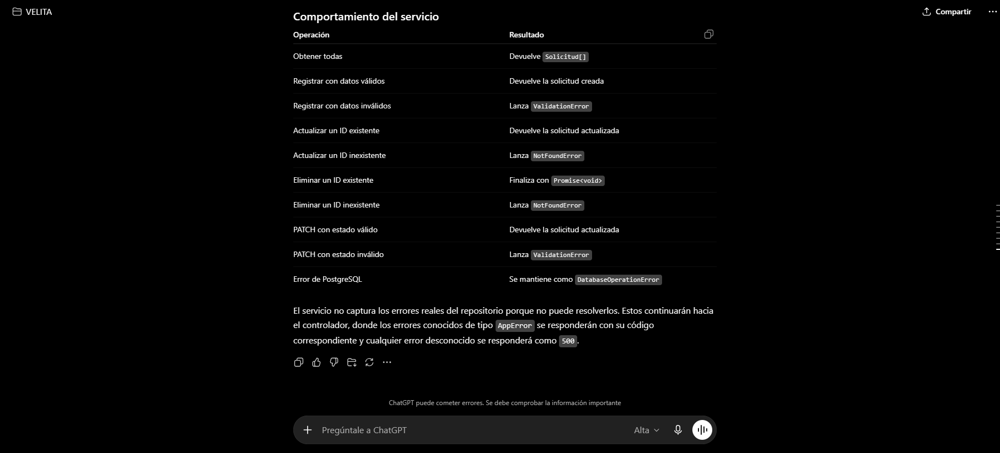

**Análisis y ajustes:**
La respuesta generada fue evaluada para confirmar que la capa de servicios quedara separada de Express y de PostgreSQL. Se verificó que `SolicitudService` no utilizara `Request`, `Response`, consultas SQL ni códigos HTTP directamente. Su responsabilidad quedó limitada a validar reglas de negocio y coordinar las operaciones del repositorio.

Se revisaron las validaciones propuestas y se conservaron las reglas requeridas por el enunciado: prioridad como número entero entre 1 y 5, costo estimado mayor o igual a 0, estado limitado a `registrada`, `en_proceso` o `finalizada`, y campos de texto obligatorios. Además, se confirmó que `trim()` fuera utilizado para evitar aceptar cadenas formadas únicamente por espacios.

Un punto importante de revisión fue el método de actualización exclusiva de estado. Se verificó que `actualizarEstado` validara únicamente el `id` y el campo `estado`, sin exigir `titulo`, `area_solicitante`, `prioridad` ni `costo_estimado`. Esto permite que el endpoint PATCH cumpla su propósito de modificar solo una parte del recurso.

También se validó el manejo de identificadores inválidos. Como el controlador convierte `req.params.id` con `Number(...)`, se revisó que el servicio rechazara valores como `NaN`, decimales, cero o números negativos mediante `validarId`. Esto evita que identificadores inválidos lleguen al repositorio.

Como mejora de código limpio, se mantuvieron métodos privados para evitar duplicar validaciones: `validarDatosCompletos`, `validarTexto`, `validarPrioridad`, `validarCostoEstimado`, `validarEstado` y `validarId`. Esto aplica el principio DRY y facilita mantener las reglas de negocio en un solo lugar.

Finalmente, se conservó la jerarquía `AppError`, `ValidationError` y `NotFoundError`, ya que permite que la capa superior maneje errores conocidos sin depender de cada clase concreta. Esto apoya el principio de Abierto/Cerrado (OCP), porque nuevos errores de dominio pueden agregarse sin modificar la lógica principal de los controladores.

## Prompt 3: Generación de la Capa de Controladores y Rutas (API REST)
**Objetivo:** Exponer la lógica de negocio a través de una API RESTful utilizando Express, asegurando que el controlador cumpla con el Principio de Responsabilidad Única (SRP) y maneje correctamente los códigos de estado HTTP y los errores genéricos (OCP).

**Prompt utilizado:**
```xml
<rol>
  Actúa como un desarrollador experto en backend utilizando TypeScript, Express y principios SOLID.
</rol>

<contexto>
  Ya hemos implementado la capa de acceso a datos (`SolicitudRepository` que lanza `DatabaseOperationError`), la capa de lógica de negocio (`SolicitudService`) y una jerarquía de errores de dominio basada en `AppError` (`ValidationError`, `NotFoundError`).
  Ahora necesito implementar la capa de presentación o API RESTful utilizando Express.
</contexto>

<tarea>
  Genera el código para las siguientes tres piezas clave:
  1. Una clase `SolicitudController` que maneje las peticiones y respuestas.
  2. Un archivo de rutas de Express (`solicitud.routes.ts`) que defina los endpoints REST (GET, POST, PUT, PATCH, DELETE).
  3. El archivo principal (`index.ts` o `app.ts`) que integre el servidor Express y realice la composición de todas las dependencias (Pool -> Repositorio -> Servicio -> Controlador).
</tarea>

<instrucciones>
  <inversion_de_dependencias>
    - El `SolicitudController` debe recibir una instancia de `SolicitudService` estrictamente a través de su constructor (Principio DIP). No debe instanciarlo directamente.
  </inversion_de_dependencias>

  <responsabilidad_unica>
    - El controlador debe dedicarse exclusivamente a extraer parámetros de `req.params` o `req.body`, invocar el método correspondiente del servicio, y devolver la respuesta con `res.status().json()`.
    - No debe existir NINGUNA lógica de negocio ni validaciones de datos dentro del controlador (Principio SRP).
  </responsabilidad_unica>

  <manejo_de_errores_y_codigos_http>
    - Envuelve la ejecución de cada método del controlador en bloques `try/catch`.
    - Si se captura un error que sea instancia de `AppError` (gracias a OCP, sin importar si es Validation o NotFound), responde con su propiedad `statusCode` y el mensaje de error.
    - Si se captura cualquier otro error (como `DatabaseOperationError` de la capa de datos o un fallo de Express), responde siempre con un status HTTP 500 y un mensaje genérico ("Error interno del servidor") para no filtrar detalles de infraestructura al cliente.
    - Los códigos de éxito deben ser precisos: 201 para POST (creación), y 200 para GET, PUT y PATCH. 
    - IMPORTANTE: Para la operación DELETE, utiliza el código 204 y asegúrate de no enviar ningún body en la respuesta (usa `res.status(204).send()`).
  </manejo_de_errores_y_codigos_http>

  <buenas_practicas_express>
    - Asegúrate de que Express esté configurado para parsear JSON (`express.json()`).
    - Utiliza el enrutador nativo de Express (`Router()`) en el archivo de rutas.
  </buenas_practicas_express>
</instrucciones>
```
**Resumen de la respuesta generada:**
La IA generó el `SolicitudController`, el archivo de rutas y el punto de entrada `index.ts`. Se implementó la composición de dependencias en el archivo principal (`Pool` -> `Repository` -> `Service` -> `Controller`), inyectando cada capa en la siguiente mediante sus constructores. Express quedó configurado con protecciones básicas (desactivar `x-powered-by`, límite de JSON de 100kb).

**Evidencia de Respuesta generada**
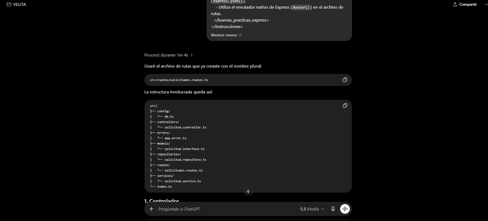
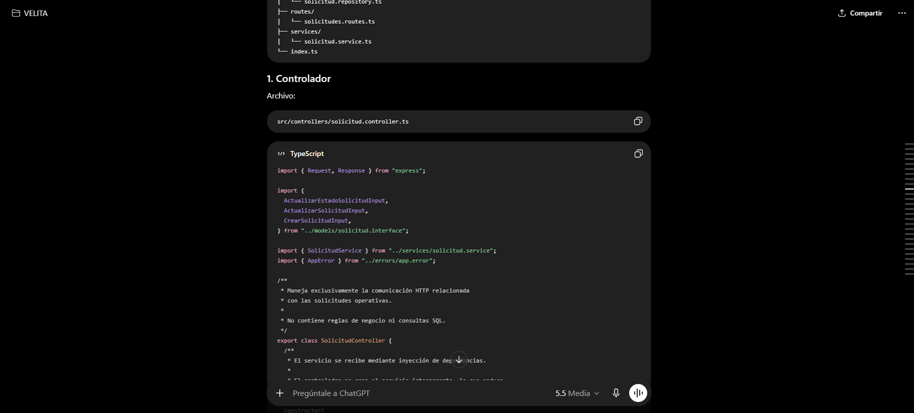
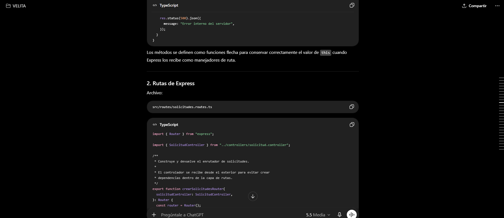
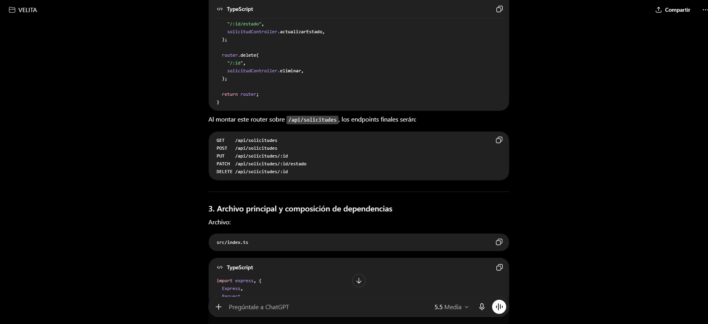
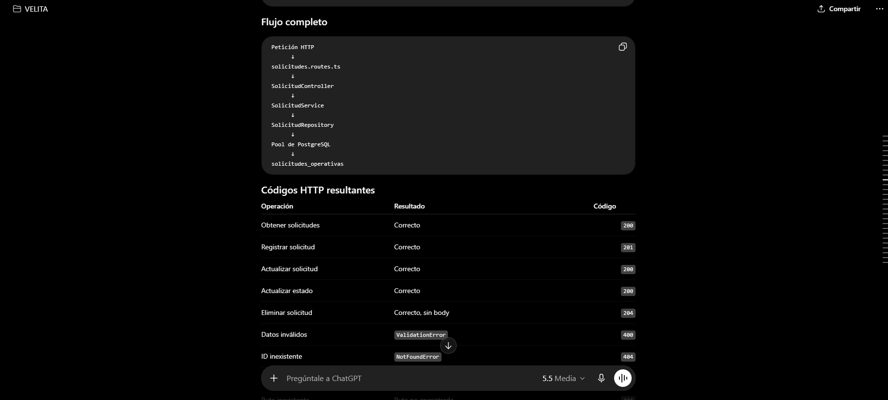

**Análisis y ajustes:**
La respuesta generada inicialmente incluía manejo de errores dentro del controlador mediante un método privado `responderError`. Aunque esta solución funcionaba, durante la revisión crítica se identificó que podía generar duplicación al existir también un middleware global de errores. Para mejorar la separación de responsabilidades, se modificó el controlador para utilizar `next(error)` en los bloques `catch`, delegando la conversión de errores HTTP al middleware `errorMiddleware`.

Este ajuste permitió que el controlador quedara enfocado únicamente en extraer datos de `req.params` o `req.body`, llamar al servicio correspondiente y devolver respuestas exitosas. De esta forma se reforzó el principio de Responsabilidad Única (SRP), ya que el controlador ya no clasifica errores ni decide respuestas de fallo.

También se implementó un middleware global de errores para capturar tanto los errores de dominio (`ValidationError`, `NotFoundError`) como los errores de infraestructura (`DatabaseOperationError`) y los errores generados por Express antes de llegar al controlador, como un JSON mal formado. Esta mejora fue necesaria porque al probar un JSON inválido, Express devolvía inicialmente una página HTML con información interna y rutas locales del proyecto. El middleware corrige este riesgo devolviendo una respuesta JSON controlada con código `400` y sin exponer detalles técnicos.

Se corrigió además el archivo `index.ts`, eliminando un registro duplicado de las rutas `/api/solicitudes`. Las rutas quedaron registradas una sola vez y el middleware de errores fue colocado al final de la configuración de Express, como corresponde en el flujo de middlewares.

Se verificó que los códigos HTTP exitosos fueran correctos: `200` para consultas y actualizaciones, `201` para creación y `204 No Content` para eliminación. En el caso de DELETE, se mantuvo `res.status(204).send()` para no enviar cuerpo en la respuesta, cumpliendo con buenas prácticas REST.

Finalmente, se revisó la composición de dependencias en `index.ts`, manteniendo el flujo `Pool -> Repository -> Service -> Controller`. Esta composición evita que las capas creen internamente sus dependencias y permite evidenciar la Inversión de Dependencias (DIP).

## Ajustes adicionales posteriores

Durante las pruebas manuales se detectó que, al enviar un JSON mal formado, Express respondía con una página HTML que incluía el stack trace y rutas internas del entorno local. Esto representaba un riesgo de seguridad porque exponía información de infraestructura al cliente.

Para corregirlo se agregó un middleware global `errorMiddleware`, encargado de transformar errores conocidos y no conocidos en respuestas JSON seguras. También se modificaron los controladores para usar `next(error)` en lugar de responder los errores directamente. Con esto se centralizó el manejo de errores y se redujo duplicación.

Además, se revisó la jerarquía de errores y se decidió que `DatabaseOperationError` extendiera de `AppError`, conservando el campo `originalError` únicamente para el log interno del servidor. Esto permitió mantener un manejo uniforme de errores conocidos sin exponer detalles técnicos al cliente.

Como mejora adicional de SOLID, se consideró definir una interfaz `ISolicitudRepository` para que el servicio dependa de un contrato y no de la clase concreta `SolicitudRepository`. Esta decisión refuerza la Inversión de Dependencias (DIP) y permite sustituir la implementación de PostgreSQL por otra implementación, por ejemplo una versión en memoria para pruebas, sin modificar la lógica de negocio.