# Práctica 3 — Diseño de Arquitectura de Software
## 1. Introducción

La institución bancaria cuenta actualmente con un sistema monolítico para el procesamiento de transacciones. En períodos de alta demanda, como fin de mes, pagos masivos de planillas corporativas o temporadas de impuestos, este enfoque puede convertirse en un punto de saturación debido a que múltiples responsabilidades compiten dentro de una misma aplicación.

La solución propuesta consiste en diseñar una arquitectura basada en microservicios, con separación explícita de responsabilidades, una base de datos independiente por servicio, un API Gateway como punto de entrada, integración con un proveedor corporativo de autenticación, mensajería asíncrona para procesos desacoplados, almacenamiento externo de archivos CSV y logging centralizado.

El diseño también reutiliza y evoluciona conceptos desarrollados en la Práctica 2, especialmente el uso de JWT, cookies HTTP-only, autorización basada en roles, guards y el límite absoluto de renovación mediante `refreshUntil`.

El objetivo no es únicamente dividir el sistema en componentes, sino justificar por qué cada componente existe, qué problema resuelve, cómo se comunica y qué ocurre cuando alguno de los elementos internos o externos falla.

---

# 2. Análisis del problema

Los requerimientos principales identificados son los siguientes:

1. El sistema debe soportar escenarios de alta demanda.
2. Los usuarios deben autenticarse mediante un servicio OAuth corporativo con una vigencia de 12 horas.
3. Debe integrarse el módulo desarrollado en la Práctica 2 para administrar permisos y accesos.
4. Las transacciones se reciben mediante archivos CSV.
5. Los archivos deben validarse según reglas internas del negocio.
6. Los archivos deben almacenarse en un servidor externo de archivos o almacenamiento en nube.
7. Los lotes deben pasar por un flujo de aprobación de tres pasos:
   - Maker.
   - Checker.
   - Authorizer.
8. Los pasos de aprobación deben ser realizados por usuarios diferentes.
9. Una vez aprobadas las transacciones deben enviarse al Core Bancario o sistema de compensación externo.
10. Al completarse la aprobación se debe notificar por correo a los clientes o beneficiarios.
11. Debe existir un historial consultable de lotes y transacciones.
12. Debe permitirse descargar el archivo asociado a un lote.
13. Debe existir logging centralizado y auditable.
14. Cada microservicio debe tener su propia base de datos.
15. La comunicación entre servicios puede realizarse mediante REST y/o mensajería asíncrona.
16. Debe utilizarse un API Gateway.

---

# 3. Criterios de diseño

La arquitectura se construyó tomando en cuenta tres criterios principales.

## 3.1 Análisis y resolución de problemas

Cada requerimiento de negocio se transforma en una responsabilidad técnica concreta.

| Requerimiento | Problema arquitectónico | Decisión |
|---|---|---|
| Alta demanda | Un único proceso puede convertirse en cuello de botella | Separar responsabilidades en microservicios |
| Carga de archivos CSV | Archivos potencialmente grandes y procesamiento costoso | Servicio especializado de lotes + almacenamiento de objetos |
| Validaciones de negocio | Las transacciones inválidas no deben llegar al Core | Validación previa antes del flujo de aprobación |
| Maker-Checker-Authorizer | Riesgo operativo y necesidad de segregación de funciones | Servicio de aprobaciones independiente |
| Core Bancario externo | Puede presentar latencia o indisponibilidad | Servicio de procesamiento aislado |
| Notificaciones por correo | El envío de correo no debe bloquear la aprobación | Servicio de notificaciones asíncrono |
| Trazabilidad | Los eventos ocurren en varios servicios | Logging centralizado + `Correlation ID` |
| OAuth + P2 | Existen identidad corporativa y permisos internos | Intercambio del token OAuth por un JWT interno |
| Bases independientes | Evitar acoplamiento por datos | Patrón Database per Service |
| Fallos temporales | No se deben perder operaciones | Reintentos controlados y Dead Letter Queue |

---

## 3.2 Comunicación técnica

Los mismos nombres de componentes serán utilizados en todos los diagramas para evitar contradicciones:

- `Auth / Identity Service`
- `Transaction Batch Service`
- `Approval Service`
- `Processing Service`
- `Notification Service`
- `API Gateway`
- `RabbitMQ`
- `AWS S3`
- `Centralized Logging`
- `Core Bancario`
- `Email Provider`

---

## 3.3 Decisiones justificadas

Cada decisión arquitectónica se documenta mediante una estructura similar a un ADR:

- contexto;
- problema;
- alternativas;
- decisión;
- justificación;
- ventajas;
- compromisos.

Esto permite explicar no solamente **qué se eligió**, sino **por qué se eligió**.

---

# 4. Arquitectura propuesta

La solución utiliza cinco microservicios:

1. `Auth / Identity Service`
2. `Transaction Batch Service`
3. `Approval Service`
4. `Processing Service`
5. `Notification Service`

Los primeros cuatro servicios de negocio operan de forma independiente. `Auth / Identity Service` funciona como un servicio transversal responsable de integrar la identidad corporativa con los usuarios y permisos internos.

---

# 5. Diagrama de Arquitectura General


---
# 6. Componentes principales

## 6.1 API Gateway

El API Gateway representa el punto de entrada principal hacia los servicios internos del sistema. Todas las solicitudes autenticadas realizadas desde la aplicación cliente pasan por este componente antes de llegar al servicio correspondiente.

### Responsabilidades

- recibir las solicitudes provenientes de la aplicación cliente;
- validar el token interno presentado por el usuario;
- generar o propagar un identificador de trazabilidad para cada operación;
- enrutar las solicitudes hacia el servicio correspondiente;
- controlar el acceso inicial a las funcionalidades internas;
- evitar que los servicios internos sean expuestos directamente al cliente.

En esta arquitectura, el API Gateway no consulta al Servicio de Autenticación y Autorización en cada petición. La validación del token interno se realiza sin generar una dependencia constante entre ambos componentes.

El Gateway tampoco contiene reglas propias del negocio bancario. Su responsabilidad se limita al acceso, validación inicial y direccionamiento de solicitudes.

---

## 6.2 Servicio de Autenticación y Autorización

Este servicio representa la evolución del mecanismo de autenticación y autorización desarrollado en la Práctica 2.

Su función es conectar la identidad corporativa del usuario con los usuarios, roles y permisos utilizados internamente por el sistema.

### Responsabilidades

- recibir desde la aplicación cliente la credencial obtenida durante la autenticación corporativa;
- validar la identidad corporativa del usuario;
- relacionar la identidad corporativa con un usuario interno;
- consultar los roles y permisos asociados al usuario;
- administrar los permisos necesarios para acceder a las funcionalidades del sistema;
- generar el token interno utilizado posteriormente para acceder a los servicios;
- controlar la vigencia máxima de la sesión;
- administrar la información interna relacionada con usuarios, roles y permisos.

### Base de datos

El servicio posee una base de datos propia:

```text
BD de Autenticación
```

---

# 7. Integración entre OAuth corporativo y la Práctica 2

## 7.1 Decisión principal

OAuth corporativo y el JWT de la aplicación no compiten.

Cada uno cumple una función diferente.

| Aspecto | OAuth corporativo | JWT interno |
|---|---|---|
| Responde a | ¿Quién eres? | ¿Qué puedes hacer en el sistema? |
| Emisor | Proveedor corporativo | Auth / Identity Service |
| Vigencia | Máximo 12 horas | Corta y configurable |
| Uso | Autenticación inicial | Solicitudes internas |
| Permisos Maker/Checker/Authorizer | No necesariamente | Sí |
| Lo validan los microservicios | No | Sí |
| Renovación | Depende del IdP | Controlada por Auth Service |

---

## 7.2 Flujo de intercambio de token

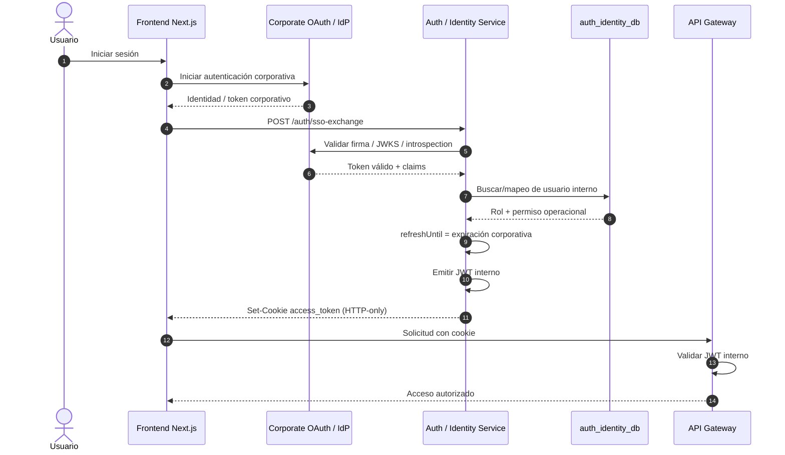
```mermaid
sequenceDiagram
    autonumber
    actor U as Usuario
    participant FE as Frontend Next.js
    participant IDP as Corporate OAuth / IdP
    participant AUTH as Auth / Identity Service
    participant DB as auth_identity_db
    participant GW as API Gateway

    U->>FE: Iniciar sesión
    FE->>IDP: Iniciar autenticación corporativa
    IDP-->>FE: Identidad / token corporativo
    FE->>AUTH: POST /auth/sso-exchange
    AUTH->>IDP: Validar firma / JWKS / introspection
    IDP-->>AUTH: Token válido + claims
    AUTH->>DB: Buscar/mapeo de usuario interno
    DB-->>AUTH: Rol + permiso operacional
    AUTH->>AUTH: refreshUntil = expiración corporativa
    AUTH->>AUTH: Emitir JWT interno
    AUTH-->>FE: Set-Cookie access_token (HTTP-only)
    FE->>GW: Solicitud con cookie
    GW->>GW: Validar JWT interno
    GW-->>FE: Acceso autorizado
```

---

## 7.3 Política de renovación del JWT interno

La Práctica 2 ya utilizaba un JWT renovable con un límite absoluto denominado `refreshUntil`.

En esta arquitectura se conserva el mismo concepto, pero el límite deja de ser un período académico corto y pasa a estar limitado por la expiración de la sesión corporativa.

```text
refreshUntil <= expiración del contexto OAuth corporativo
```

El JWT interno posee una vida corta configurable:

```text
INTERNAL_JWT_TTL
```

Cuando expira:

1. el cliente intenta renovar la sesión a través del `Auth / Identity Service`;
2. el servicio verifica la firma del JWT expirado ignorando solamente su `exp`;
3. comprueba que `now < refreshUntil`;
4. opcionalmente puede consultar al proveedor corporativo si se requiere verificar revocación;
5. genera un nuevo JWT interno;
6. conserva el mismo `refreshUntil`.

Cuando:

```text
now >= refreshUntil
```

la renovación se rechaza con:

```text
401 Unauthorized
```

y se exige una nueva autenticación corporativa.

---

## 7.4 Adaptación del mecanismo de renovación de P2

En P2 la estrategia JWT podía renovar el token dentro del mismo monolito porque el componente que validaba también tenía acceso a la llave de firma.

En P3 esto se modifica por seguridad:

```text
Solo Auth / Identity Service puede firmar JWT.
```

Por ello, la renovación deja de realizarse dentro de cada microservicio y pasa a estar centralizada en el servicio de identidad.

Los demás componentes únicamente verifican la firma.

---

# 8. Firma del JWT interno

Se propone utilizar firma asimétrica.

```text
RS256
```

## Distribución de claves

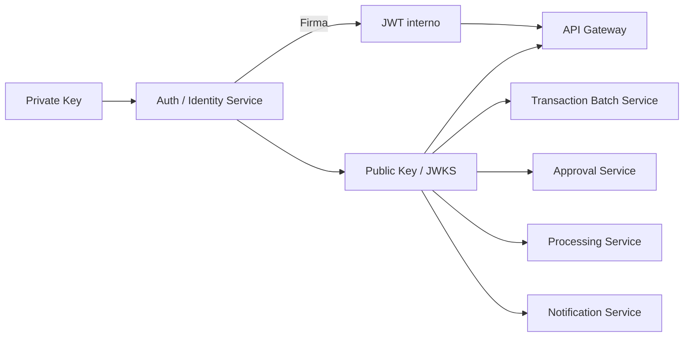
```mermaid
flowchart LR
    PRIV[Private Key]
    AUTH[Auth / Identity Service]
    JWT[JWT interno]
    PUB[Public Key / JWKS]
    GW[API Gateway]
    B[Transaction Batch Service]
    A[Approval Service]
    P[Processing Service]
    N[Notification Service]

    PRIV --> AUTH
    AUTH -->|Firma| JWT
    AUTH --> PUB

    PUB --> GW
    PUB --> B
    PUB --> A
    PUB --> P
    PUB --> N

    JWT --> GW
```

### Justificación

En el monolito de P2 una llave simétrica era suficiente.

En una arquitectura distribuida una firma asimétrica permite que:

- solamente `Auth / Identity Service` pueda emitir tokens;
- el Gateway y los microservicios puedan verificarlos sin conocer la llave privada;
- un compromiso de un microservicio no otorgue automáticamente capacidad de emitir nuevos JWT.

---

# 9. Roles y permisos operacionales

La Práctica 2 utilizaba:

```text
Admin
Cliente
```

La nueva solución conserva esos roles como clasificación general y agrega permisos operacionales:

```text
Maker
Checker
Authorizer
```

## Modelo conceptual

```text
Rol general:
- Admin
- Cliente

Permiso operacional:
- Maker
- Checker
- Authorizer
```

Ejemplo:

| Usuario | Rol | Permiso operacional |
|---|---|---|
| Usuario A | Cliente | Maker |
| Usuario B | Cliente | Checker |
| Usuario C | Cliente | Authorizer |
| Usuario D | Admin | Administración |

La separación evita mezclar la clasificación general del usuario con la responsabilidad temporal dentro del proceso bancario.

---

# 10. Regla de segregación de funciones

Para un mismo lote:

```text
Maker != Checker
Maker != Authorizer
Checker != Authorizer
```

El `Approval Service` debe validar esta regla antes de registrar cada aprobación.

Esto evita que una sola persona pueda crear, revisar y autorizar el mismo lote.

---

# 11. Comunicación entre servicios

Se propone un enfoque híbrido.

## 11.1 REST

Se utiliza cuando el usuario necesita una respuesta inmediata.

Ejemplos:

```http
POST /batches
GET /batches
GET /batches/{id}
GET /batches/{id}/transactions
GET /batches/{id}/download

POST /approvals/{batchId}/maker
POST /approvals/{batchId}/checker
POST /approvals/{batchId}/authorizer
POST /approvals/{batchId}/reject
```

---

## 11.2 RabbitMQ

Se utiliza para eventos internos que no deben bloquear la operación del usuario.

Evento principal:

```text
batch.approved
```

Consumidores:

```text
Processing Service
Notification Service
```

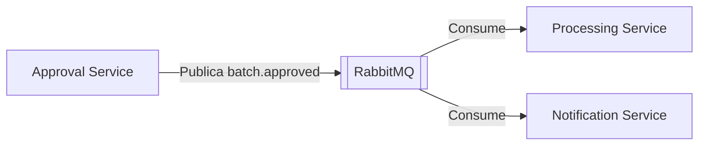
```mermaid
flowchart LR
    A[Approval Service]
    MQ[[RabbitMQ]]
    P[Processing Service]
    N[Notification Service]

    A -->|Publica batch.approved| MQ
    MQ -->|Consume| P
    MQ -->|Consume| N
```

### Justificación

La aprobación no depende de que el Core Bancario o el proveedor de correo estén disponibles en ese mismo instante.

---

# 12. Almacenamiento de CSV

Se propone utilizar:

```text
AWS S3
```

La base de datos no almacena el binario completo del archivo.

Almacena solamente metadatos:

```text
id
batch_id
original_name
storage_key
checksum
size
uploaded_at
uploaded_by
```

## Flujo

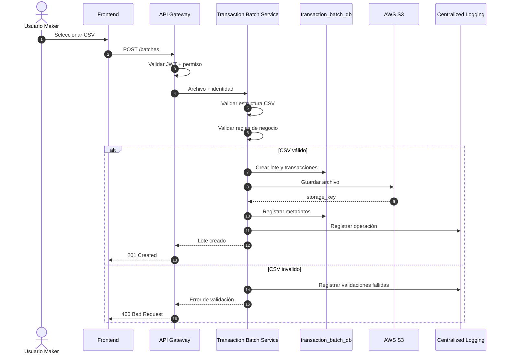
```mermaid
sequenceDiagram
    autonumber
    actor U as Usuario Maker
    participant FE as Frontend
    participant GW as API Gateway
    participant BS as Transaction Batch Service
    participant DB as transaction_batch_db
    participant S3 as AWS S3
    participant LOG as Centralized Logging

    U->>FE: Seleccionar CSV
    FE->>GW: POST /batches
    GW->>GW: Validar JWT + permiso
    GW->>BS: Archivo + identidad
    BS->>BS: Validar estructura CSV
    BS->>BS: Validar reglas de negocio

    alt CSV válido
        BS->>DB: Crear lote y transacciones
        BS->>S3: Guardar archivo
        S3-->>BS: storage_key
        BS->>DB: Registrar metadatos
        BS->>LOG: Registrar operación
        BS-->>GW: Lote creado
        GW-->>FE: 201 Created
    else CSV inválido
        BS->>LOG: Registrar validaciones fallidas
        BS-->>GW: Error de validación
        GW-->>FE: 400 Bad Request
    end
```

---

# 13. Reglas de validación del negocio

Antes de que un lote pueda entrar al proceso de aprobación se deben revisar, como mínimo, las reglas indicadas en el problema:

- saldo disponible;
- límites de transacción;
- existencia o validez de cuentas;
- reglas de prevención de fraude;
- estructura correcta del CSV.

Un lote con errores no pasa a `PENDING_APPROVAL`.

---

# 14. Estados del lote

Se propone el siguiente conjunto de estados:

```text
UPLOADED
VALIDATING
INVALID
PENDING_APPROVAL
APPROVED
REJECTED
PROCESSING
PROCESSED
FAILED
```

## Transición conceptual

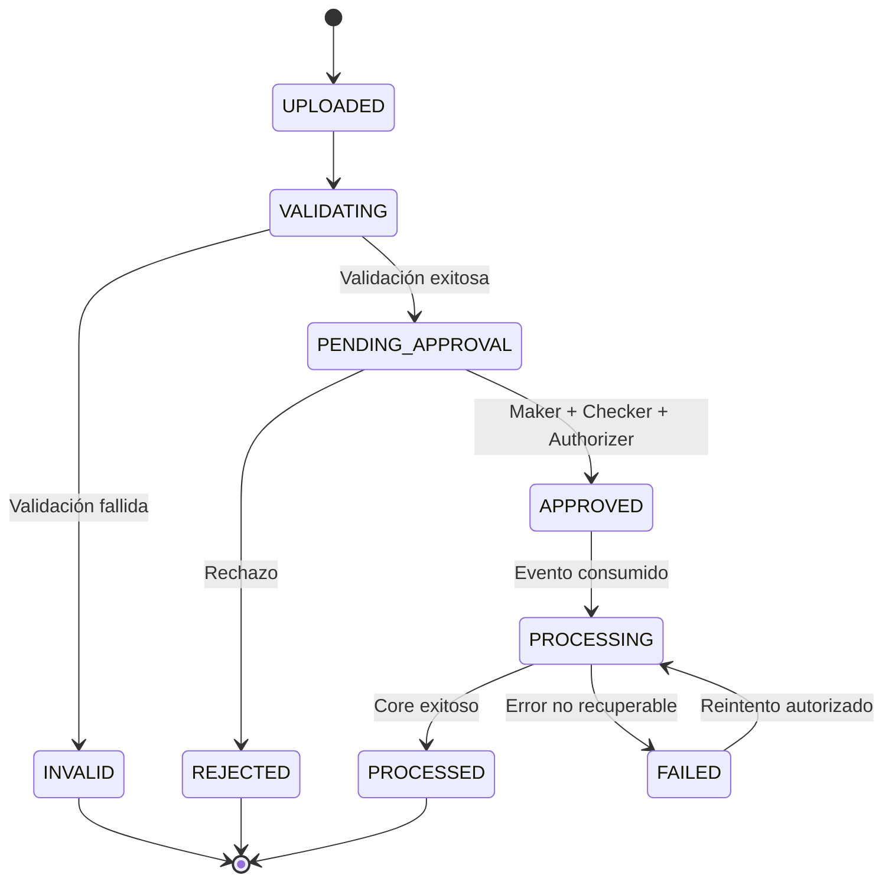
```mermaid
stateDiagram-v2
    [*] --> UPLOADED
    UPLOADED --> VALIDATING
    VALIDATING --> INVALID: Validación fallida
    VALIDATING --> PENDING_APPROVAL: Validación exitosa
    PENDING_APPROVAL --> REJECTED: Rechazo
    PENDING_APPROVAL --> APPROVED: Maker + Checker + Authorizer
    APPROVED --> PROCESSING: Evento consumido
    PROCESSING --> PROCESSED: Core exitoso
    PROCESSING --> FAILED: Error no recuperable
    FAILED --> PROCESSING: Reintento autorizado
    INVALID --> [*]
    REJECTED --> [*]
    PROCESSED --> [*]
```

---

# 15. Flujo Maker-Checker-Authorizer

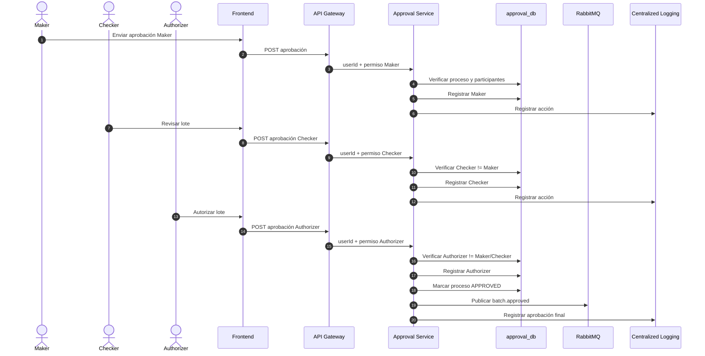
```mermaid
sequenceDiagram
    autonumber
    actor M as Maker
    actor C as Checker
    actor A as Authorizer
    participant FE as Frontend
    participant GW as API Gateway
    participant AS as Approval Service
    participant DB as approval_db
    participant MQ as RabbitMQ
    participant LOG as Centralized Logging

    M->>FE: Enviar aprobación Maker
    FE->>GW: POST aprobación
    GW->>AS: userId + permiso Maker
    AS->>DB: Verificar proceso y participantes
    AS->>DB: Registrar Maker
    AS->>LOG: Registrar acción

    C->>FE: Revisar lote
    FE->>GW: POST aprobación Checker
    GW->>AS: userId + permiso Checker
    AS->>DB: Verificar Checker != Maker
    AS->>DB: Registrar Checker
    AS->>LOG: Registrar acción

    A->>FE: Autorizar lote
    FE->>GW: POST aprobación Authorizer
    GW->>AS: userId + permiso Authorizer
    AS->>DB: Verificar Authorizer != Maker/Checker
    AS->>DB: Registrar Authorizer
    AS->>DB: Marcar proceso APPROVED
    AS->>MQ: Publicar batch.approved
    AS->>LOG: Registrar aprobación final
```

---

# 16. Rechazo durante la aprobación

Cualquiera de las etapas habilitadas para revisión puede producir un rechazo de acuerdo con las reglas internas definidas para el flujo.

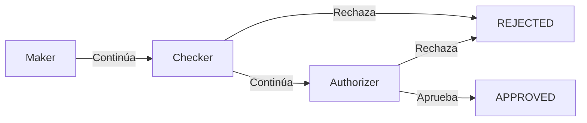
```mermaid
flowchart LR
    M[Maker]
    C[Checker]
    A[Authorizer]
    R[REJECTED]
    OK[APPROVED]

    M -->|Continúa| C
    C -->|Continúa| A
    C -->|Rechaza| R
    A -->|Rechaza| R
    A -->|Aprueba| OK
```

El rechazo debe registrar:

- usuario;
- fecha;
- etapa;
- motivo;
- lote;
- `Correlation ID`.

---

# 17. Envío al Core Bancario

El `Processing Service` consume el evento `batch.approved`.

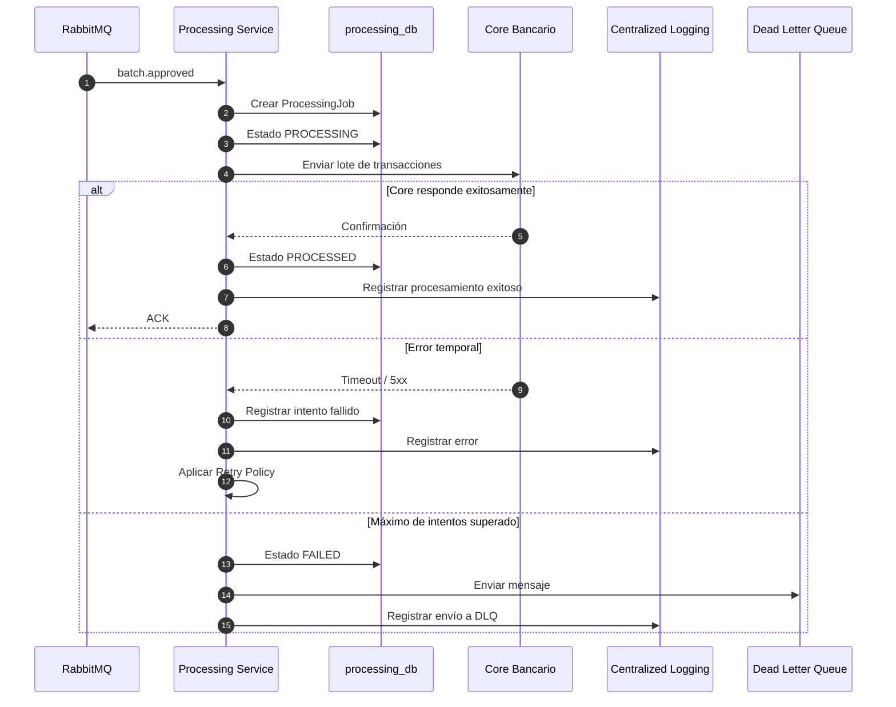
```mermaid
sequenceDiagram
    autonumber
    participant MQ as RabbitMQ
    participant PS as Processing Service
    participant DB as processing_db
    participant CORE as Core Bancario
    participant LOG as Centralized Logging
    participant DLQ as Dead Letter Queue

    MQ->>PS: batch.approved
    PS->>DB: Crear ProcessingJob
    PS->>DB: Estado PROCESSING
    PS->>CORE: Enviar lote de transacciones

    alt Core responde exitosamente
        CORE-->>PS: Confirmación
        PS->>DB: Estado PROCESSED
        PS->>LOG: Registrar procesamiento exitoso
        PS-->>MQ: ACK
    else Error temporal
        CORE-->>PS: Timeout / 5xx
        PS->>DB: Registrar intento fallido
        PS->>LOG: Registrar error
        PS->>PS: Aplicar Retry Policy
    else Máximo de intentos superado
        PS->>DB: Estado FAILED
        PS->>DLQ: Enviar mensaje
        PS->>LOG: Registrar envío a DLQ
    end
```

---

# 18. Notificación a clientes o beneficiarios

El envío de notificaciones ocurre después de la aprobación final.

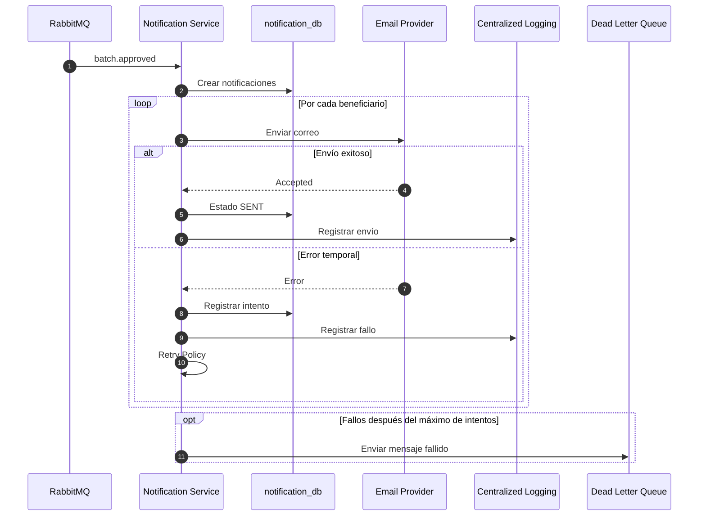
```mermaid
sequenceDiagram
    autonumber
    participant MQ as RabbitMQ
    participant NS as Notification Service
    participant DB as notification_db
    participant MAIL as Email Provider
    participant LOG as Centralized Logging
    participant DLQ as Dead Letter Queue

    MQ->>NS: batch.approved
    NS->>DB: Crear notificaciones
    loop Por cada beneficiario
        NS->>MAIL: Enviar correo
        alt Envío exitoso
            MAIL-->>NS: Accepted
            NS->>DB: Estado SENT
            NS->>LOG: Registrar envío
        else Error temporal
            MAIL-->>NS: Error
            NS->>DB: Registrar intento
            NS->>LOG: Registrar fallo
            NS->>NS: Retry Policy
        end
    end

    opt Fallos después del máximo de intentos
        NS->>DLQ: Enviar mensaje fallido
    end
```

---

# 19. Logging centralizado y auditable

Se propone utilizar una solución basada en:

```text
ELK Stack
- Elasticsearch
- Logstash
- Kibana
```

Cada componente genera logs estructurados.

Campos recomendados:

```text
timestamp
level
service
correlationId
userId
role
operationalPermission
action
batchId
transactionId
result
errorCode
message
```

## Correlation ID

Cada operación recibe un identificador que se mantiene durante todo el flujo.

Ejemplo:

```text
correlationId = 2f85a501-...
```

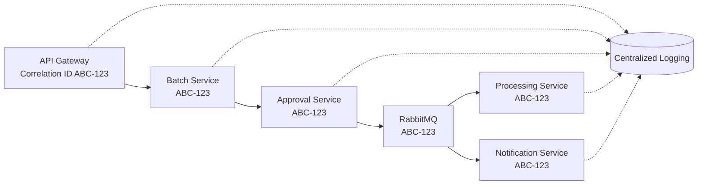
```mermaid
flowchart LR
    GW[API Gateway<br/>Correlation ID ABC-123]
    B[Batch Service<br/>ABC-123]
    A[Approval Service<br/>ABC-123]
    MQ[RabbitMQ<br/>ABC-123]
    P[Processing Service<br/>ABC-123]
    N[Notification Service<br/>ABC-123]
    L[(Centralized Logging)]

    GW --> B
    B --> A
    A --> MQ
    MQ --> P
    MQ --> N

    GW -.-> L
    B -.-> L
    A -.-> L
    P -.-> L
    N -.-> L
```

Esto permite reconstruir una operación completa aunque haya atravesado múltiples servicios.

---

# 20. Manejo de fallos y resiliencia

## 20.1 Retry Pattern

Se utiliza ante fallos transitorios.

Ejemplos:

- timeout del Core Bancario;
- error temporal del proveedor de correo;
- conexión temporalmente no disponible.

Los reintentos deben tener un número máximo y una espera progresiva.

---

## 20.2 Dead Letter Queue

Los mensajes que superan el máximo de reintentos se envían a una cola de mensajes fallidos.

```text
Dead Letter Queue
```

Esto evita:

- ciclos infinitos;
- pérdida silenciosa de operaciones;
- bloqueo de la cola principal.

---

## 20.3 Idempotencia

Los consumidores deben evitar procesar dos veces un mismo evento.

Por ejemplo:

```text
eventId
batchId
```

pueden ser utilizados para detectar eventos ya procesados.

Esto es especialmente importante antes de reenviar una transacción al Core Bancario.

---

## 20.4 Circuit Breaker

Se considera apropiado para llamadas síncronas repetidas hacia servicios externos que presenten fallas.

Su aplicación principal sería la integración con:

```text
Core Bancario
```

Cuando se supera un umbral de errores, el circuito evita continuar enviando solicitudes durante un período corto.

---

# 21. Consistencia entre microservicios

Cada microservicio es propietario de su base de datos.

Está prohibido que un servicio modifique directamente las tablas de otro.

Incorrecto:

```text
Approval Service
    |
    v
UPDATE transaction_batch_db
```

Correcto:

```text
Approval Service
    |
    v
Evento de dominio
    |
    v
El servicio propietario actualiza sus propios datos
```

Debido a que no existe una transacción SQL global, ciertos cambios distribuidos utilizan:

```text
consistencia eventual
```

---

# 22. Patrón Database per Service

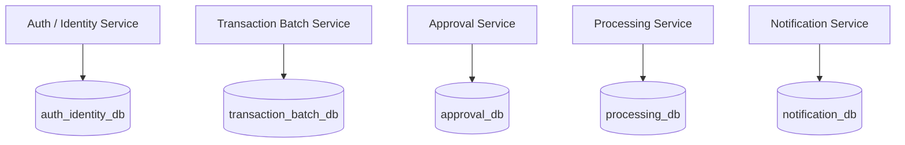
```mermaid
flowchart TB
    AUTH[Auth / Identity Service] --> AUTHDB[(auth_identity_db)]
    B[Transaction Batch Service] --> BDB[(transaction_batch_db)]
    A[Approval Service] --> ADB[(approval_db)]
    P[Processing Service] --> PDB[(processing_db)]
    N[Notification Service] --> NDB[(notification_db)]
```

### Justificación

Cada servicio:

- controla sus datos;
- puede evolucionar su esquema independientemente;
- evita acoplamiento por tablas compartidas;
- puede escalar sin depender de un esquema monolítico común.

---

# 23. Modelo ER — Auth / Identity Service

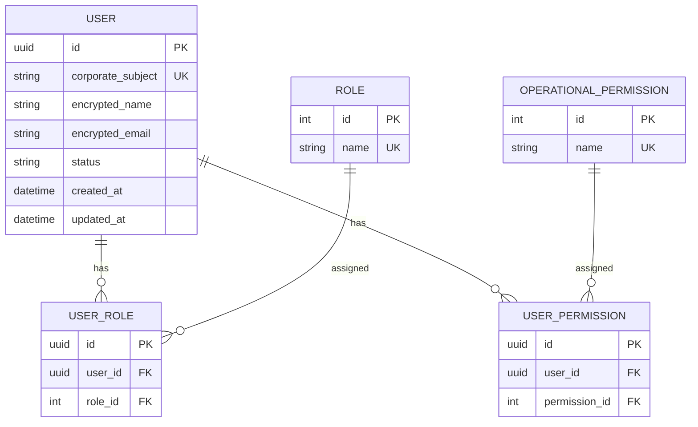
```mermaid
erDiagram
    USER {
        uuid id PK
        string corporate_subject UK
        string encrypted_name
        string encrypted_email
        string status
        datetime created_at
        datetime updated_at
    }

    ROLE {
        int id PK
        string name UK
    }

    OPERATIONAL_PERMISSION {
        int id PK
        string name UK
    }

    USER_ROLE {
        uuid id PK
        uuid user_id FK
        int role_id FK
    }

    USER_PERMISSION {
        uuid id PK
        uuid user_id FK
        int permission_id FK
    }

    USER ||--o{ USER_ROLE : has
    ROLE ||--o{ USER_ROLE : assigned
    USER ||--o{ USER_PERMISSION : has
    OPERATIONAL_PERMISSION ||--o{ USER_PERMISSION : assigned
```

---

# 24. Modelo ER — Transaction Batch Service

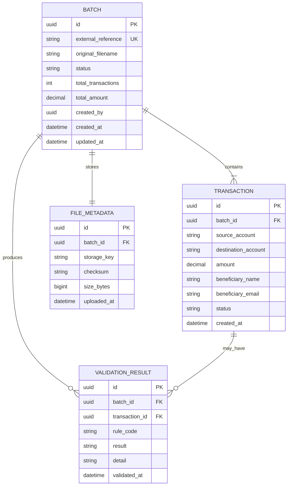
```mermaid
erDiagram
    BATCH {
        uuid id PK
        string external_reference UK
        string original_filename
        string status
        int total_transactions
        decimal total_amount
        uuid created_by
        datetime created_at
        datetime updated_at
    }

    TRANSACTION {
        uuid id PK
        uuid batch_id FK
        string source_account
        string destination_account
        decimal amount
        string beneficiary_name
        string beneficiary_email
        string status
        datetime created_at
    }

    FILE_METADATA {
        uuid id PK
        uuid batch_id FK
        string storage_key
        string checksum
        bigint size_bytes
        datetime uploaded_at
    }

    VALIDATION_RESULT {
        uuid id PK
        uuid batch_id FK
        uuid transaction_id FK
        string rule_code
        string result
        string detail
        datetime validated_at
    }

    BATCH ||--|{ TRANSACTION : contains
    BATCH ||--|| FILE_METADATA : stores
    BATCH ||--o{ VALIDATION_RESULT : produces
    TRANSACTION ||--o{ VALIDATION_RESULT : may_have
```

---

# 25. Modelo ER — Approval Service

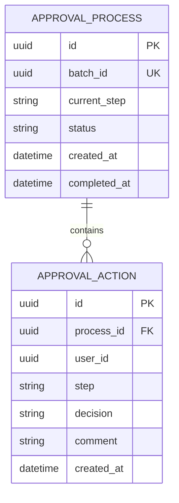
```mermaid
erDiagram
    APPROVAL_PROCESS {
        uuid id PK
        uuid batch_id UK
        string current_step
        string status
        datetime created_at
        datetime completed_at
    }

    APPROVAL_ACTION {
        uuid id PK
        uuid process_id FK
        uuid user_id
        string step
        string decision
        string comment
        datetime created_at
    }

    APPROVAL_PROCESS ||--o{ APPROVAL_ACTION : contains
```

El servicio guarda identificadores externos como `batch_id` y `user_id`, pero no accede directamente a las bases de datos de otros servicios.

---

# 26. Modelo ER — Processing Service

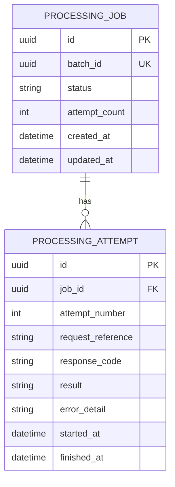
```mermaid
erDiagram
    PROCESSING_JOB {
        uuid id PK
        uuid batch_id UK
        string status
        int attempt_count
        datetime created_at
        datetime updated_at
    }

    PROCESSING_ATTEMPT {
        uuid id PK
        uuid job_id FK
        int attempt_number
        string request_reference
        string response_code
        string result
        string error_detail
        datetime started_at
        datetime finished_at
    }

    PROCESSING_JOB ||--o{ PROCESSING_ATTEMPT : has
```

---

# 27. Modelo ER — Notification Service

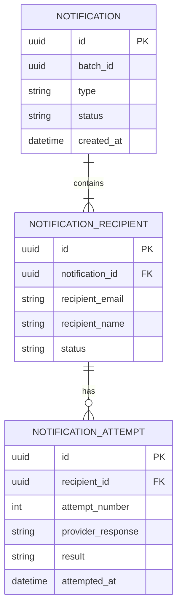
```mermaid
erDiagram
    NOTIFICATION {
        uuid id PK
        uuid batch_id
        string type
        string status
        datetime created_at
    }

    NOTIFICATION_RECIPIENT {
        uuid id PK
        uuid notification_id FK
        string recipient_email
        string recipient_name
        string status
    }

    NOTIFICATION_ATTEMPT {
        uuid id PK
        uuid recipient_id FK
        int attempt_number
        string provider_response
        string result
        datetime attempted_at
    }

    NOTIFICATION ||--|{ NOTIFICATION_RECIPIENT : contains
    NOTIFICATION_RECIPIENT ||--o{ NOTIFICATION_ATTEMPT : has
```

---

# 28. UML de clases — Auth / Identity Service

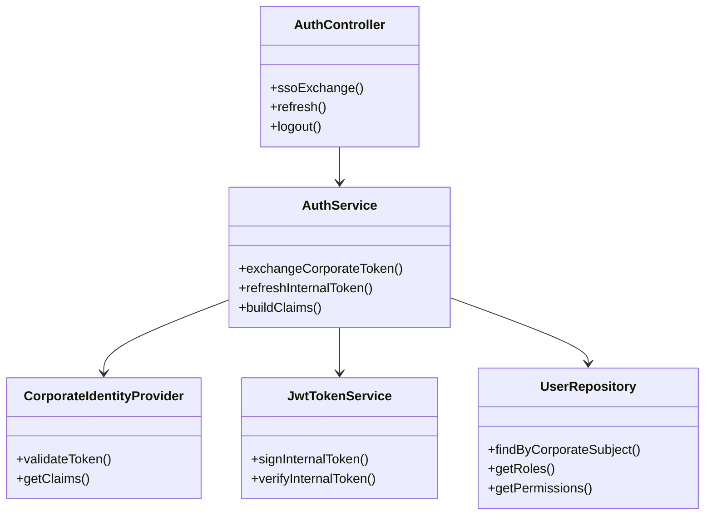
```mermaid
classDiagram
    class AuthController {
        +ssoExchange()
        +refresh()
        +logout()
    }

    class AuthService {
        +exchangeCorporateToken()
        +refreshInternalToken()
        +buildClaims()
    }

    class CorporateIdentityProvider {
        +validateToken()
        +getClaims()
    }

    class JwtTokenService {
        +signInternalToken()
        +verifyInternalToken()
    }

    class UserRepository {
        +findByCorporateSubject()
        +getRoles()
        +getPermissions()
    }

    AuthController --> AuthService
    AuthService --> CorporateIdentityProvider
    AuthService --> JwtTokenService
    AuthService --> UserRepository
```

---

# 29. UML de clases — Transaction Batch Service

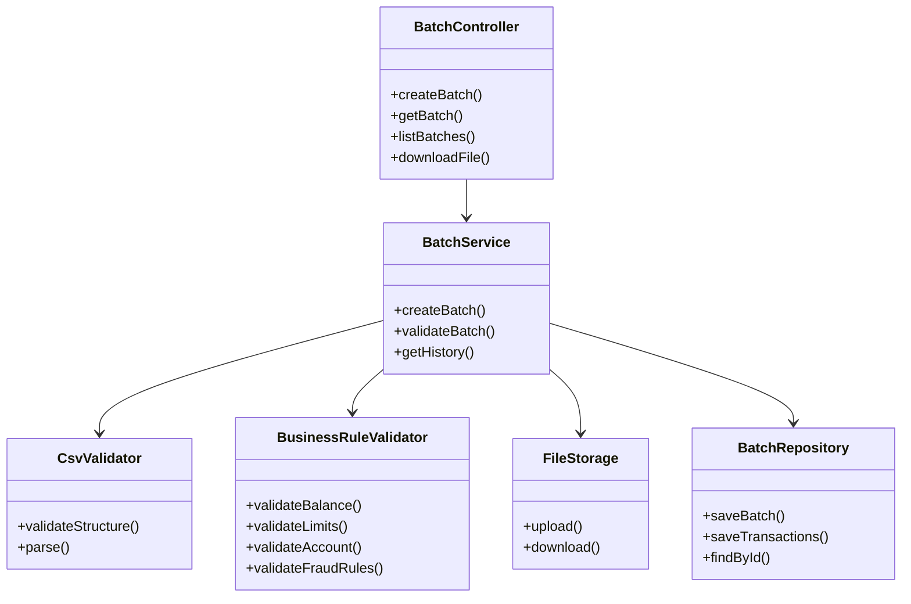
```mermaid
classDiagram
    class BatchController {
        +createBatch()
        +getBatch()
        +listBatches()
        +downloadFile()
    }

    class BatchService {
        +createBatch()
        +validateBatch()
        +getHistory()
    }

    class CsvValidator {
        +validateStructure()
        +parse()
    }

    class BusinessRuleValidator {
        +validateBalance()
        +validateLimits()
        +validateAccount()
        +validateFraudRules()
    }

    class FileStorage {
        +upload()
        +download()
    }

    class BatchRepository {
        +saveBatch()
        +saveTransactions()
        +findById()
    }

    BatchController --> BatchService
    BatchService --> CsvValidator
    BatchService --> BusinessRuleValidator
    BatchService --> FileStorage
    BatchService --> BatchRepository
```

---

# 30. UML de clases — Approval Service

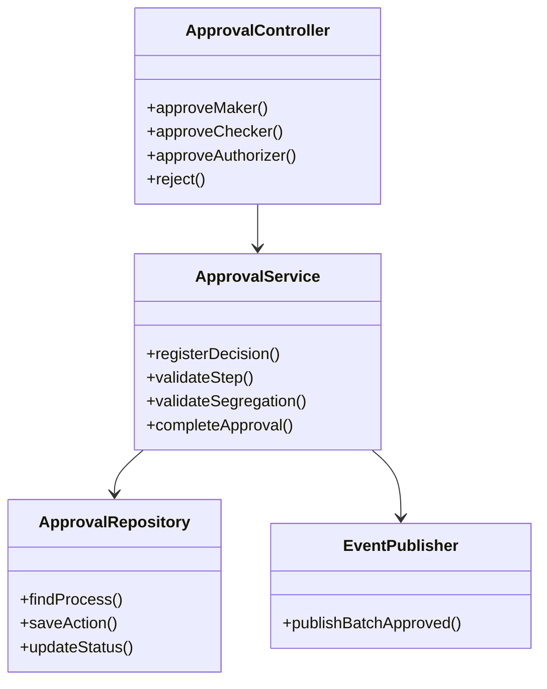
```mermaid
classDiagram
    class ApprovalController {
        +approveMaker()
        +approveChecker()
        +approveAuthorizer()
        +reject()
    }

    class ApprovalService {
        +registerDecision()
        +validateStep()
        +validateSegregation()
        +completeApproval()
    }

    class ApprovalRepository {
        +findProcess()
        +saveAction()
        +updateStatus()
    }

    class EventPublisher {
        +publishBatchApproved()
    }

    ApprovalController --> ApprovalService
    ApprovalService --> ApprovalRepository
    ApprovalService --> EventPublisher
```

---

# 31. UML de clases — Processing Service

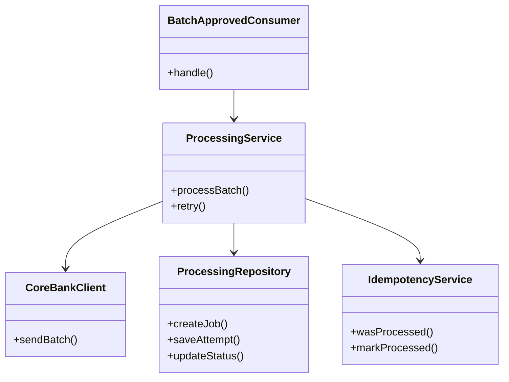
```mermaid
classDiagram
    class BatchApprovedConsumer {
        +handle()
    }

    class ProcessingService {
        +processBatch()
        +retry()
    }

    class CoreBankClient {
        +sendBatch()
    }

    class ProcessingRepository {
        +createJob()
        +saveAttempt()
        +updateStatus()
    }

    class IdempotencyService {
        +wasProcessed()
        +markProcessed()
    }

    BatchApprovedConsumer --> ProcessingService
    ProcessingService --> CoreBankClient
    ProcessingService --> ProcessingRepository
    ProcessingService --> IdempotencyService
```

---

# 32. UML de clases — Notification Service

```mermaid
classDiagram
    class BatchApprovedConsumer {
        +handle()
    }

    class NotificationService {
        +createNotifications()
        +sendPending()
        +retryFailed()
    }

    class EmailClient {
        +send()
    }

    class NotificationRepository {
        +saveNotification()
        +saveAttempt()
        +updateStatus()
    }

    BatchApprovedConsumer --> NotificationService
    NotificationService --> EmailClient
    NotificationService --> NotificationRepository
```

---

# 33. Diagrama UML de componentes

```mermaid
flowchart TB
    subgraph Client["Capa Cliente"]
        FE[Frontend Next.js]
    end

    subgraph Security["Identidad y Acceso"]
        IDP[Corporate OAuth / IdP]
        AUTH[Auth / Identity Service]
    end

    subgraph Edge["Acceso"]
        GW[API Gateway]
    end

    subgraph Business["Microservicios"]
        B[Transaction Batch Service]
        A[Approval Service]
        P[Processing Service]
        N[Notification Service]
    end

    subgraph Infrastructure["Infraestructura"]
        MQ[[RabbitMQ]]
        S3[(AWS S3)]
        LOG[(ELK Stack)]
    end

    subgraph External["Sistemas Externos"]
        CORE[Core Bancario]
        MAIL[Email Provider]
    end

    FE --> IDP
    FE --> AUTH
    FE --> GW

    AUTH --> IDP
    GW --> AUTH
    GW --> B
    GW --> A

    B --> S3
    A --> MQ
    MQ --> P
    MQ --> N

    P --> CORE
    N --> MAIL

    GW -.-> LOG
    AUTH -.-> LOG
    B -.-> LOG
    A -.-> LOG
    P -.-> LOG
    N -.-> LOG
```

---

# 34. Tecnologías seleccionadas

| Área | Tecnología propuesta | Justificación |
|---|---|---|
| Frontend | Next.js | Continúa la tecnología utilizada en P2 y permite mantener una interfaz web moderna |
| Backend | NestJS | Favorece modularidad, inyección de dependencias y continuidad con P2 |
| API Gateway | Kong | Permite routing, plugins de autenticación, rate limiting y observabilidad |
| Autenticación corporativa | OAuth 2.0 / proveedor corporativo | Requerimiento del escenario |
| Identidad, cuando el IdP la soporte | OpenID Connect | Complementa OAuth con identidad de usuario estandarizada |
| JWT interno | JWT firmado con RS256 | Solo Auth Service firma; los demás servicios verifican |
| Base de datos | PostgreSQL | Tecnología robusta y conocida; continuidad con P2 |
| ORM | Prisma | Continuidad con P2 y acceso tipado a PostgreSQL |
| Mensajería | RabbitMQ | Adecuado para colas, confirmaciones, reintentos y desacoplamiento |
| Archivos | AWS S3 | Separa archivos del almacenamiento relacional y facilita escalabilidad |
| Logging | ELK Stack | Centralización, búsqueda y visualización de logs |
| Correo | SMTP / proveedor externo | Permite desacoplar el envío de correo de la lógica interna |

---

# 35. Patrones arquitectónicos

## API Gateway Pattern

Un único punto de entrada hacia los microservicios.

## Database per Service

Cada servicio es propietario de su persistencia.

## Event-Driven Architecture

Los eventos permiten reaccionar a cambios sin dependencias síncronas innecesarias.

## Publish/Subscribe

`batch.approved` puede ser consumido por más de un servicio.

## Retry Pattern

Permite recuperarse de fallos temporales.

## Dead Letter Queue

Conserva mensajes que no pudieron procesarse después del límite de reintentos.

## Circuit Breaker

Protege frente a fallas continuas de servicios externos.

## Idempotent Consumer

Evita procesar accidentalmente el mismo evento dos veces.

## Correlation ID

Permite trazabilidad distribuida.

---

# 36. ADR-01 — Separación en cinco microservicios

## Problema

El sistema monolítico mezcla responsabilidades con perfiles de carga y fallos diferentes.

## Alternativas

- mantener un monolito;
- usar tres microservicios muy grandes;
- separar por capacidades de negocio.

## Decisión

Utilizar cinco servicios con responsabilidades independientes.

## Justificación

La división elegida evita tanto el monolito original como una sobrefragmentación excesiva.

Los límites siguen capacidades claras:

- identidad;
- lotes;
- aprobación;
- procesamiento;
- notificaciones.

---

# 37. ADR-02 — Base de datos independiente por servicio

## Decisión

Aplicar `Database per Service`.

## Justificación

Evita que un servicio modifique tablas que pertenecen a otro y permite que cada esquema evolucione independientemente.

## Compromiso

No existe una transacción SQL distribuida global; se acepta consistencia eventual en procesos asíncronos.

---

# 38. ADR-03 — RabbitMQ para procesos asíncronos

## Problema

Después de la aprobación se deben realizar tareas que dependen de sistemas externos.

## Alternativas

- REST directo;
- Kafka;
- RabbitMQ.

## Decisión

RabbitMQ.

## Justificación

El escenario requiere colas confiables, consumidores independientes, reintentos y DLQ, sin necesidad de incorporar la mayor complejidad de una plataforma de streaming.

## Compromiso

Se agrega infraestructura de mensajería que debe ser monitoreada.

---

# 39. ADR-04 — AWS S3 para archivos CSV

## Alternativas

- almacenar archivos en PostgreSQL;
- FTP;
- AWS S3.

## Decisión

AWS S3.

## Justificación

Los archivos no pertenecen naturalmente a una base de datos relacional. S3 permite almacenamiento independiente, descarga y crecimiento sin aumentar innecesariamente el tamaño de las bases de datos de negocio.

---

# 40. ADR-05 — Logging centralizado con Correlation ID

## Problema

Una sola transacción puede atravesar Gateway, lotes, aprobaciones, RabbitMQ, procesamiento y notificaciones.

## Decisión

Centralizar logs y propagar un `Correlation ID`.

## Justificación

Permite reconstruir el recorrido completo de una operación para auditoría y diagnóstico.

---

# 41. ADR-06 — Autenticación corporativa + autorización interna

## Problema

El proveedor corporativo conoce la identidad del usuario, pero no necesariamente conoce conceptos del dominio como Maker, Checker o Authorizer.

## Decisión

Separar autenticación corporativa de autorización interna.

```text
OAuth / IdP
    |
    v
Auth / Identity Service
    |
    v
JWT interno
```

## Justificación

El sistema mantiene su modelo de permisos sin acoplarlo al proveedor externo.

---

# 42. ADR-07 — Intercambio de OAuth por JWT interno

## Contexto

El sistema debe integrar OAuth corporativo con vigencia máxima de 12 horas y reutilizar el mecanismo JWT de la Práctica 2.

## Alternativas

### A. Utilizar el token OAuth directamente en todos los servicios

Desventajas:

- acoplamiento al IdP;
- dificultad para representar permisos internos;
- cada servicio depende de detalles externos.

### B. Gateway recibe OAuth y reenvía claims

Desventajas:

- el Gateway empieza a conocer demasiada lógica de dominio;
- los permisos internos siguen sin tener un emisor propio.

### C. Intercambiar OAuth por JWT interno

**Seleccionada.**

## Decisión

`Auth / Identity Service` valida el token corporativo y emite un JWT interno.

## Regla

```text
refreshUntil <= expiración corporativa
```

## Ventajas

- reutiliza el concepto de JWT de P2;
- reutiliza `refreshUntil`;
- permite roles y permisos internos;
- desacopla los microservicios del IdP;
- evita consultas al Auth Service en cada petición.

## Compromiso

Se agrega un paso de intercambio de token durante el inicio de sesión.

---

# 43. ADR-08 — Firma asimétrica del JWT

## Alternativas

- secreto compartido HS256;
- firma asimétrica RS256.

## Decisión

RS256.

## Justificación

Solo `Auth / Identity Service` posee la llave privada.

Los demás componentes reciben únicamente la llave pública.

Esto permite verificar tokens sin otorgar capacidad de emitirlos.

---

# 44. ADR-09 — Renovación centralizada del JWT interno

## Problema

En P2 el mismo monolito podía validar y renovar el JWT porque poseía el secreto.

En microservicios no es recomendable distribuir la capacidad de firma.

## Decisión

Mover la renovación a `Auth / Identity Service`.

## Justificación

Mantiene una única autoridad emisora de tokens y conserva el concepto de renovación automática de P2.

---

# 45. ADR-10 — Segregación Maker-Checker-Authorizer

## Decisión

Separar rol general de permiso operacional y validar que los tres participantes sean distintos para un mismo lote.

## Justificación

Refuerza la separación de funciones y evita que un mismo usuario controle todo el proceso.

---

# 46. Historial y descarga

`Transaction Batch Service` conserva el historial de lotes y la información necesaria para consultar sus transacciones.

El archivo original se conserva en S3 y puede descargarse mediante una operación controlada.

Flujo conceptual:

```text
Usuario
  |
  v
GET /batches/{id}/download
  |
  v
API Gateway
  |
  v
Transaction Batch Service
  |
  v
AWS S3
```

El servicio debe validar previamente que el usuario tenga autorización para consultar el lote.

---

# 47. Seguridad adicional

Además del JWT y los permisos se consideran:

- HTTPS en todas las comunicaciones;
- cookie `HTTP-only`;
- `Secure=true` en producción;
- `SameSite` según la topología final;
- secretos administrados fuera del código;
- llave privada disponible solamente para Auth Service;
- rotación de claves;
- principio de mínimo privilegio;
- validación de tamaño y tipo del CSV;
- protección contra cargas maliciosas;
- `rate limiting`;
- auditoría de acciones críticas.

---

# 48. Escalabilidad

La separación permite escalar de manera independiente los componentes con mayor demanda.

Ejemplo:

```text
Transaction Batch Service x4
Approval Service x2
Processing Service x5
Notification Service x3
```

No todos los servicios necesitan el mismo número de instancias.

RabbitMQ distribuye mensajes entre consumidores y el API Gateway distribuye solicitudes entre instancias disponibles.

---

# 49. Diagrama conceptual de escalamiento

```mermaid
flowchart LR
    GW[API Gateway]

    B1[Batch #1]
    B2[Batch #2]
    B3[Batch #3]

    A1[Approval #1]
    A2[Approval #2]

    MQ[[RabbitMQ]]

    P1[Processing #1]
    P2[Processing #2]
    P3[Processing #3]

    GW --> B1
    GW --> B2
    GW --> B3

    GW --> A1
    GW --> A2

    A1 --> MQ
    A2 --> MQ

    MQ --> P1
    MQ --> P2
    MQ --> P3
```

---

# 50. Trazabilidad de reglas del negocio

| Regla | Componente principal | Evidencia de diseño |
|---|---|---|
| CSV | Transaction Batch Service | Arquitectura, ER y secuencia de carga |
| Saldo disponible | BusinessRuleValidator | UML de clases |
| Límites | BusinessRuleValidator | UML de clases |
| Cuenta válida | BusinessRuleValidator | UML de clases |
| Prevención de fraude | BusinessRuleValidator | UML de clases |
| Maker | Approval Service | ER y secuencia |
| Checker | Approval Service | ER y secuencia |
| Authorizer | Approval Service | ER y secuencia |
| Usuarios distintos | Approval Service | Regla de segregación |
| Core externo | Processing Service | Secuencia Core |
| Correo después de aprobación | Notification Service | Evento `batch.approved` |
| Historial | Transaction Batch Service | ER Batch/Transaction |
| Descarga | Transaction Batch Service + S3 | Flujo de descarga |
| Logging | ELK | Diagrama de logging |
| Auditoría | Logs + ApprovalAction | ER y Correlation ID |

---

# 51. Matriz de decisiones arquitectónicas

| ID | Decisión | Selección | Motivo principal |
|---|---|---|---|
| ADR-01 | Separación de servicios | 5 microservicios | Separación clara de capacidades |
| ADR-02 | Persistencia | Database per Service | Reducir acoplamiento |
| ADR-03 | Mensajería | RabbitMQ | Colas, reintentos y DLQ |
| ADR-04 | Archivos | AWS S3 | Escalabilidad y separación |
| ADR-05 | Observabilidad | ELK + Correlation ID | Auditoría distribuida |
| ADR-06 | Identidad y permisos | OAuth + autorización interna | Separar responsabilidades |
| ADR-07 | Tokens | Exchange OAuth → JWT interno | Desacoplar IdP del dominio |
| ADR-08 | Firma JWT | RS256 | Solo Auth puede emitir |
| ADR-09 | Renovación | Centralizada en Auth Service | Evitar distribuir llave privada |
| ADR-10 | Aprobaciones | Maker/Checker/Authorizer separados | Segregación de funciones |

---

# 52. Relación con la Práctica 2

Los siguientes conceptos se conservan o evolucionan:

| Práctica 2 | Práctica 3 |
|---|---|
| NestJS monolítico | Microservicios NestJS |
| Next.js | Next.js |
| PostgreSQL | PostgreSQL independiente por servicio |
| Prisma | Prisma por servicio |
| JWT interno | JWT interno firmado asimétricamente |
| Cookie HTTP-only | Se conserva |
| `JwtAuthGuard` | Base para verificación en servicios |
| `UserRoleGuard` | Evoluciona hacia roles + permisos |
| `@Auth()` | Puede evolucionar a decoradores de permisos |
| `refreshUntil` | Se limita por la sesión OAuth de 12 h |
| JWT renovado por el monolito | Renovación centralizada en Auth Service |
| Admin / Cliente | Se conservan como roles generales |
| Sin Maker/Checker/Authorizer | Se agregan permisos operacionales |

La integración no consiste en copiar P2 sin cambios, sino en adaptar sus mecanismos al contexto distribuido.

---

# 53. Consideraciones sobre OAuth y OpenID Connect

El enunciado utiliza el término **OAuth corporativo** para autenticación.

En una implementación empresarial real, OAuth 2.0 puede complementarse con OpenID Connect cuando se necesita obtener identidad estandarizada del usuario.

Para efectos de esta arquitectura se conserva el término solicitado por el enunciado y se modela al proveedor externo como:

```text
Corporate OAuth / IdP
```

---

# 54. Conclusiones

La arquitectura propuesta transforma el problema monolítico en una solución distribuida organizada por capacidades de negocio.

La separación entre lotes, aprobaciones, procesamiento, notificaciones e identidad permite que cada responsabilidad tenga límites definidos y pueda evolucionar de forma independiente.

La integración con la Práctica 2 no se plantea como una copia del monolito anterior. Se reutilizan sus ideas principales —JWT, cookie HTTP-only, roles, guards y `refreshUntil`— y se adaptan al contexto de microservicios.

La decisión de intercambiar el token OAuth corporativo por un JWT interno permite diferenciar claramente identidad corporativa de autorización de dominio. Asimismo, la firma asimétrica evita distribuir la capacidad de emisión de tokens entre los microservicios.

RabbitMQ permite que el procesamiento bancario y el envío de correos ocurran sin bloquear el flujo de aprobación, mientras que S3 separa los archivos CSV de la persistencia relacional.

Finalmente, el logging centralizado, el `Correlation ID`, los reintentos, la DLQ y la idempotencia fortalecen la trazabilidad y la resiliencia necesarias para un sistema bancario de alta demanda.

---

# 55. Checklist de revisión

## Arquitectura

- [x] Arquitectura basada en microservicios.
- [x] API Gateway.
- [x] OAuth corporativo.
- [x] Integración con P2.
- [x] Core Bancario externo.
- [x] Almacenamiento CSV.
- [x] Logging centralizado.

## Microservicios

- [x] Auth / Identity Service.
- [x] Transaction Batch Service.
- [x] Approval Service.
- [x] Processing Service.
- [x] Notification Service.
- [x] Base de datos independiente por servicio.

## UML y datos

- [x] Diagrama de Arquitectura General.
- [x] Diagrama de Componentes.
- [x] ER de Auth / Identity.
- [x] ER de Transaction Batch.
- [x] ER de Approval.
- [x] ER de Processing.
- [x] ER de Notification.
- [x] UML de clases de cada servicio.
- [x] Secuencia de autenticación.
- [x] Secuencia de carga CSV.
- [x] Secuencia de aprobación.
- [x] Secuencia de Core Bancario.
- [x] Secuencia de notificación.

## Reglas de negocio

- [x] Saldo.
- [x] Límites.
- [x] Cuentas válidas.
- [x] Prevención de fraude.
- [x] Maker.
- [x] Checker.
- [x] Authorizer.
- [x] Usuarios distintos.
- [x] Historial.
- [x] Descarga.
- [x] Correo.
- [x] Auditoría.

## Decisiones técnicas

- [x] REST.
- [x] RabbitMQ.
- [x] S3.
- [x] ELK.
- [x] Correlation ID.
- [x] Retry.
- [x] DLQ.
- [x] Idempotencia.
- [x] RS256.
- [x] Renovación centralizada.
- [x] ADR documentados.

---

# 56. Nota para elaboración final de diagramas

Los diagramas Mermaid incluidos en este documento funcionan como modelo lógico y base de trabajo.

Para la versión final pueden reconstruirse en Lucidchart conservando:

- nombres;
- relaciones;
- dirección de las flechas;
- límites de cada microservicio;
- sistemas externos;
- bases de datos;
- protocolos y eventos principales.

Se recomienda exportarlos posteriormente en formato PNG o SVG y mantener los archivos editables de Lucidchart como respaldo.
