# Práctica 3 — Diseño de Arquitectura de Software

**Curso:** Software Avanzado  
**Práctica:** Práctica 3 — Diseño de Arquitectura  
**Estudiante:** Josué David Velásquez Ixchop  
**Carné:** 202307705  
**Semestre:** Segundo Semestre 2026  

---

# 1. Diagrama de Arquitectura General del sistema

## 1.1 Diagrama final

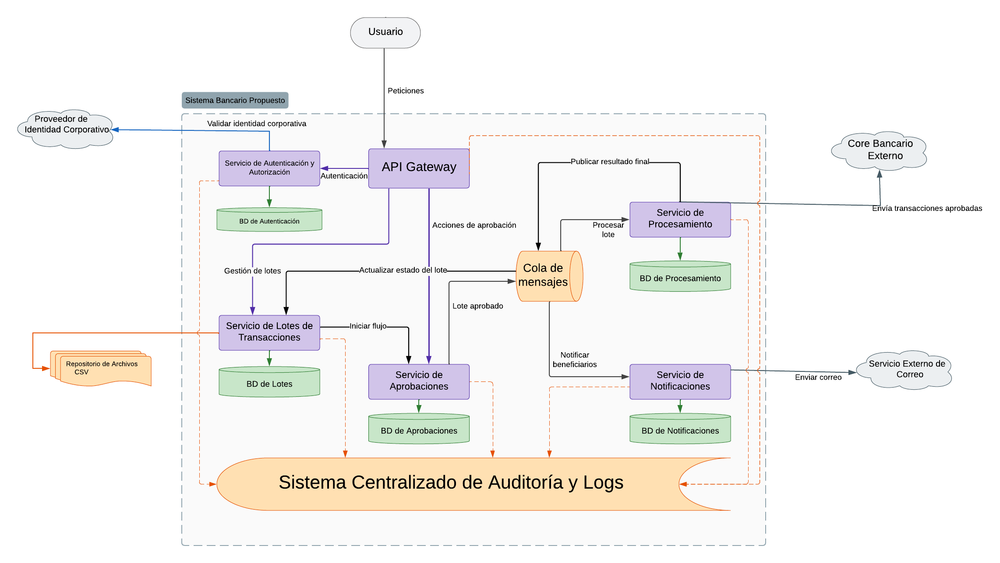

## 1.2 Descripción general del flujo

El flujo inicia cuando el usuario interactúa con la aplicación cliente.

Para autenticarse, la aplicación utiliza un proveedor de identidad corporativo. Una vez obtenida la credencial corporativa, esta es enviada al Servicio de Autenticación y Autorización, responsable de relacionar la identidad corporativa con los usuarios, roles y permisos internos del sistema.

Después de establecerse la sesión interna, las solicitudes autenticadas ingresan al sistema por medio del API Gateway, que funciona como punto de entrada hacia los servicios internos.

Las operaciones principales del usuario se dirigen hacia:

- el Servicio de Lotes de Transacciones, encargado de administrar la carga, validación, almacenamiento, consulta e historial de los lotes;
- el Servicio de Aprobaciones, encargado del flujo Maker-Checker-Authorizer.

Una vez que un lote ha sido validado correctamente, el Servicio de Lotes comunica que se encuentra listo para iniciar su proceso de aprobación.

Al completarse las tres etapas de aprobación, se genera el evento de lote aprobado. Este evento produce tres efectos principales:

1. actualizar el estado del lote;
2. iniciar el procesamiento hacia el Core Bancario externo;
3. iniciar la notificación a los clientes o beneficiarios.

El Servicio de Procesamiento se comunica con el Core Bancario externo y recibe el resultado de la operación. Posteriormente comunica si el lote fue procesado correctamente o si ocurrió un fallo, permitiendo que el Servicio de Lotes actualice su estado final y mantenga un historial completo.

Todos los servicios relevantes generan información de auditoría y trazabilidad hacia un sistema centralizado de logs.

## 1.3 Cierre del ciclo del lote

Una decisión importante del diseño es cerrar el ciclo completo del lote después de la respuesta del Core Bancario.

```text
Lote aprobado
      ↓
Servicio de Procesamiento
      ↓
Core Bancario Externo
      ↓
Resultado
      ↓
Servicio de Procesamiento
      ↓
Lote procesado / Lote fallido
      ↓
Bus de Eventos
      ↓
Servicio de Lotes
      ↓
Actualización del historial
```

Esto evita que el historial quede detenido en el estado de aprobación y permite representar el resultado real del procesamiento.

---

# 2. Uso e integración del servicio de autenticación de la Práctica 2

La Práctica 2 implementó un mecanismo de autenticación y autorización basado en JWT, cookie HTTP-only, renovación automática mediante `refreshUntil`, guards y autorización por roles.

La nueva arquitectura conserva esos principios, pero los adapta a un entorno distribuido y los integra con el servicio de autenticación OAuth corporativo solicitado en la práctica.

## 2.1 Decisión de integración

Se definen dos responsabilidades diferentes:

| Elemento | Responsabilidad |
|---|---|
| Servicio OAuth corporativo | Autenticar la identidad corporativa del usuario |
| Servicio de Autenticación y Autorización | Administrar identidad interna, roles, permisos y emitir el token interno |

El token corporativo no se utiliza directamente en cada microservicio.

Después de autenticarse corporativamente, la aplicación cliente entrega la credencial obtenida al Servicio de Autenticación y Autorización. Este servicio valida la identidad, localiza el usuario interno y genera un token interno con los permisos requeridos por el sistema.

## 2.2 Flujo de autenticación e intercambio

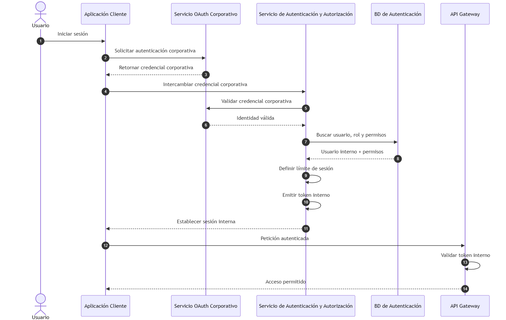
## 2.3 Reutilización de la Práctica 2

Se reutilizan conceptualmente:

- JWT como token interno;
- cookie HTTP-only para mantener el token del navegador;
- autorización por roles;
- guards;
- decoradores de autorización;
- concepto `refreshUntil`;
- diferencia entre `401 Unauthorized` y `403 Forbidden`.

## 2.4 Adaptación de `refreshUntil`

En P2, `refreshUntil` representaba el límite absoluto para renovar una sesión.

En P3 se utiliza para garantizar que la sesión interna nunca pueda superar la vigencia máxima del contexto corporativo.

El servicio de autenticación OAuth corporativo establece una vigencia máxima de 12 horas. Por lo tanto, la sesión interna y cualquier renovación del token interno nunca podrán superar ese límite.

```text
refreshUntil <= expiración de la sesión corporativa <= 12 horas
```

Una renovación del token interno no puede extender la sesión más allá de ese límite.

## 2.5 Renovación centralizada

En P2 el monolito podía validar y renovar el JWT.

En P3, la renovación queda centralizada en el Servicio de Autenticación y Autorización para evitar distribuir la capacidad de emisión de tokens entre todos los servicios.

## 2.6 Roles y permisos operacionales

Se conservan los roles generales existentes:

```text
Admin
Cliente
```

y se agregan permisos operacionales para el flujo bancario:

```text
Maker
Checker
Authorizer
```

El rol general y el permiso operacional representan conceptos diferentes.

---

# 3. Diseño de microservicios con separación adecuada de responsabilidades

La solución utiliza cinco servicios con límites de responsabilidad definidos.

## 3.1 Vista general

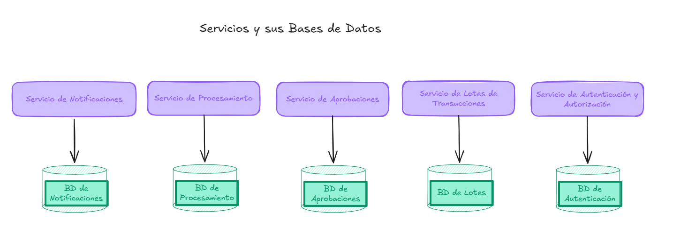
## 3.2 Servicio de Autenticación y Autorización

### Objetivo

Administrar la integración de identidad corporativa con los usuarios, roles y permisos internos.

### Responsabilidades

- validar la identidad corporativa;
- mapear el usuario corporativo con el usuario interno;
- administrar roles;
- administrar permisos operacionales;
- emitir y renovar tokens internos;
- controlar el límite máximo de la sesión.

### No es responsable de

- cargar CSV;
- aprobar lotes;
- procesar transacciones;
- enviar notificaciones.

---

## 3.3 Servicio de Lotes de Transacciones

### Objetivo

Administrar el ciclo de vida y el historial de los lotes.

### Responsabilidades

- carga de CSV;
- validación del archivo;
- registro de lotes;
- registro de transacciones;
- reglas de validación de negocio;
- relación con el archivo almacenado;
- historial;
- consulta;
- descarga;
- actualización del estado final del lote.

### Reglas de negocio

- saldo disponible;
- límites de transacción;
- cuentas válidas;
- prevención de fraude.

Justificación de diseño: La prevención de fraude y las reglas de negocio se evalúan estrictamente en el punto de ingesta (antes de iniciar el flujo de aprobación). Esto permite rechazar transacciones inválidas lo antes posible, evitando desperdiciar ciclos de revisión y aprobación humana en datos corruptos o maliciosos.

---

## 3.4 Servicio de Aprobaciones

### Objetivo

Gestionar exclusivamente el flujo Maker-Checker-Authorizer.

### Responsabilidades

- registrar cada etapa;
- validar el orden de aprobación;
- validar permisos;
- garantizar segregación de funciones;
- registrar rechazo;
- registrar aprobación;
- comunicar que un lote fue aprobado.

### No es responsable de

- validar reglas de negocio bancarias (saldos, fraude);
- enviar las transacciones al sistema externo;
- notificar a los clientes.

---

## 3.5 Servicio de Procesamiento

### Objetivo

Aislar la integración con el Core Bancario externo.

### Responsabilidades

- recibir lotes aprobados;
- enviar transacciones al Core;
- recibir respuestas;
- mantener intentos y estados;
- gestionar errores;
- comunicar el resultado final.

### No es responsable de

- decidir si un lote es válido o fraudulento;
- intervenir en las aprobaciones humanas;
- gestionar la comunicación con los clientes finales.


---

## 3.6 Servicio de Notificaciones

### Objetivo

Gestionar la comunicación con clientes y beneficiarios.

### Responsabilidades

- recibir el evento de lote aprobado;
- identificar destinatarios;
- generar notificaciones;
- enviar correos;
- registrar resultados y errores.

### No es responsable de

- interactuar con el Core Bancario;
- almacenar el historial financiero de los lotes;
- gestionar flujos de revisión.


---

## 3.7 Justificación de separación

Los servicios se dividen por capacidades de negocio y no únicamente por entidades.

Esto permite:

- reducir drásticamente el acoplamiento;  
- aislar fallos (si el servicio de correo cae, las transacciones se siguen procesando);
- escalar responsabilidades de forma independiente según la carga técnica requerida;
- mantener persistencia de datos independiente por dominio (Database per Service);
- evitar que una modificación futura en los canales de notificación afecte el procesamiento bancario directo;
- impedir que la lógica compleja de aprobación humana quede mezclada y acoplada con la ingesta y validación de archivos CSV.

---

# 4. Diagrama ER por cada microservicio

Cada microservicio mantiene su propia persistencia bajo el principio **Database per Service**.

Los identificadores pertenecientes a otros dominios se conservan como referencias externas, pero **no representan claves foráneas entre bases de datos distintas**.

El `Correlation ID` no se persiste como parte obligatoria de las entidades principales, ya que su función se concentra en la trazabilidad de solicitudes, eventos y logs distribuidos.

## 4.1 ER — Servicio de Autenticación y Autorización

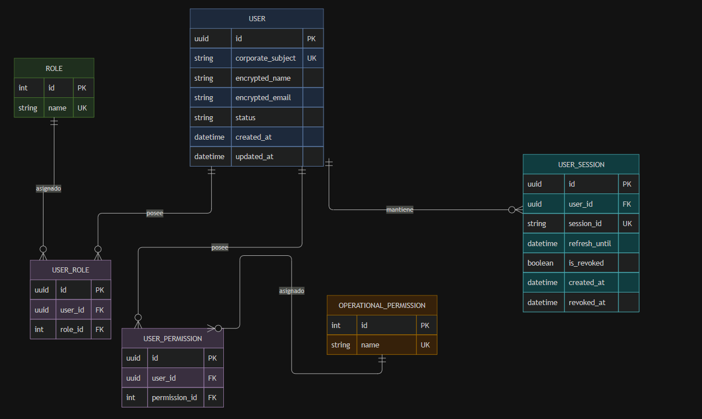

**Estados válidos de `USER.status`:**

* `ACTIVE`: usuario habilitado para operar.
* `SUSPENDED`: usuario temporalmente inhabilitado.

**Roles generales:**

* `ADMIN`
* `CLIENTE`

**Permisos operacionales:**

* `MAKER`
* `CHECKER`
* `AUTHORIZER`

La entidad `USER_SESSION` permite mantener el límite absoluto de sesión mediante `refresh_until` y bloquear futuras renovaciones mediante `is_revoked`, sin almacenar directamente el token JWT completo.

---

## 4.2 ER — Servicio de Lotes de Transacciones

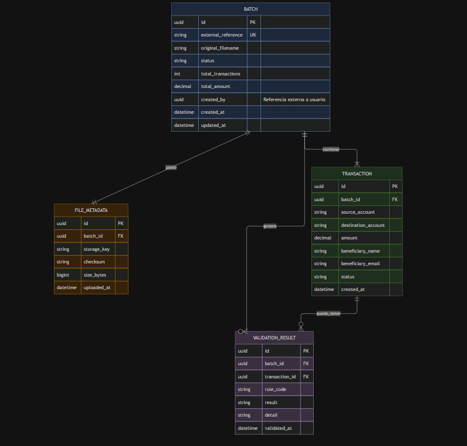

**Estados válidos de `BATCH.status`:**

* `PENDING`
* `VALIDATING`
* `INVALID`
* `PENDING_APPROVAL`
* `REJECTED`
* `APPROVED`
* `PROCESSING`
* `PROCESSED`
* `FAILED`

**Estados posibles de `TRANSACTION.status`:**

* `PENDING`
* `VALID`
* `INVALID`
* `PROCESSING`
* `PROCESSED`
* `FAILED`

El campo `created_by` representa una referencia externa al usuario que creó el lote, pero no establece una clave foránea hacia la base de datos del Servicio de Autenticación.

Los resultados de validación permiten registrar reglas como:

* saldo disponible;
* límite de transacción;
* cuenta válida;
* prevención de fraude;
* estructura del archivo CSV.

---

## 4.3 ER — Servicio de Aprobaciones

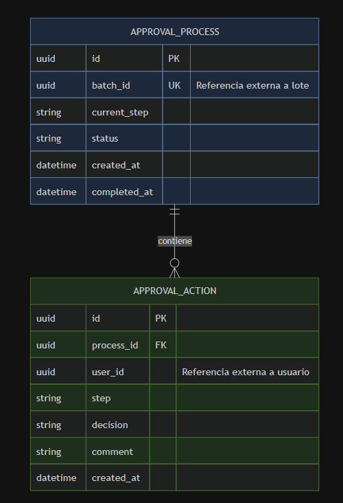

**Estados válidos de `APPROVAL_PROCESS.status`:**

* `PENDING`
* `APPROVED`
* `REJECTED`

**Valores de `current_step`:**

* `MAKER`
* `CHECKER`
* `AUTHORIZER`
* `COMPLETED`

**Valores de `APPROVAL_ACTION.step`:**

* `MAKER`
* `CHECKER`
* `AUTHORIZER`

**Valores de `APPROVAL_ACTION.decision`:**

* `SUBMITTED`
* `APPROVED`
* `REJECTED`

Los campos `batch_id` y `user_id` representan referencias externas a otros dominios, pero no establecen claves foráneas hacia bases de datos de otros microservicios.

La información almacenada permite verificar posteriormente que Maker, Checker y Authorizer hayan sido usuarios diferentes para un mismo lote.

---

## 4.4 ER — Servicio de Procesamiento

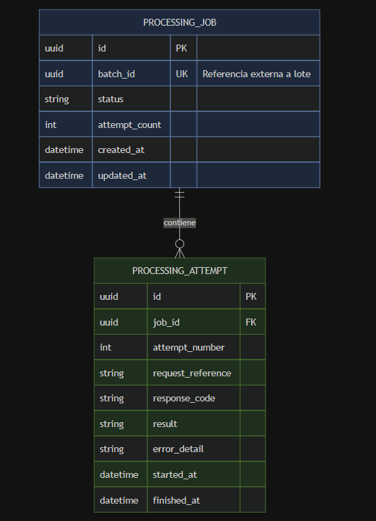

**Estados válidos de `PROCESSING_JOB.status`:**

* `PENDING`
* `PROCESSING`
* `COMPLETED`
* `REJECTED`
* `RETRY_PENDING`
* `FAILED`

Los estados permiten diferenciar distintos resultados del procesamiento:

* `COMPLETED`: el Core Bancario aceptó correctamente el procesamiento.
* `REJECTED`: el Core Bancario respondió, pero rechazó la operación.
* `RETRY_PENDING`: ocurrió un fallo temporal y el procesamiento debe reintentarse.
* `FAILED`: ocurrió un fallo técnico definitivo después de los intentos permitidos.

La entidad `PROCESSING_ATTEMPT` permite conservar el historial de cada intento realizado hacia el Core Bancario.

---

## 4.5 ER — Servicio de Notificaciones

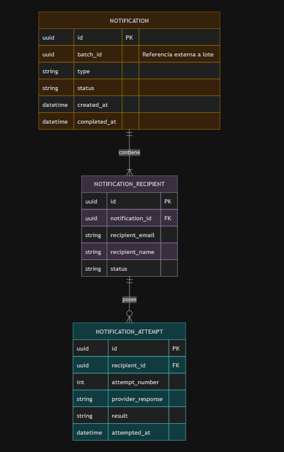

**Estados válidos de `NOTIFICATION.status`:**

* `PENDING`
* `PROCESSING`
* `SENT`
* `PARTIAL`
* `FAILED`

**Estados válidos de `NOTIFICATION_RECIPIENT.status`:**

* `PENDING`
* `SENT`
* `RETRY_PENDING`
* `FAILED`

El estado `PARTIAL` permite representar casos donde una parte de los beneficiarios recibió correctamente la notificación y otra parte presentó errores.

Los campos `recipient_name` y `recipient_email` se almacenan intencionalmente dentro del Servicio de Notificaciones como una copia controlada de la información necesaria para el envío.

Esta desnormalización permite que el servicio mantenga autonomía sobre sus propios datos y evita depender continuamente del Servicio de Lotes durante el proceso de notificación.

---

# 5. Diagrama de clases UML por cada microservicio

## 5.1 UML — Servicio de Autenticación y Autorización

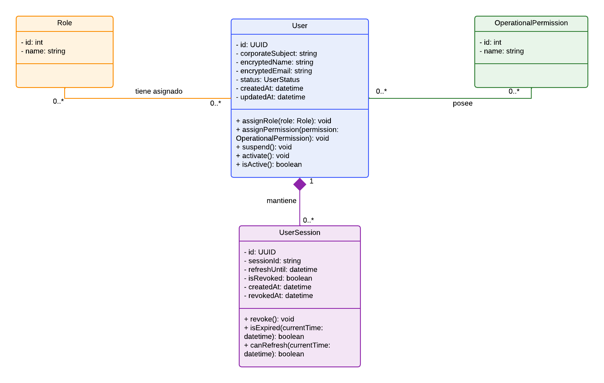

### Responsabilidades del modelo

`User` representa al usuario interno relacionado con una identidad corporativa.

Los roles generales definidos inicialmente son:

```text
ADMIN
CLIENTE
```

Los permisos operacionales son:

```text
MAKER
CHECKER
AUTHORIZER
```

`UserSession` representa una sesión interna y mantiene el límite absoluto de renovación mediante `refreshUntil`.

No almacena el JWT completo. La sesión se identifica mediante `sessionId`.

La relación entre `User` y `UserSession` se modela mediante composición debido a que una sesión no tiene sentido dentro del dominio sin un usuario propietario.

`Role` y `OperationalPermission`, en cambio, existen independientemente y pueden ser utilizados por diferentes usuarios, por lo que se representan mediante asociaciones.

---

## 5.2 UML — Servicio de Lotes de Transacciones

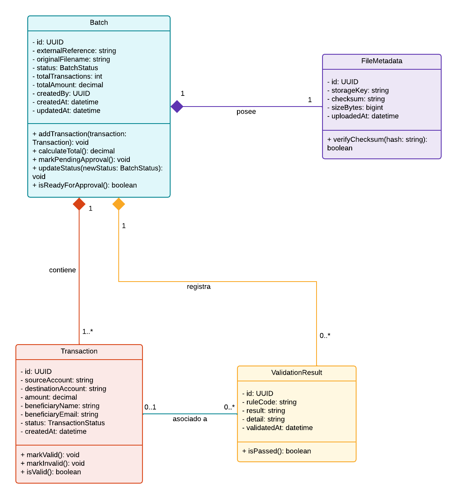

### Responsabilidades del modelo

`Batch` funciona como la entidad principal del agregado y representa un lote completo de transacciones.

Su responsabilidad no consiste en decidir si el lote es aprobado o rechazado por un usuario. Esa lógica pertenece al Servicio de Aprobaciones.

Por esta razón no se incluyen métodos como:

```text
approve()
reject()
```

En cambio, el lote puede modificar su estado cuando recibe el resultado correspondiente del proceso.

`Transaction` representa cada operación contenida dentro del archivo.

`FileMetadata` conserva la información necesaria para localizar y verificar el archivo asociado al lote.

`ValidationResult` registra el resultado de las diferentes reglas de validación.

Puede representar validaciones generales del lote o validaciones asociadas a una transacción específica.

Las principales reglas consideradas son:

```text
AVAILABLE_BALANCE
TRANSACTION_LIMIT
VALID_ACCOUNT
FRAUD_PREVENTION
CSV_STRUCTURE
```

---

## 5.3 UML — Servicio de Aprobaciones

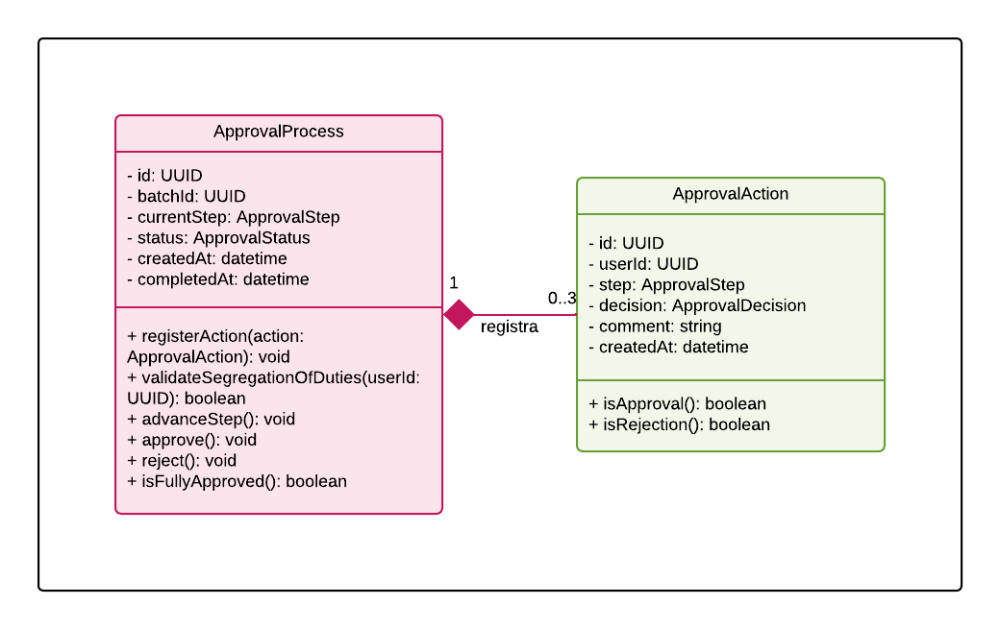

### Responsabilidades del modelo

`ApprovalProcess` representa el flujo completo de aprobación asociado a un lote.

El atributo:

```text
batchId
```

es una referencia externa al identificador del lote administrado por el Servicio de Lotes y no representa una relación directa entre bases de datos.

`ApprovalProcess` controla:

```text
MAKER
  ↓
CHECKER
  ↓
AUTHORIZER
```

y aplica la regla de segregación de funciones.

Para un mismo lote:

```text
Maker != Checker
Maker != Authorizer
Checker != Authorizer
```

`ApprovalAction` registra cada acción realizada durante el proceso.

Los pasos válidos son:

```text
MAKER
CHECKER
AUTHORIZER
```

Las decisiones son:

```text
SUBMITTED
APPROVED
REJECTED
```

La relación se representa mediante composición debido a que una acción de aprobación no tiene sentido fuera de su proceso correspondiente.

Se utiliza una multiplicidad:

```text
0..3
```

porque un proceso recién creado puede no tener todavía ninguna acción y puede registrar como máximo una acción principal por cada una de las tres etapas definidas.

---

## 5.4 UML — Servicio de Procesamiento

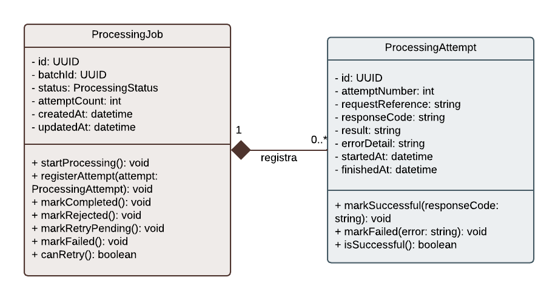

### Responsabilidades del modelo

`ProcessingJob` representa el procesamiento de un lote previamente aprobado.

El atributo:

```text
batchId
```

es una referencia externa al Servicio de Lotes.

Los posibles estados del procesamiento son:

```text
PENDING
PROCESSING
COMPLETED
REJECTED
RETRY_PENDING
FAILED
```

La diferencia entre los resultados es importante:

* `COMPLETED`: el Core Bancario aceptó el procesamiento;
* `REJECTED`: el Core respondió correctamente, pero rechazó la operación;
* `RETRY_PENDING`: ocurrió un fallo temporal y se permite otro intento;
* `FAILED`: ocurrió un fallo técnico definitivo.

`ProcessingAttempt` registra cada intento de comunicación con el Core Bancario.

La relación utiliza:

```text
0..*
```

porque un `ProcessingJob` puede existir antes de que se realice el primer intento.

La composición permite conservar el historial completo de intentos asociados a un mismo procesamiento.

---

## 5.5 UML — Servicio de Notificaciones

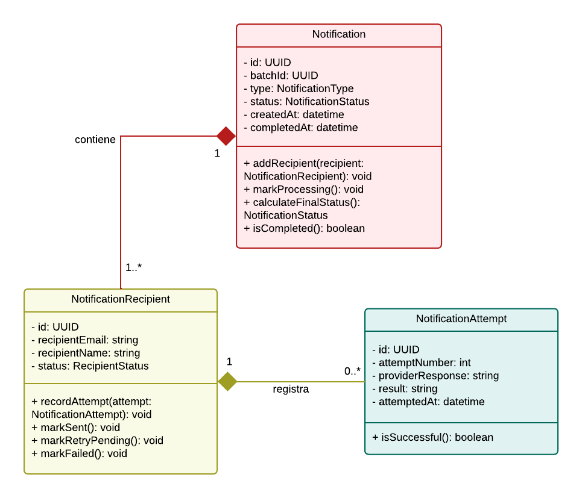

### Responsabilidades del modelo

`Notification` representa el proceso de notificación asociado a un lote aprobado.

El atributo:

```text
batchId
```

es una referencia externa hacia el lote correspondiente.

Una notificación contiene uno o más destinatarios.

Los posibles estados generales son:

```text
PENDING
PROCESSING
SENT
PARTIAL
FAILED
```

El estado:

```text
PARTIAL
```

permite representar situaciones donde algunos beneficiarios recibieron correctamente la notificación y otros presentaron errores.

Cada `NotificationRecipient` mantiene su propio estado:

```text
PENDING
SENT
RETRY_PENDING
FAILED
```

La información:

```text
recipientName
recipientEmail
```

se conserva dentro de este microservicio como una copia controlada de los datos necesarios para efectuar y auditar el envío.

Esto evita una dependencia permanente hacia el Servicio de Lotes.

`NotificationAttempt` registra cada intento realizado para un destinatario.

La relación entre destinatario e intentos se representa como:

```text
0..*
```

porque un destinatario puede existir antes de realizarse su primer intento de envío.

---

# 6. Diagramas de secuencia UML para los flujos críticos

Los siguientes diagramas representan los tres flujos críticos solicitados:

1. aprobación de transacciones mediante Maker-Checker-Authorizer;
2. envío de transacciones aprobadas al Core Bancario;
3. notificación a clientes o beneficiarios.

El identificador de trazabilidad (`Correlation ID`) se propaga en las solicitudes y en los eventos internos. Para mantener los diagramas legibles, no se muestra como parámetro en cada mensaje, pero forma parte del contexto de cada operación.

---

## 6.1 Secuencia UML — Aprobación de transacciones de tres pasos

El proceso de aprobación debe cumplir el esquema:

```text
Maker
  ↓
Checker
  ↓
Authorizer
````

Cada etapa debe ser realizada por un usuario distinto.

Si el Checker o el Authorizer rechazan el lote, el resultado debe comunicarse al Servicio de Lotes para actualizar su estado e historial.

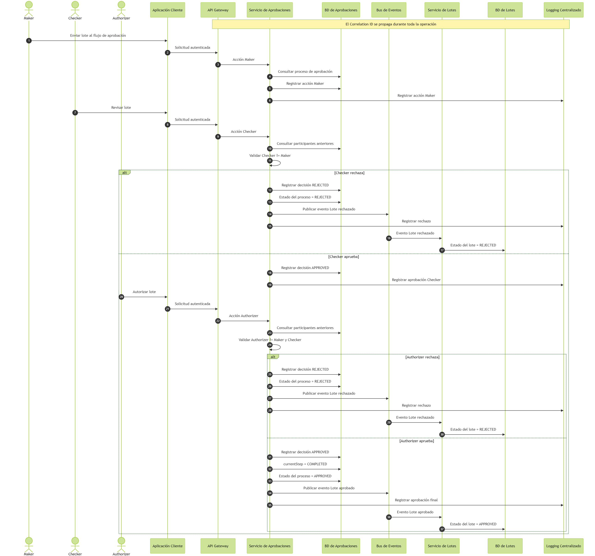


### Resultado del flujo

Un lote únicamente se considera aprobado cuando:

```text
Maker registrado
        +
Checker aprobado
        +
Authorizer aprobado
```

Además:

```text
Maker != Checker
Maker != Authorizer
Checker != Authorizer
```

Si Checker o Authorizer rechazan el lote, se genera el evento:

```text
Lote rechazado
```

que permite actualizar el historial administrado por el Servicio de Lotes.

---

## 6.2 Secuencia UML — Envío al sistema Core Bancario

El Servicio de Procesamiento inicia su trabajo cuando recibe el evento `Lote aprobado`.

Antes de enviar las transacciones al Core Bancario se verifica si el lote ya fue procesado previamente. Esta validación permite evitar que un evento duplicado provoque el envío de las mismas transacciones más de una vez.

También se contempla un mecanismo de reintento para errores técnicos temporales. Si después de los intentos permitidos el Core continúa sin estar disponible, el procesamiento se marca como fallido.

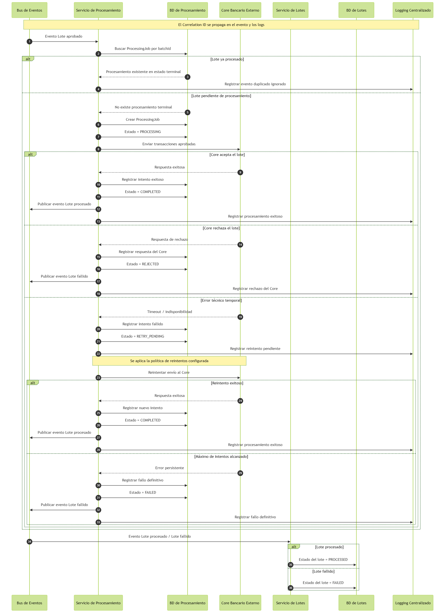

### Idempotencia

Antes de realizar cualquier envío hacia el Core Bancario, el Servicio de Procesamiento consulta si ya existe un procesamiento asociado al `batchId`.

El atributo:

```text
PROCESSING_JOB.batch_id
```

se mantiene único dentro del Servicio de Procesamiento.

Esto permite detectar eventos duplicados y evitar que un mismo lote sea enviado nuevamente al Core Bancario después de haber alcanzado un estado terminal.

### Manejo de resultados

El procesamiento puede finalizar de las siguientes formas:

```text
COMPLETED
→ El Core Bancario recibió y aceptó correctamente el lote.

REJECTED
→ El Core Bancario respondió correctamente, pero rechazó la operación.

RETRY_PENDING
→ Ocurrió un error técnico temporal y se realizará un nuevo intento.

FAILED
→ Se agotaron los intentos permitidos sin completar el procesamiento.
```

Cuando el procesamiento finaliza, el resultado se comunica mediante el Bus de Eventos al Servicio de Lotes.

De esta manera se cierra el ciclo:

```text
Lote aprobado
      ↓
Servicio de Procesamiento
      ↓
Core Bancario
      ↓
Resultado
      ↓
Lote procesado / Lote fallido
      ↓
Bus de Eventos
      ↓
Servicio de Lotes
      ↓
PROCESSED / FAILED
```

Esto garantiza que el historial administrado por el Servicio de Lotes refleje el resultado final de la operación.

---

## 6.3 Secuencia UML — Notificación a clientes o beneficiarios

El Servicio de Notificaciones comienza su operación al recibir el evento:

```text
Lote aprobado
```

El envío de correos se realiza de forma independiente al procesamiento bancario.

De esta manera, un problema temporal en el servicio de correo no bloquea la aprobación ni el envío del lote al Core Bancario.

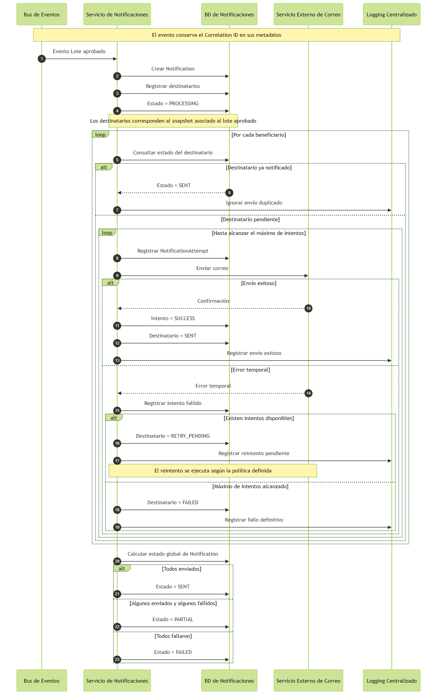

El mensaje enviado a cada cliente o beneficiario debe informar que su transacción ha sido aprobada y se encuentra **en proceso**, cumpliendo con la notificación requerida después del tercer paso de aprobación.

### Estados finales

El estado general de una notificación puede ser:

```text
PENDING
PROCESSING
SENT
PARTIAL
FAILED
```

Mientras que cada destinatario puede encontrarse en:

```text
PENDING
SENT
RETRY_PENDING
FAILED
```

Esto permite representar correctamente un lote con múltiples beneficiarios.

Por ejemplo:

```text
100 beneficiarios

98 enviados correctamente
2 fallidos

Estado general:
PARTIAL
```


---

# 7. Diagrama de componentes UML


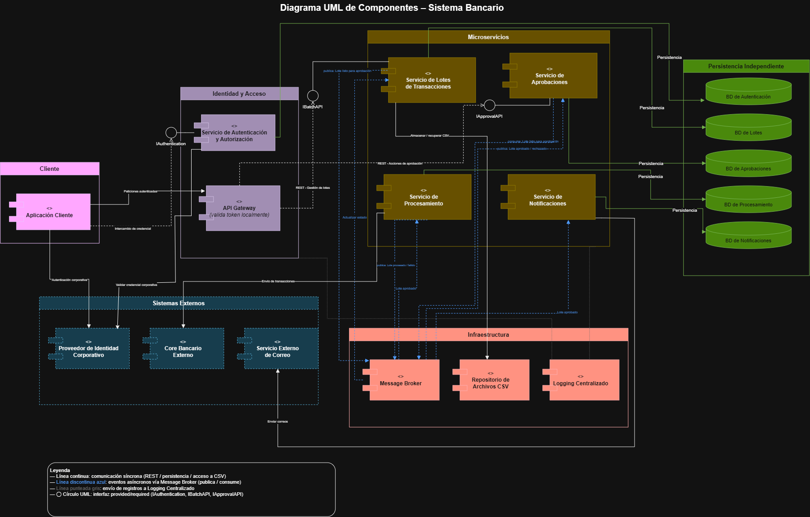


---

# 8. Definición y documentación del flujo de aprobación de 3 pasos

El sistema utiliza el esquema Maker-Checker-Authorizer para separar la preparación, revisión y autorización final de un lote.

El flujo de aprobación no se crea directamente por una acción del Maker. Primero, el Servicio de Lotes valida el archivo y, cuando el lote cumple las reglas de negocio, publica el evento:

```text
Lote listo para aprobación
```

El Servicio de Aprobaciones consume este evento, crea el `ApprovalProcess` correspondiente y deja el proceso preparado en la etapa `MAKER`.

---

## 8.1 Inicio del proceso de aprobación

El inicio del flujo ocurre después de que el Servicio de Lotes completa satisfactoriamente las validaciones del lote.

```text
Servicio de Lotes
        ↓
Lote listo para aprobación
        ↓
Message Broker
        ↓
Servicio de Aprobaciones
        ↓
Crear ApprovalProcess
        ↓
currentStep = MAKER
status = PENDING
```

Esta decisión mantiene separadas las responsabilidades:

- el Servicio de Lotes determina si el lote es válido;
- el Servicio de Aprobaciones administra quién participa en cada etapa y en qué orden.

---

## 8.2 Maker

El Maker realiza la primera acción humana dentro del proceso de aprobación.

Su responsabilidad es presentar o confirmar el lote para que continúe hacia la etapa de revisión.

Después de registrar correctamente la acción del Maker:

```text
currentStep = CHECKER
```

El usuario que actúa como Maker no puede participar posteriormente como Checker ni como Authorizer del mismo lote.

---

## 8.3 Checker

El Checker revisa el lote después de la acción del Maker.

Puede:

- aprobar y permitir que el proceso continúe hacia el Authorizer;
- rechazar el lote indicando el motivo correspondiente.

Debe ser un usuario diferente al Maker.

Si aprueba:

```text
currentStep = AUTHORIZER
```

Si rechaza:

```text
APPROVAL_PROCESS.status = REJECTED
```

y se publica el evento:

```text
Lote rechazado
```

para que el Servicio de Lotes actualice el estado e historial del lote.

---

## 8.4 Authorizer

El Authorizer realiza la decisión final del flujo de aprobación.

Debe ser un usuario diferente al Maker y al Checker.

Puede:

- aprobar definitivamente el lote;
- rechazarlo.

Si rechaza, el proceso se marca como `REJECTED` y se publica el evento `Lote rechazado`.

Si aprueba:

```text
currentStep = COMPLETED
APPROVAL_PROCESS.status = APPROVED
```

y se publica el evento:

```text
Lote aprobado
```

Este evento permite:

- actualizar el estado del lote;
- iniciar el procesamiento hacia el Core Bancario;
- iniciar el proceso de notificación a clientes o beneficiarios.

---

## 8.5 Regla de segregación de funciones

Para un mismo lote debe cumplirse:

```text
Maker != Checker
Maker != Authorizer
Checker != Authorizer
```

La validación se realiza antes de registrar las acciones de Checker y Authorizer.

Esta regla impide que un mismo usuario controle todas las etapas de aprobación de una operación.

---

## 8.6 Diagrama conceptual del flujo

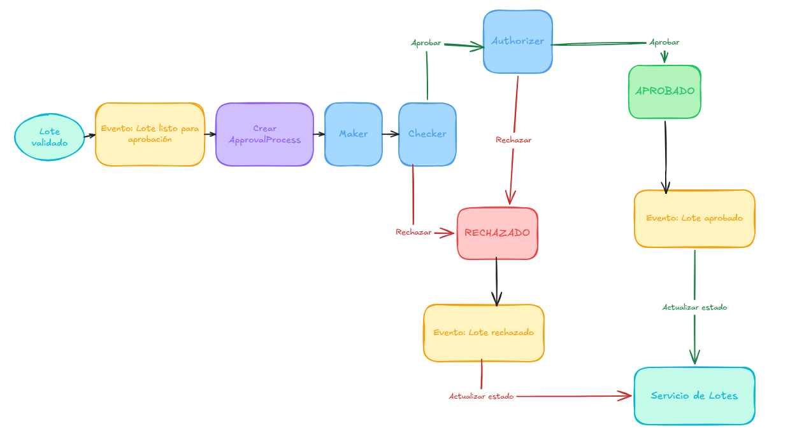

---

## 8.7 Información registrada

Por cada acción del flujo de aprobación se conserva en el dominio de Aprobaciones:

- identificador del proceso;
- referencia externa del lote;
- identificador externo del usuario;
- etapa;
- decisión;
- fecha y hora;
- observación o motivo cuando corresponda.

Adicionalmente, el `Correlation ID` de la operación se propaga en las solicitudes, eventos y registros de auditoría para mantener trazabilidad distribuida.

El `Correlation ID` no se considera una relación de negocio ni una clave foránea entre microservicios.

---

# 9. Diseño de la estrategia de almacenamiento de archivos CSV

Los archivos CSV se almacenan fuera de la base de datos relacional del Servicio de Lotes.

La base de datos conserva únicamente los metadatos necesarios para relacionar cada lote con el archivo original almacenado externamente.

La estrategia propuesta busca:

- evitar almacenar archivos binarios o completos dentro de la base relacional;
- conservar el archivo original asociado al lote;
- permitir descarga posterior;
- mantener trazabilidad e integridad mediante checksum;
- controlar el acceso desde el Servicio de Lotes.

---

## 9.1 Flujo propuesto

El archivo original se conserva incluso cuando posteriormente alguna validación de negocio falla. Esto permite mantener evidencia del archivo recibido y facilita auditoría.

Antes de almacenarlo se realizan validaciones iniciales de seguridad y estructura mínima necesarias para aceptar la carga.

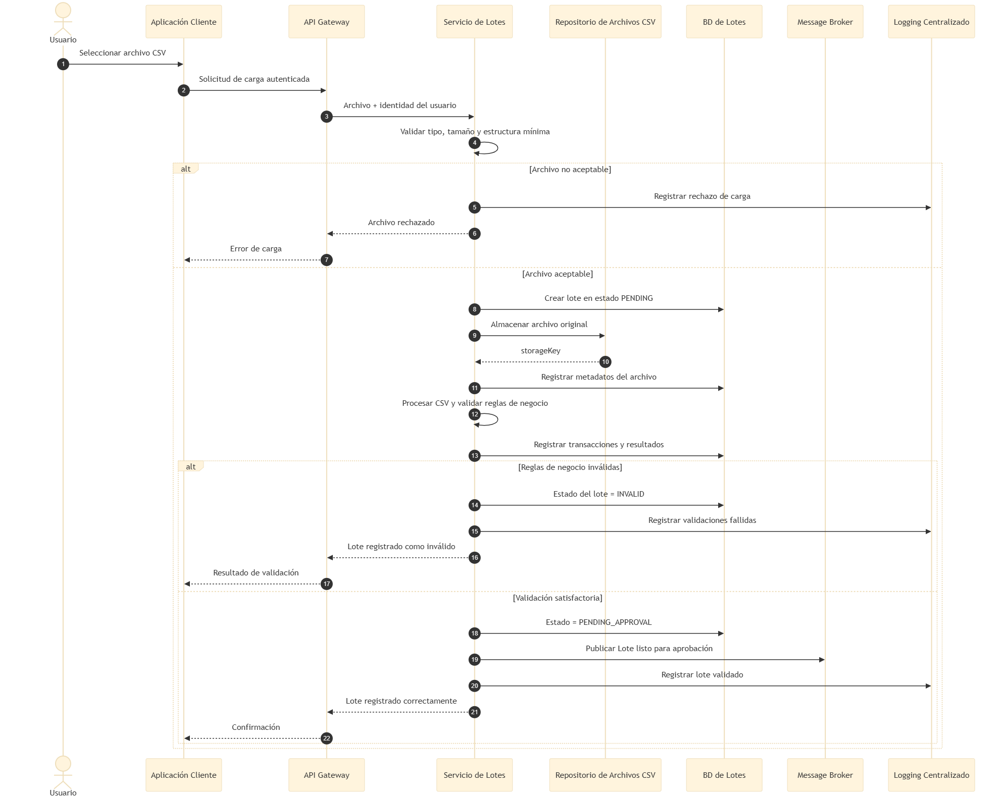
---

## 9.2 Metadatos del archivo

Se propone conservar:

```text
id
batch_id
original_name
storage_key
checksum
size_bytes
uploaded_at
uploaded_by
```

El `storage_key` permite localizar el objeto dentro del repositorio sin almacenar el archivo completo en la base de datos.

El `checksum` permite comprobar posteriormente que el archivo recuperado corresponde al archivo originalmente almacenado.

---

## 9.3 Estructura lógica del almacenamiento

Una organización conceptual puede ser:

```text
batches/
  {batchId}/
    original.csv
```

La aplicación no expone directamente la ubicación física del repositorio al usuario.

El Servicio de Lotes conserva la referencia y controla quién puede solicitar el archivo.

---

## 9.4 Descarga de archivos

El flujo de descarga será:

```text
Usuario
  ↓
Aplicación Cliente
  ↓
API Gateway
  ↓
Servicio de Lotes
  ↓
Validación de autorización
  ↓
Repositorio de Archivos CSV
```

El Servicio de Lotes valida previamente que el usuario tenga autorización para consultar el lote.

La descarga puede realizarse a través del propio servicio o mediante un enlace temporal controlado generado después de validar la autorización.

---

## 9.5 Decisión tecnológica


Para esta propuesta se selecciona:

```text
AWS S3
```

como implementación del `Repositorio de Archivos CSV`.


Ventajas:

- almacenamiento independiente de las bases de datos;
- crecimiento sin modificar el esquema relacional;
- acceso controlado;
- identificación individual de cada archivo mediante una clave;
- facilidad para conservar archivos históricos.

### Decisión

Se propone AWS S3 porque se ajusta naturalmente al almacenamiento de archivos CSV independientes de la persistencia transaccional y facilita su recuperación controlada.

El modelo arquitectónico continúa utilizando el nombre genérico `Repositorio de Archivos CSV`; AWS S3 representa únicamente la tecnología propuesta para implementarlo.

---

# 10. Diseño de la estrategia de logging centralizado

Todos los componentes relevantes generan logs estructurados y los envían a un sistema centralizado.

La estrategia busca resolver un problema propio de las arquitecturas distribuidas: una sola operación puede atravesar múltiples servicios y eventos antes de finalizar.

El logging centralizado permite reconstruir ese recorrido sin depender de revisar manualmente los logs individuales de cada componente.


## 10.1 Componentes que generan logs

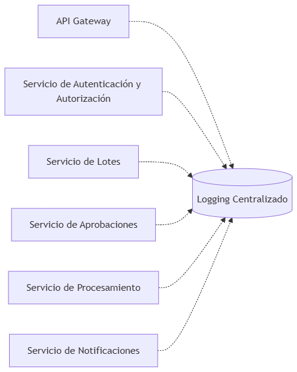


## 10.2 Tipos de registro

Se distinguen dos categorías principales.

### Logs técnicos

Permiten diagnosticar la ejecución del sistema.

Ejemplos:

- inicio y finalización de operaciones;
- errores;
- timeouts;
- fallos de comunicación;
- reintentos;
- consumo de eventos;
- respuestas de sistemas externos.

### Registros de auditoría

Permiten conocer quién realizó una acción relevante sobre el negocio.

Ejemplos:

- usuario que cargó un lote;
- Maker que presentó el lote;
- Checker que aprobó o rechazó;
- Authorizer que aprobó o rechazó;
- cambio de estado del lote;
- envío al Core Bancario;
- resultado del procesamiento.

Los registros de auditoría no sustituyen las entidades de dominio como `ApprovalAction`; ambos mecanismos se complementan.

---

## 10.3 Campos 

```text
timestamp
level
service
correlationId
eventId
userId
action
batchId
transactionId
result
errorCode
message
```

Los campos se incluyen únicamente cuando corresponden a la operación registrada.

No se deben registrar en texto claro:

- contraseñas;
- tokens completos;
- llaves privadas;
- secretos;
- información sensible innecesaria.

---

## 10.4 Correlation ID

El API Gateway genera o propaga un identificador de trazabilidad para las operaciones iniciadas mediante una petición del usuario.

```text
Correlation ID
```

Este identificador acompaña la operación en:

- llamadas síncronas;
- mensajes y eventos;
- procesamiento;
- notificaciones;
- logs.

Cuando un servicio publica un evento como consecuencia de una operación existente, conserva el `Correlation ID` dentro de los metadatos del mensaje.

El `batchId` identifica permanentemente al lote dentro del negocio, mientras que el `Correlation ID` identifica una cadena concreta de ejecución distribuida. Por ello ambos conceptos no deben confundirse.

---

## 10.5 Tecnología propuesta

Se propone:

```text
ELK Stack
```

compuesto por:

```text
Elasticsearch
Logstash
Kibana
```

La elección se justifica porque permite:

- centralizar logs procedentes de varios servicios;
- indexar registros;
- buscar operaciones por `correlationId`, `batchId` o servicio;
- consultar errores;
- construir vistas para auditoría y diagnóstico.

En el Diagrama de Arquitectura General y en el Diagrama de Componentes se conserva el nombre conceptual `Logging Centralizado`; ELK Stack representa la implementación propuesta.

---

# 11. Explicación de la comunicación entre servicios

La arquitectura utiliza un enfoque híbrido.

Se utiliza comunicación síncrona cuando el usuario necesita una respuesta inmediata y mensajería asíncrona cuando una operación puede continuar mediante eventos sin bloquear el flujo original.

---

## 11.1 Comunicación síncrona

La comunicación síncrona se utiliza principalmente para las operaciones iniciadas directamente por el usuario:

```text
Aplicación Cliente
      ↓
API Gateway
      ↓
Servicio responsable
```

Las principales comunicaciones son:

```text
API Gateway → Servicio de Lotes
API Gateway → Servicio de Aprobaciones
```

Ejemplos:

- cargar un lote;
- consultar lotes;
- consultar historial;
- consultar contenido;
- descargar archivo;
- realizar acción Maker;
- realizar acción Checker;
- realizar acción Authorizer;
- rechazar una aprobación.

Se propone utilizar:

```text
REST sobre HTTPS
```

para estas interacciones.

El flujo de autenticación corporativa se maneja separadamente entre la Aplicación Cliente, el Proveedor de Identidad Corporativo y el Servicio de Autenticación y Autorización.

---

## 11.2 Comunicación asíncrona

Los eventos del negocio se transmiten mediante el Message Broker.

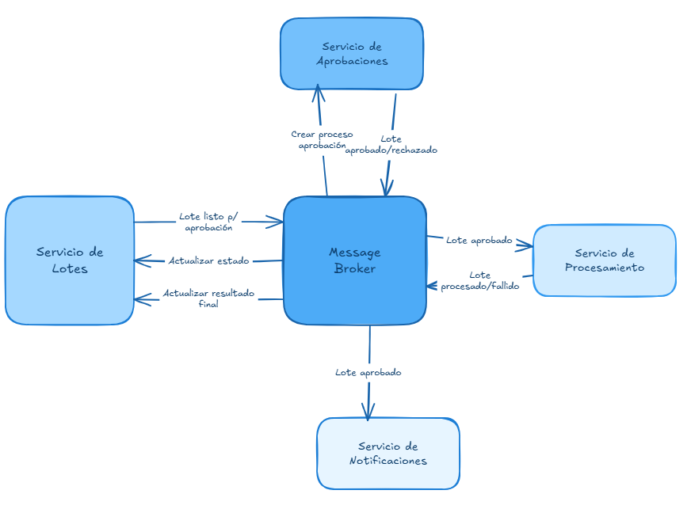

### Eventos principales

```text
Lote listo para aprobación
Lote aprobado
Lote rechazado
Lote procesado
Lote fallido
```

---

## 11.3 Comunicación con sistemas externos

El Servicio de Procesamiento se comunica directamente con:

```text
Core Bancario Externo
```

para enviar las transacciones aprobadas y recibir el resultado.

El Servicio de Notificaciones se comunica directamente con:

```text
Servicio Externo de Correo
```

para realizar los envíos.

Estas integraciones son responsabilidad exclusiva de sus respectivos servicios.

---

## 11.4 Tecnología de mensajería propuesta

Se propone:

```text
RabbitMQ
```

como implementación del `Message Broker`.

### Justificación

El escenario requiere:

- productores y consumidores independientes;
- entrega de mensajes a distintos servicios;
- confirmación de procesamiento;
- reintentos;
- manejo de mensajes fallidos;
- desacoplamiento entre aprobación, procesamiento y notificación.

Para eventos consumidos por más de un servicio, cada consumidor debe disponer de su propia cola lógica vinculada al evento correspondiente.

Por ejemplo, el evento:

```text
Lote aprobado
```

debe poder ser recibido independientemente por:

```text
Servicio de Lotes
Servicio de Procesamiento
Servicio de Notificaciones
```

sin que el consumo realizado por uno impida que los demás reciban el evento.

---

## 11.5 Manejo de fallos

La estrategia contempla:

- reintentos controlados;
- Dead Letter Queue;
- idempotencia de consumidores;
- identificadores únicos de evento;
- registro centralizado de errores.

### Reintentos

Los fallos temporales pueden reintentarse hasta un límite configurado.

Ejemplos:

```text
timeout del Core Bancario
indisponibilidad temporal del proveedor de correo
```

### Dead Letter Queue

Cuando un mensaje supera el máximo de intentos permitidos, se envía a una cola de mensajes fallidos para evitar ciclos infinitos y pérdida silenciosa de operaciones.

### Idempotencia

Los consumidores deben poder reconocer un evento ya procesado.

En particular, el Servicio de Procesamiento consulta el procesamiento asociado al `batchId` antes de enviar nuevamente el lote al Core Bancario.

Esto reduce el riesgo de ejecutar dos veces una operación debido a la entrega duplicada de un evento.

---

## 11.6 Consistencia entre servicios

Cada microservicio modifica únicamente su propia persistencia.

Por ejemplo, el Servicio de Procesamiento no actualiza directamente la BD de Lotes.

En su lugar:

```text
Servicio de Procesamiento
        ↓
Lote procesado / Lote fallido
        ↓
Message Broker
        ↓
Servicio de Lotes
        ↓
BD de Lotes
```

Esta estrategia mantiene el patrón `Database per Service` y utiliza consistencia eventual cuando un estado debe propagarse entre dominios.

---

# 12. Propuesta de API Gateway

El API Gateway funciona como punto de entrada para las operaciones de negocio expuestas por los microservicios al cliente.

Su objetivo es evitar que la aplicación cliente conozca o acceda directamente a las direcciones internas de los servicios.

---

## 12.1 Responsabilidades

El API Gateway será responsable de:

- recibir peticiones autenticadas;
- validar el token interno;
- verificar información básica de acceso incluida en el token;
- enrutar solicitudes;
- generar o propagar el `Correlation ID`;
- aplicar políticas de seguridad;
- aplicar límites de solicitudes;
- registrar accesos;
- ocultar las ubicaciones internas de los microservicios.

El Gateway no contiene reglas de negocio relacionadas con:

- validación de lotes;
- Maker-Checker-Authorizer;
- procesamiento bancario;
- notificaciones.

Estas responsabilidades permanecen dentro de los microservicios correspondientes.

---

## 12.2 Validación stateless del token

El API Gateway no consulta al Servicio de Autenticación y Autorización en cada petición.

La validación del token interno se realiza localmente utilizando la información necesaria para verificar su autenticidad y vigencia.

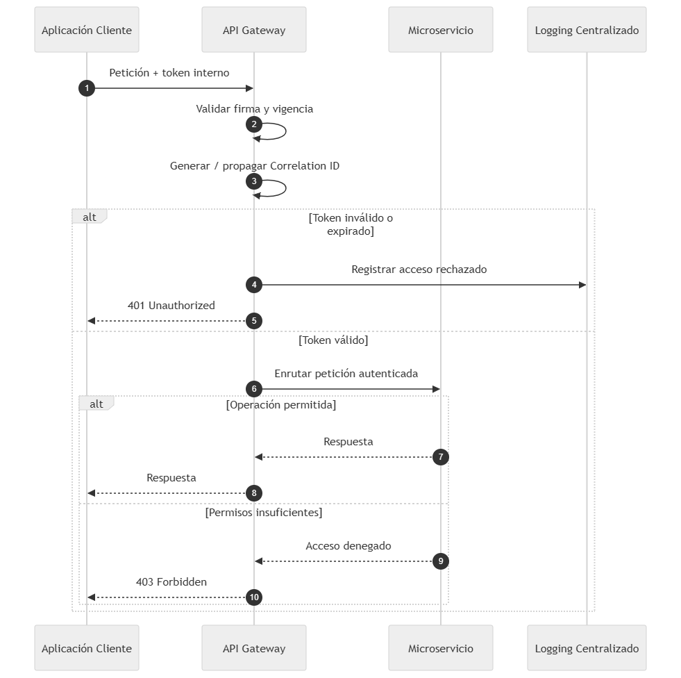

La renovación o emisión de nuevos tokens permanece bajo responsabilidad exclusiva del Servicio de Autenticación y Autorización.

---

## 12.3 Servicios expuestos a través del Gateway

El flujo principal del usuario utiliza el Gateway para acceder a:

```text
Servicio de Lotes de Transacciones
Servicio de Aprobaciones
```

Ejemplos conceptuales de rutas:

```text
/batches/*
/approvals/*
```

El Servicio de Procesamiento y el Servicio de Notificaciones no se exponen como parte del flujo principal del usuario.

Estos servicios reaccionan principalmente al evento:

```text
Lote aprobado
```

mediante el Message Broker.

El historial general del lote se consulta a través del Servicio de Lotes, que recibe mediante eventos las actualizaciones generadas por Aprobaciones y Procesamiento.

El intercambio inicial de la credencial corporativa con el Servicio de Autenticación y Autorización pertenece al flujo de identidad definido en el apartado correspondiente y no requiere que el Gateway consulte al servicio de autenticación en cada petición posterior.

---

## 12.4 Flujo conceptual de enrutamiento

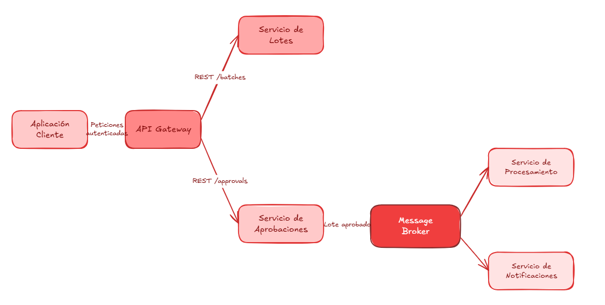

Esto permite distinguir claramente entre:

```text
Servicios invocados directamente por el usuario
→ Lotes y Aprobaciones
```

y:

```text
Servicios reactivos a eventos
→ Procesamiento y Notificaciones
```

---

## 12.5 Políticas propuestas

### Rate limiting

El Gateway puede limitar la cantidad de solicitudes permitidas por usuario, cliente o intervalo de tiempo.

Esto protege los servicios internos frente a cargas excesivas o comportamientos anómalos.

### Trazabilidad

Cada solicitud recibe o conserva un:

```text
Correlation ID
```

que se propaga hacia el servicio destino y posteriormente hacia los eventos generados.

### Manejo de errores

El Gateway devuelve respuestas HTTP consistentes para errores de entrada y acceso.

Ejemplos:

```text
400 Bad Request
401 Unauthorized
403 Forbidden
404 Not Found
429 Too Many Requests
500 Internal Server Error
```

Los errores propios del dominio son definidos por el servicio responsable y propagados de forma controlada.

---

## 12.6 Tecnología propuesta

Se propone:

```text
Kong Gateway
```

como implementación del API Gateway.

### Justificación

La tecnología seleccionada debe cubrir principalmente:

- routing;
- validación de autenticación;
- rate limiting;
- políticas de acceso;
- logging;
- extensibilidad;
- observabilidad.

Kong se propone porque permite centralizar estas responsabilidades sin trasladar reglas de negocio al Gateway.

En los diagramas arquitectónicos se conserva el nombre genérico:

```text
API Gateway
```

mientras que Kong representa únicamente la implementación tecnológica propuesta.

---

## 12.7 Límites de responsabilidad

El API Gateway puede decidir:

```text
¿La petición posee un token válido?
¿A qué servicio debe dirigirse?
¿Debe aplicarse una política de límite de solicitudes?
```

pero no debe decidir:

```text
¿El lote tiene saldo suficiente?
¿Checker puede aprobar este lote?
¿El Core debe aceptar la transacción?
¿Debe reintentarse un correo?
```

Estas decisiones pertenecen a los microservicios responsables del dominio.


## 12.8 Resumen de tecnologías y patrones arquitectónicos

Las tecnologías y patrones seleccionados responden a las necesidades específicas de la arquitectura propuesta.

| Elemento | Tecnología / Patrón | Justificación |
|---|---|---|
| API Gateway | Kong Gateway / API Gateway Pattern | Centraliza el acceso, routing, validación del token, rate limiting y trazabilidad sin incorporar reglas de negocio |
| Comunicación asíncrona | RabbitMQ / Event-Driven Architecture | Desacopla aprobaciones, procesamiento y notificaciones |
| Distribución de eventos | Publish/Subscribe | Permite que un mismo evento, como `Lote aprobado`, sea consumido independientemente por varios servicios |
| Persistencia | Database per Service | Garantiza autonomía de datos y evita acoplamiento entre microservicios |
| Archivos CSV | AWS S3 | Separa los archivos de la persistencia relacional y facilita almacenamiento y recuperación controlada |
| Logging | ELK Stack | Centraliza, indexa y permite consultar los registros distribuidos |
| Fallos temporales | Retry Pattern | Permite recuperarse de errores transitorios en sistemas externos |
| Mensajes fallidos | Dead Letter Queue | Evita pérdida de mensajes y ciclos infinitos de reintentos |
| Eventos duplicados | Idempotent Consumer | Evita que un mismo lote sea procesado más de una vez |
| Trazabilidad | Correlation ID | Permite reconstruir una operación a través de múltiples servicios y eventos |

Estas decisiones buscan mantener una arquitectura escalable, desacoplada, auditable y resistente a fallos.