# Práctica 3 — Diseño de Arquitectura de Software

**Curso:** Software Avanzado  
**Práctica:** Práctica 3 — Diseño de Arquitectura  
**Estudiante:** Josué David Velásquez Ixchop  
**Carné:** 202307705  
**Semestre:** Segundo Semestre 2026  

---

## Introducción

La institución bancaria cuenta actualmente con un sistema monolítico para el procesamiento de transacciones. En períodos de alta demanda, como fin de mes, pagos masivos de planillas corporativas o temporadas de impuestos, este enfoque puede convertirse en un punto de saturación debido a que múltiples responsabilidades se ejecutan dentro de una misma solución.

La propuesta consiste en diseñar una arquitectura basada en microservicios que permita separar responsabilidades, reducir el acoplamiento y facilitar la evolución independiente de las distintas capacidades del sistema.

El diseño contempla el proceso completo de carga y validación de lotes de transacciones, el flujo de aprobación de tres pasos Maker-Checker-Authorizer, la integración con el sistema Core Bancario externo, la notificación a clientes o beneficiarios, el almacenamiento de archivos CSV, la autenticación y autorización, así como la trazabilidad y auditoría de las operaciones.

La solución también aprovecha el trabajo desarrollado en la Práctica 2 para la gestión de autenticación, sesiones, roles y permisos, adaptándolo al nuevo contexto distribuido.

A lo largo de este documento, cada apartado corresponde directamente con uno de los elementos solicitados en el alcance de la práctica. Los diagramas Mermaid incluidos funcionan como **referencia lógica para su elaboración final en Lucidchart**.

---

# 1. Diagrama de Arquitectura General del sistema

## 1.1 Diagrama final


## 1.2 Descripción general del flujo

El flujo inicia cuando el usuario interactúa con la aplicación cliente.

Para autenticarse, la aplicación utiliza un proveedor de identidad corporativo. Una vez obtenida la credencial corporativa, esta es enviada al Servicio de Autenticación y Autorización, responsable de relacionar la identidad corporativa con los usuarios, roles y permisos internos del sistema.

Después de establecerse la sesión interna, las solicitudes autenticadas ingresan al sistema por medio del API Gateway, que funciona como punto de entrada hacia los servicios internos.

Las operaciones principales del usuario se dirigen hacia:

- el Servicio de Lotes de Transacciones, encargado de administrar la carga, validación, almacenamiento, consulta e historial de los lotes;
- el Servicio de Aprobaciones, encargado del flujo Maker-Checker-Authorizer.

Una vez que un lote ha sido validado correctamente, el Servicio de Lotes comunica que se encuentra listo para iniciar su proceso de aprobación.

Al completarse las tres etapas de aprobación, se genera el evento de lote aprobado. Este evento produce tres efectos principales:

1. actualizar el estado del lote;
2. iniciar el procesamiento hacia el Core Bancario externo;
3. iniciar la notificación a los clientes o beneficiarios.

El Servicio de Procesamiento se comunica con el Core Bancario externo y recibe el resultado de la operación. Posteriormente comunica si el lote fue procesado correctamente o si ocurrió un fallo, permitiendo que el Servicio de Lotes actualice su estado final y mantenga un historial completo.

Todos los servicios relevantes generan información de auditoría y trazabilidad hacia un sistema centralizado de logs.

## 1.3 Cierre del ciclo del lote

Una decisión importante del diseño es cerrar el ciclo completo del lote después de la respuesta del Core Bancario.

```text
Lote aprobado
      ↓
Servicio de Procesamiento
      ↓
Core Bancario Externo
      ↓
Resultado
      ↓
Servicio de Procesamiento
      ↓
Lote procesado / Lote fallido
      ↓
Bus de Eventos
      ↓
Servicio de Lotes
      ↓
Actualización del historial
```

Esto evita que el historial quede detenido en el estado de aprobación y permite representar el resultado real del procesamiento.

---

# 2. Uso e integración del servicio de autenticación de la Práctica 2

La Práctica 2 implementó un mecanismo de autenticación y autorización basado en JWT, cookie HTTP-only, renovación automática mediante `refreshUntil`, guards y autorización por roles.

La nueva arquitectura conserva esos principios, pero los adapta a un entorno distribuido y los integra con el servicio de autenticación OAuth corporativo solicitado en la práctica.

## 2.1 Decisión de integración

Se definen dos responsabilidades diferentes:

| Elemento | Responsabilidad |
|---|---|
| Servicio OAuth corporativo | Autenticar la identidad corporativa del usuario |
| Servicio de Autenticación y Autorización | Administrar identidad interna, roles, permisos y emitir el token interno |

El token corporativo no se utiliza directamente en cada microservicio.

Después de autenticarse corporativamente, la aplicación cliente entrega la credencial obtenida al Servicio de Autenticación y Autorización. Este servicio valida la identidad, localiza el usuario interno y genera un token interno con los permisos requeridos por el sistema.

## 2.2 Flujo de autenticación e intercambio


## 2.3 Reutilización de la Práctica 2

Se reutilizan conceptualmente:

- JWT como token interno;
- cookie HTTP-only para mantener el token del navegador;
- autorización por roles;
- guards;
- decoradores de autorización;
- concepto `refreshUntil`;
- diferencia entre `401 Unauthorized` y `403 Forbidden`.

## 2.4 Adaptación de `refreshUntil`

En P2, `refreshUntil` representaba el límite absoluto para renovar una sesión.

En P3 se utiliza para garantizar que la sesión interna nunca pueda superar la vigencia máxima del contexto corporativo.

```text
refreshUntil <= expiración de la sesión corporativa
```

Una renovación del token interno no puede extender la sesión más allá de ese límite.

## 2.5 Renovación centralizada

En P2 el monolito podía validar y renovar el JWT.

En P3, la renovación queda centralizada en el Servicio de Autenticación y Autorización para evitar distribuir la capacidad de emisión de tokens entre todos los servicios.

## 2.6 Roles y permisos operacionales

Se conservan los roles generales existentes:

```text
Admin
Cliente
```

y se agregan permisos operacionales para el flujo bancario:

```text
Maker
Checker
Authorizer
```

El rol general y el permiso operacional representan conceptos diferentes.

---

# 3. Diseño de microservicios con separación adecuada de responsabilidades

La solución utiliza cinco servicios con límites de responsabilidad definidos.

## 3.1 Vista general


## 3.2 Servicio de Autenticación y Autorización

### Objetivo

Administrar la integración de identidad corporativa con los usuarios, roles y permisos internos.

### Responsabilidades

- validar la identidad corporativa;
- mapear el usuario corporativo con el usuario interno;
- administrar roles;
- administrar permisos operacionales;
- emitir y renovar tokens internos;
- controlar el límite máximo de la sesión.

### No es responsable de

- cargar CSV;
- aprobar lotes;
- procesar transacciones;
- enviar notificaciones.

---

## 3.3 Servicio de Lotes de Transacciones

### Objetivo

Administrar el ciclo de vida y el historial de los lotes.

### Responsabilidades

- carga de CSV;
- validación del archivo;
- registro de lotes;
- registro de transacciones;
- reglas de validación de negocio;
- relación con el archivo almacenado;
- historial;
- consulta;
- descarga;
- actualización del estado final del lote.

### Reglas de negocio

- saldo disponible;
- límites de transacción;
- cuentas válidas;
- prevención de fraude.

Justificación de diseño: La prevención de fraude y las reglas de negocio se evalúan estrictamente en el punto de ingesta (antes de iniciar el flujo de aprobación). Esto permite rechazar transacciones inválidas lo antes posible, evitando desperdiciar ciclos de revisión y aprobación humana en datos corruptos o maliciosos.

---

## 3.4 Servicio de Aprobaciones

### Objetivo

Gestionar exclusivamente el flujo Maker-Checker-Authorizer.

### Responsabilidades

- registrar cada etapa;
- validar el orden de aprobación;
- validar permisos;
- garantizar segregación de funciones;
- registrar rechazo;
- registrar aprobación;
- comunicar que un lote fue aprobado.

### No es responsable de

- validar reglas de negocio bancarias (saldos, fraude);
- enviar las transacciones al sistema externo;
- notificar a los clientes.

---

## 3.5 Servicio de Procesamiento

### Objetivo

Aislar la integración con el Core Bancario externo.

### Responsabilidades

- recibir lotes aprobados;
- enviar transacciones al Core;
- recibir respuestas;
- mantener intentos y estados;
- gestionar errores;
- comunicar el resultado final.

### No es responsable de

- decidir si un lote es válido o fraudulento;
- intervenir en las aprobaciones humanas;
- gestionar la comunicación con los clientes finales.


---

## 3.6 Servicio de Notificaciones

### Objetivo

Gestionar la comunicación con clientes y beneficiarios.

### Responsabilidades

- recibir el evento de lote aprobado;
- identificar destinatarios;
- generar notificaciones;
- enviar correos;
- registrar resultados y errores.

### No es responsable de

- interactuar con el Core Bancario;
- almacenar el historial financiero de los lotes;
- gestionar flujos de revisión.


---

## 3.7 Justificación de separación

Los servicios se dividen por capacidades de negocio y no únicamente por entidades.

Esto permite:

- reducir drásticamente el acoplamiento;  
- aislar fallos (si el servicio de correo cae, las transacciones se siguen procesando);
- escalar responsabilidades de forma independiente según la carga técnica requerida;
- mantener persistencia de datos independiente por dominio (Database per Service);
- evitar que una modificación futura en los canales de notificación afecte el procesamiento bancario directo;
- impedir que la lógica compleja de aprobación humana quede mezclada y acoplada con la ingesta y validación de archivos CSV.

---

# 4. Diagrama ER por cada microservicio

Cada microservicio mantiene su propia persistencia bajo el principio **Database per Service**.

Los identificadores pertenecientes a otros dominios se conservan como referencias externas, pero **no representan claves foráneas entre bases de datos distintas**.

El `Correlation ID` no se persiste como parte obligatoria de las entidades principales, ya que su función se concentra en la trazabilidad de solicitudes, eventos y logs distribuidos.

## 4.1 ER — Servicio de Autenticación y Autorización


**Estados válidos de `USER.status`:**

* `ACTIVE`: usuario habilitado para operar.
* `SUSPENDED`: usuario temporalmente inhabilitado.

**Roles generales:**

* `ADMIN`
* `CLIENTE`

**Permisos operacionales:**

* `MAKER`
* `CHECKER`
* `AUTHORIZER`

La entidad `USER_SESSION` permite mantener el límite absoluto de sesión mediante `refresh_until` y bloquear futuras renovaciones mediante `is_revoked`, sin almacenar directamente el token JWT completo.

---

## 4.2 ER — Servicio de Lotes de Transacciones


**Estados válidos de `BATCH.status`:**

* `PENDING`
* `VALIDATING`
* `INVALID`
* `PENDING_APPROVAL`
* `REJECTED`
* `APPROVED`
* `PROCESSING`
* `PROCESSED`
* `FAILED`

**Estados posibles de `TRANSACTION.status`:**

* `PENDING`
* `VALID`
* `INVALID`
* `PROCESSING`
* `PROCESSED`
* `FAILED`

El campo `created_by` representa una referencia externa al usuario que creó el lote, pero no establece una clave foránea hacia la base de datos del Servicio de Autenticación.

Los resultados de validación permiten registrar reglas como:

* saldo disponible;
* límite de transacción;
* cuenta válida;
* prevención de fraude;
* estructura del archivo CSV.

---

## 4.3 ER — Servicio de Aprobaciones


**Estados válidos de `APPROVAL_PROCESS.status`:**

* `PENDING`
* `APPROVED`
* `REJECTED`

**Valores de `current_step`:**

* `MAKER`
* `CHECKER`
* `AUTHORIZER`
* `COMPLETED`

**Valores de `APPROVAL_ACTION.step`:**

* `MAKER`
* `CHECKER`
* `AUTHORIZER`

**Valores de `APPROVAL_ACTION.decision`:**

* `SUBMITTED`
* `APPROVED`
* `REJECTED`

Los campos `batch_id` y `user_id` representan referencias externas a otros dominios, pero no establecen claves foráneas hacia bases de datos de otros microservicios.

La información almacenada permite verificar posteriormente que Maker, Checker y Authorizer hayan sido usuarios diferentes para un mismo lote.

---

## 4.4 ER — Servicio de Procesamiento


**Estados válidos de `PROCESSING_JOB.status`:**

* `PENDING`
* `PROCESSING`
* `COMPLETED`
* `REJECTED`
* `RETRY_PENDING`
* `FAILED`

Los estados permiten diferenciar distintos resultados del procesamiento:

* `COMPLETED`: el Core Bancario aceptó correctamente el procesamiento.
* `REJECTED`: el Core Bancario respondió, pero rechazó la operación.
* `RETRY_PENDING`: ocurrió un fallo temporal y el procesamiento debe reintentarse.
* `FAILED`: ocurrió un fallo técnico definitivo después de los intentos permitidos.

La entidad `PROCESSING_ATTEMPT` permite conservar el historial de cada intento realizado hacia el Core Bancario.

---

## 4.5 ER — Servicio de Notificaciones


**Estados válidos de `NOTIFICATION.status`:**

* `PENDING`
* `PROCESSING`
* `SENT`
* `PARTIAL`
* `FAILED`

**Estados válidos de `NOTIFICATION_RECIPIENT.status`:**

* `PENDING`
* `SENT`
* `RETRY_PENDING`
* `FAILED`

El estado `PARTIAL` permite representar casos donde una parte de los beneficiarios recibió correctamente la notificación y otra parte presentó errores.

Los campos `recipient_name` y `recipient_email` se almacenan intencionalmente dentro del Servicio de Notificaciones como una copia controlada de la información necesaria para el envío.

Esta desnormalización permite que el servicio mantenga autonomía sobre sus propios datos y evita depender continuamente del Servicio de Lotes durante el proceso de notificación.

---

# 5. Diagrama de clases UML por cada microservicio

## 5.1 UML — Servicio de Autenticación y Autorización

```mermaid
classDiagram

    class User {
        -id: UUID
        -corporateSubject: string
        -encryptedName: string
        -encryptedEmail: string
        -status: UserStatus
        -createdAt: datetime
        -updatedAt: datetime

        +assignRole(role: Role): void
        +assignPermission(permission: OperationalPermission): void
        +suspend(): void
        +activate(): void
        +isActive(): boolean
    }

    class Role {
        -id: int
        -name: string
    }

    class OperationalPermission {
        -id: int
        -name: string
    }

    class UserSession {
        -id: UUID
        -sessionId: string
        -refreshUntil: datetime
        -isRevoked: boolean
        -createdAt: datetime
        -revokedAt: datetime

        +revoke(): void
        +isExpired(currentTime: datetime): boolean
        +canRefresh(currentTime: datetime): boolean
    }

    User "0..*" -- "0..*" Role : tiene asignado

    User "0..*" -- "0..*" OperationalPermission : posee

    User "1" *-- "0..*" UserSession : mantiene
````

### Responsabilidades del modelo

`User` representa al usuario interno relacionado con una identidad corporativa.

Los roles generales definidos inicialmente son:

```text
ADMIN
CLIENTE
```

Los permisos operacionales son:

```text
MAKER
CHECKER
AUTHORIZER
```

`UserSession` representa una sesión interna y mantiene el límite absoluto de renovación mediante `refreshUntil`.

No almacena el JWT completo. La sesión se identifica mediante `sessionId`.

La relación entre `User` y `UserSession` se modela mediante composición debido a que una sesión no tiene sentido dentro del dominio sin un usuario propietario.

`Role` y `OperationalPermission`, en cambio, existen independientemente y pueden ser utilizados por diferentes usuarios, por lo que se representan mediante asociaciones.

---

## 5.2 UML — Servicio de Lotes de Transacciones

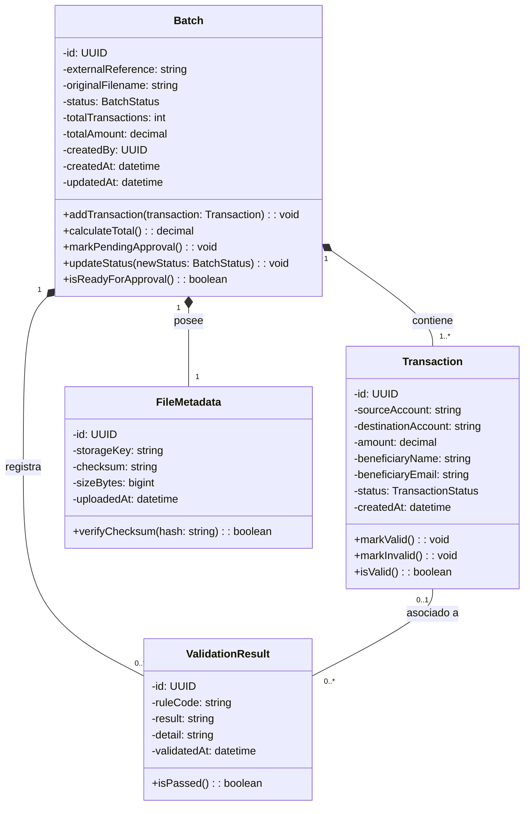

### Responsabilidades del modelo

`Batch` funciona como la entidad principal del agregado y representa un lote completo de transacciones.

Su responsabilidad no consiste en decidir si el lote es aprobado o rechazado por un usuario. Esa lógica pertenece al Servicio de Aprobaciones.

Por esta razón no se incluyen métodos como:

```text
approve()
reject()
```

En cambio, el lote puede modificar su estado cuando recibe el resultado correspondiente del proceso.

`Transaction` representa cada operación contenida dentro del archivo.

`FileMetadata` conserva la información necesaria para localizar y verificar el archivo asociado al lote.

`ValidationResult` registra el resultado de las diferentes reglas de validación.

Puede representar validaciones generales del lote o validaciones asociadas a una transacción específica.

Las principales reglas consideradas son:

```text
AVAILABLE_BALANCE
TRANSACTION_LIMIT
VALID_ACCOUNT
FRAUD_PREVENTION
CSV_STRUCTURE
```

---

## 5.3 UML — Servicio de Aprobaciones

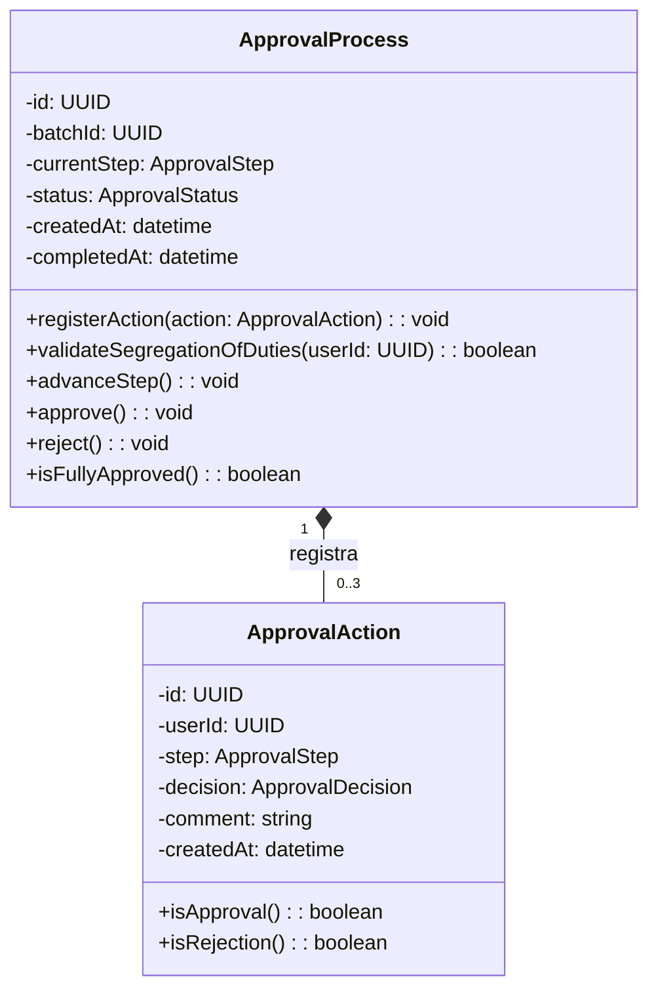

### Responsabilidades del modelo

`ApprovalProcess` representa el flujo completo de aprobación asociado a un lote.

El atributo:

```text
batchId
```

es una referencia externa al identificador del lote administrado por el Servicio de Lotes y no representa una relación directa entre bases de datos.

`ApprovalProcess` controla:

```text
MAKER
  ↓
CHECKER
  ↓
AUTHORIZER
```

y aplica la regla de segregación de funciones.

Para un mismo lote:

```text
Maker != Checker
Maker != Authorizer
Checker != Authorizer
```

`ApprovalAction` registra cada acción realizada durante el proceso.

Los pasos válidos son:

```text
MAKER
CHECKER
AUTHORIZER
```

Las decisiones son:

```text
SUBMITTED
APPROVED
REJECTED
```

La relación se representa mediante composición debido a que una acción de aprobación no tiene sentido fuera de su proceso correspondiente.

Se utiliza una multiplicidad:

```text
0..3
```

porque un proceso recién creado puede no tener todavía ninguna acción y puede registrar como máximo una acción principal por cada una de las tres etapas definidas.

---

## 5.4 UML — Servicio de Procesamiento

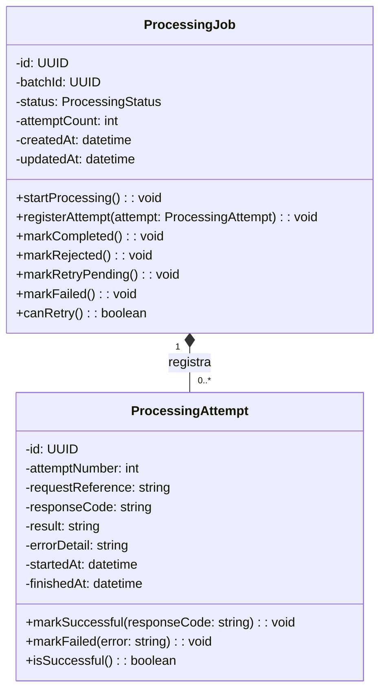

### Responsabilidades del modelo

`ProcessingJob` representa el procesamiento de un lote previamente aprobado.

El atributo:

```text
batchId
```

es una referencia externa al Servicio de Lotes.

Los posibles estados del procesamiento son:

```text
PENDING
PROCESSING
COMPLETED
REJECTED
RETRY_PENDING
FAILED
```

La diferencia entre los resultados es importante:

* `COMPLETED`: el Core Bancario aceptó el procesamiento;
* `REJECTED`: el Core respondió correctamente, pero rechazó la operación;
* `RETRY_PENDING`: ocurrió un fallo temporal y se permite otro intento;
* `FAILED`: ocurrió un fallo técnico definitivo.

`ProcessingAttempt` registra cada intento de comunicación con el Core Bancario.

La relación utiliza:

```text
0..*
```

porque un `ProcessingJob` puede existir antes de que se realice el primer intento.

La composición permite conservar el historial completo de intentos asociados a un mismo procesamiento.

---

## 5.5 UML — Servicio de Notificaciones

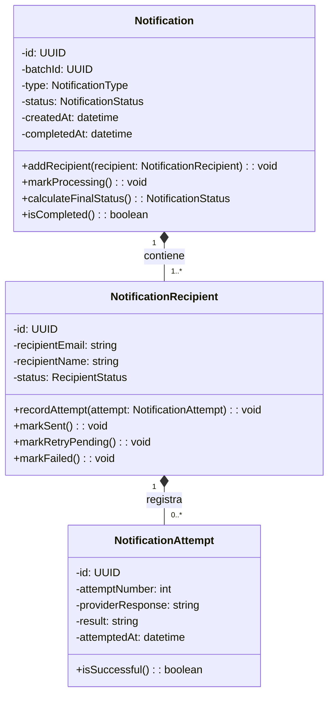

### Responsabilidades del modelo

`Notification` representa el proceso de notificación asociado a un lote aprobado.

El atributo:

```text
batchId
```

es una referencia externa hacia el lote correspondiente.

Una notificación contiene uno o más destinatarios.

Los posibles estados generales son:

```text
PENDING
PROCESSING
SENT
PARTIAL
FAILED
```

El estado:

```text
PARTIAL
```

permite representar situaciones donde algunos beneficiarios recibieron correctamente la notificación y otros presentaron errores.

Cada `NotificationRecipient` mantiene su propio estado:

```text
PENDING
SENT
RETRY_PENDING
FAILED
```

La información:

```text
recipientName
recipientEmail
```

se conserva dentro de este microservicio como una copia controlada de los datos necesarios para efectuar y auditar el envío.

Esto evita una dependencia permanente hacia el Servicio de Lotes.

`NotificationAttempt` registra cada intento realizado para un destinatario.

La relación entre destinatario e intentos se representa como:

```text
0..*
```

porque un destinatario puede existir antes de realizarse su primer intento de envío.

---

# 6. Diagramas de secuencia UML para los flujos críticos

## 6.1 Aprobación de transacciones de tres pasos

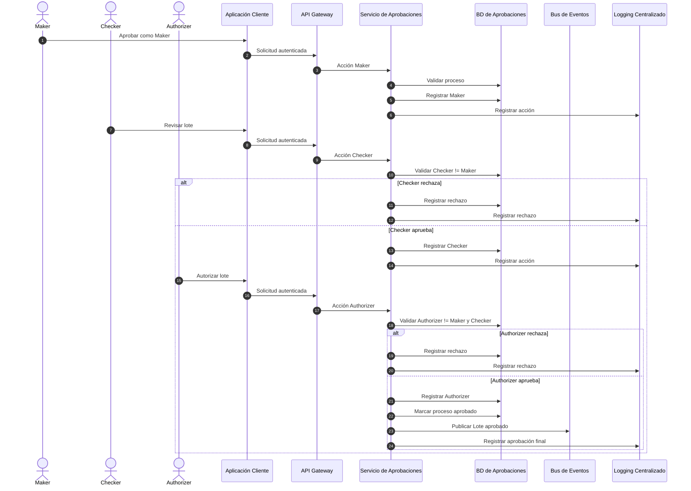

---

## 6.2 Envío al sistema Core Bancario

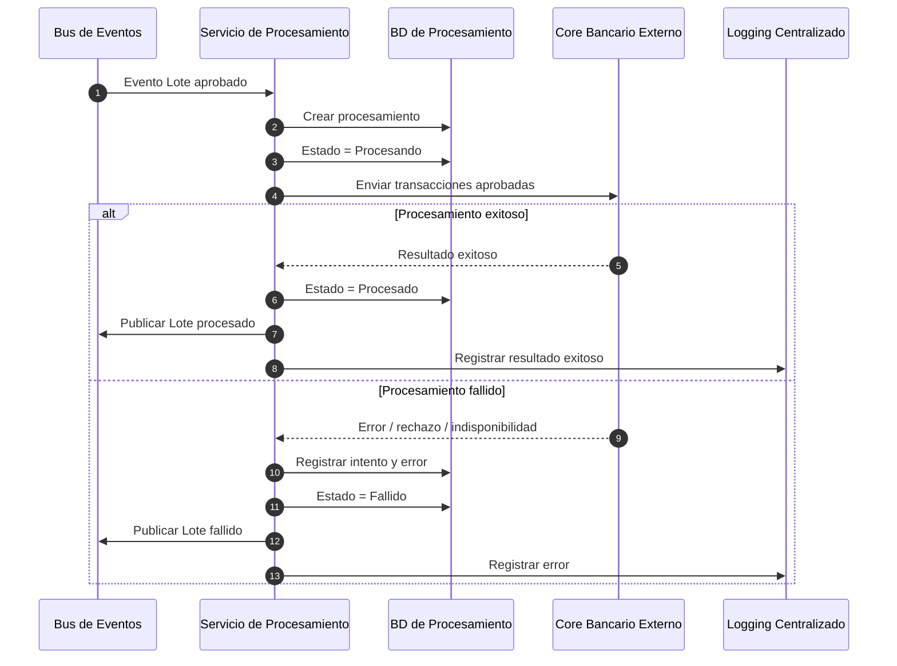

---

## 6.3 Notificación a clientes o beneficiarios

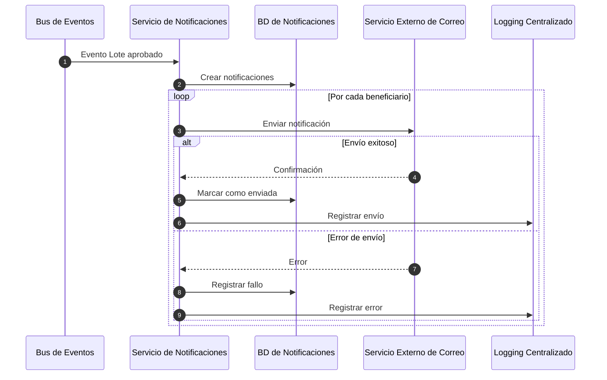

---

# 7. Diagrama de componentes UML

El diagrama de componentes mostrará una vista más técnica que el Diagrama de Arquitectura General.

En esta vista sí se representan las dependencias principales entre componentes y los mecanismos técnicos seleccionados.

## 7.1 Código Mermaid de referencia

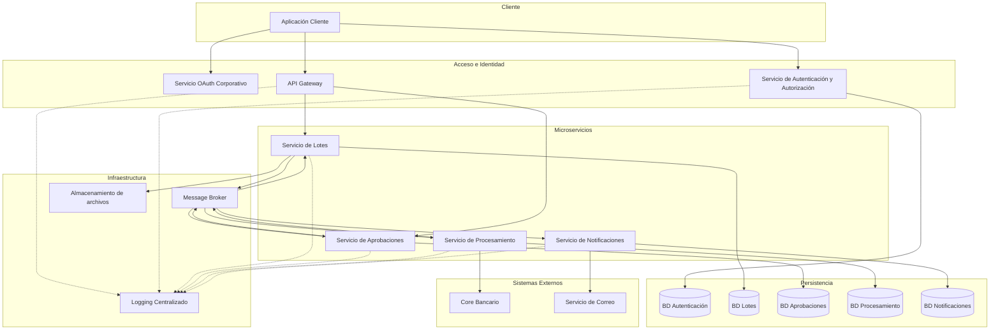

---

# 8. Definición y documentación del flujo de aprobación de 3 pasos

El sistema utiliza el esquema Maker-Checker-Authorizer para separar la creación, revisión y autorización final de un lote.

## 8.1 Maker

Responsable de iniciar o confirmar el lote que será sometido al proceso de aprobación.

No puede actuar posteriormente como Checker ni Authorizer del mismo lote.

## 8.2 Checker

Responsable de revisar el lote después del Maker.

Puede:

- aprobar y permitir que continúe al Authorizer;
- rechazar el lote indicando el motivo.

Debe ser un usuario distinto al Maker.

## 8.3 Authorizer

Realiza la decisión final.

Debe ser diferente al Maker y al Checker.

Puede:

- aprobar definitivamente el lote;
- rechazarlo.

La aprobación del Authorizer es la que genera el evento `Lote aprobado`.

## 8.4 Regla de segregación

Para un mismo lote:

```text
Maker != Checker
Maker != Authorizer
Checker != Authorizer
```

## 8.5 Diagrama conceptual del flujo

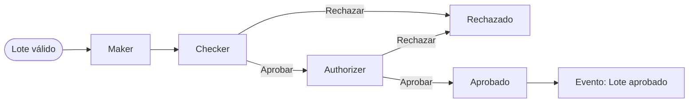

## 8.6 Información registrada

Por cada acción se debe conservar:

- lote;
- usuario;
- etapa;
- decisión;
- fecha y hora;
- observación o motivo;
- identificador de trazabilidad.

---

# 9. Diseño de la estrategia de almacenamiento de archivos CSV

Se propone mantener los archivos CSV fuera de la base de datos relacional del Servicio de Lotes.

La base de datos guarda únicamente los metadatos necesarios para relacionar el lote con el archivo.

## 9.1 Flujo propuesto

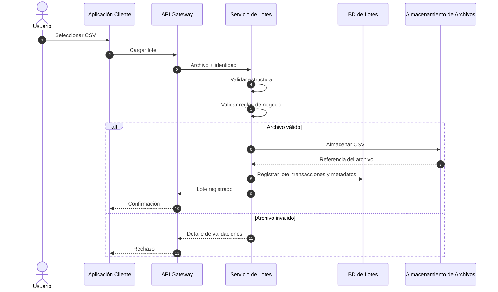

## 9.2 Metadatos

Se propone conservar:

```text
id
batch_id
nombre_original
referencia_almacenamiento
checksum
tamaño
fecha_carga
usuario_carga
```

## 9.3 Decisión tecnológica

Para la implementación se propone utilizar almacenamiento de objetos en nube.

La selección final deberá justificarse frente a las alternativas permitidas por el enunciado:

- almacenamiento de objetos;
- servidor FTP.

Una opción tecnológica propuesta es AWS S3 debido a su separación del almacenamiento relacional, disponibilidad y facilidad de descarga controlada.

---

# 10. Diseño de la estrategia de logging centralizado

Todos los componentes relevantes deben producir logs estructurados y enviarlos a un punto central.

## 10.1 Diagrama de referencia

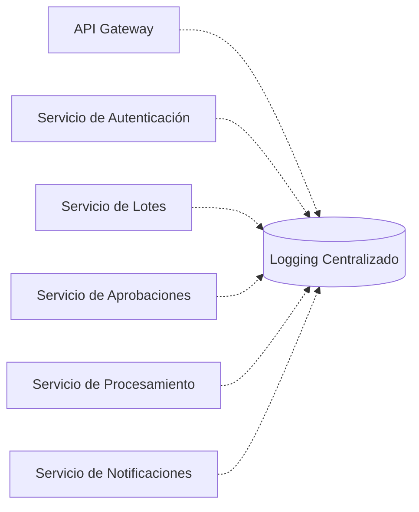

## 10.2 Datos recomendados

```text
timestamp
nivel
servicio
correlationId
userId
acción
batchId
transactionId
resultado
códigoError
mensaje
```

## 10.3 Correlation ID

Cada solicitud iniciada desde el Gateway debe recibir un identificador de trazabilidad.

Ese identificador se propaga a:

- llamadas internas;
- eventos;
- procesamiento;
- notificaciones;
- logs.

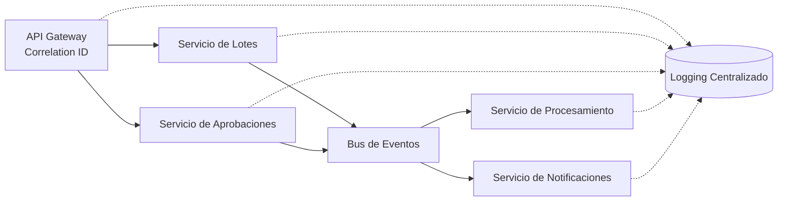

## 10.4 Tecnología propuesta

Se propone una plataforma centralizada que permita recepción, indexación y consulta de logs.

Una alternativa de implementación es ELK Stack.

La elección deberá justificarse por:

- centralización;
- capacidad de búsqueda;
- visualización;
- trazabilidad;
- soporte para auditoría.

---

# 11. Explicación de la comunicación entre servicios

Se utiliza un enfoque híbrido: comunicación síncrona para operaciones que necesitan respuesta inmediata y mensajería asíncrona para eventos del negocio.

## 11.1 Comunicación síncrona

Se utiliza principalmente entre:

```text
Aplicación Cliente
      ↓
API Gateway
      ↓
Servicio responsable
```

Ejemplos:

- carga de un lote;
- consulta de lotes;
- consulta del historial;
- descarga;
- aprobación o rechazo.

Se propone REST para estas operaciones.

## 11.2 Comunicación asíncrona

Se utiliza para eventos que pueden ser procesados independientemente.

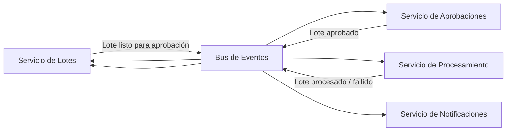

## 11.3 Tecnología propuesta

Se propone RabbitMQ como Message Broker.

### Justificación

El escenario necesita:

- procesamiento desacoplado;
- consumidores independientes;
- confirmación de mensajes;
- reintentos;
- colas de mensajes fallidos.

RabbitMQ ofrece estas capacidades sin introducir la complejidad adicional de una plataforma de streaming cuando el caso principal consiste en procesamiento de eventos y colas de trabajo.

## 11.4 Manejo de fallos

La estrategia contempla:

- reintentos controlados;
- Dead Letter Queue;
- idempotencia de consumidores;
- registro de errores.

El Servicio de Procesamiento debe evitar enviar dos veces el mismo lote al Core por un evento duplicado.

---

# 12. Propuesta de API Gateway

El API Gateway funciona como punto único de entrada a los microservicios expuestos al cliente.

## 12.1 Responsabilidades

- recibir peticiones;
- validar el token interno;
- enrutar solicitudes;
- aplicar políticas de acceso;
- generar o propagar `Correlation ID`;
- registrar accesos;
- aplicar límites de solicitudes;
- evitar exposición directa de servicios internos.

## 12.2 Validación stateless

El Gateway no consulta al Servicio de Autenticación y Autorización en cada petición.

Valida localmente el token interno, evitando crear una dependencia síncrona permanente hacia el servicio de autenticación.

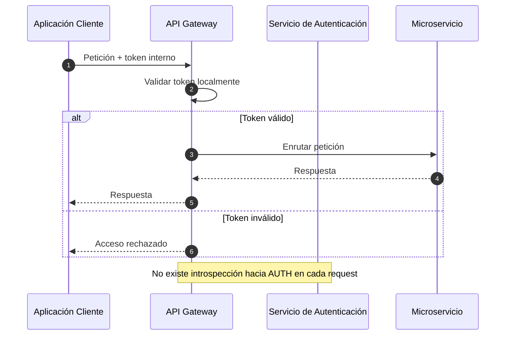

## 12.3 Rutas conceptuales

El Gateway expone principalmente las operaciones dirigidas a:

```text
Servicio de Lotes
Servicio de Aprobaciones
Servicio de Autenticación
```

Los servicios de Procesamiento y Notificaciones no necesitan ser invocados por el usuario como parte de su flujo principal, ya que reaccionan principalmente a eventos internos.

## 12.4 Tecnología propuesta

Para la implementación del Gateway se puede seleccionar una herramienta especializada que soporte:

- routing;
- validación de tokens;
- rate limiting;
- logging;
- extensibilidad.

La tecnología final deberá justificarse en función de estas necesidades.

---

# Conclusiones

La documentación se organizó de forma que cada sección corresponda directamente con uno de los elementos solicitados en el alcance de la práctica.

El Diagrama de Arquitectura General establece la base conceptual de la solución y los diagramas Mermaid restantes sirven como referencias lógicas para construir las versiones finales en Lucidchart.

La solución mantiene una separación clara entre:

- autenticación y autorización;
- gestión de lotes;
- aprobaciones;
- procesamiento bancario;
- notificaciones.

También define mecanismos para:

- bases de datos independientes;
- almacenamiento externo de CSV;
- comunicación síncrona y asíncrona;
- actualización final del historial;
- logging centralizado;
- trazabilidad;
- integración con la Práctica 2.

Las decisiones tecnológicas deberán mantenerse justificadas en función del problema que resuelven y no únicamente por preferencia de implementación.
