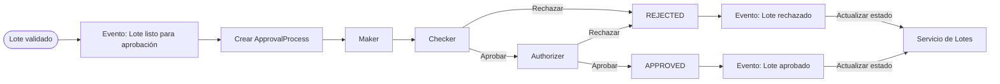
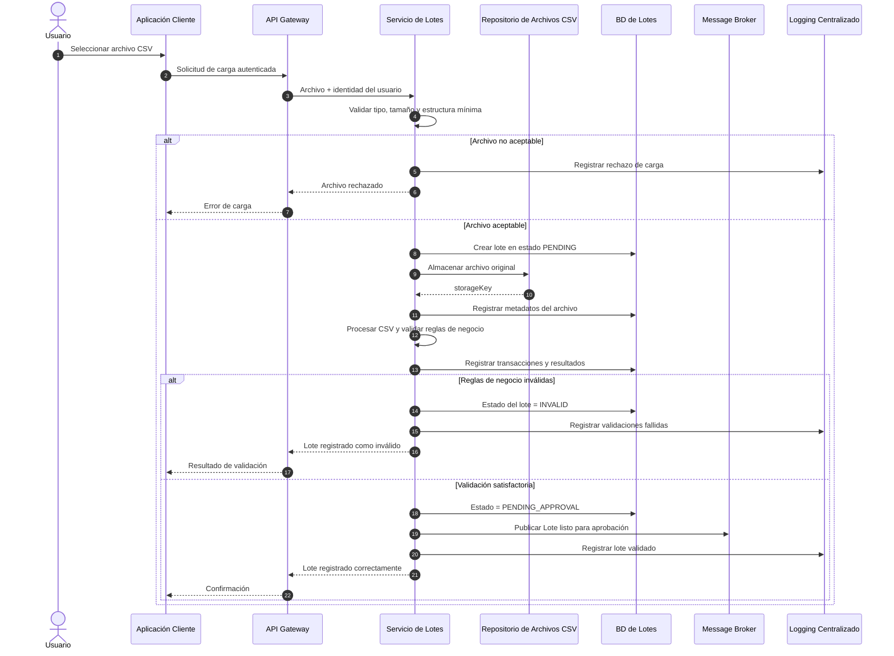
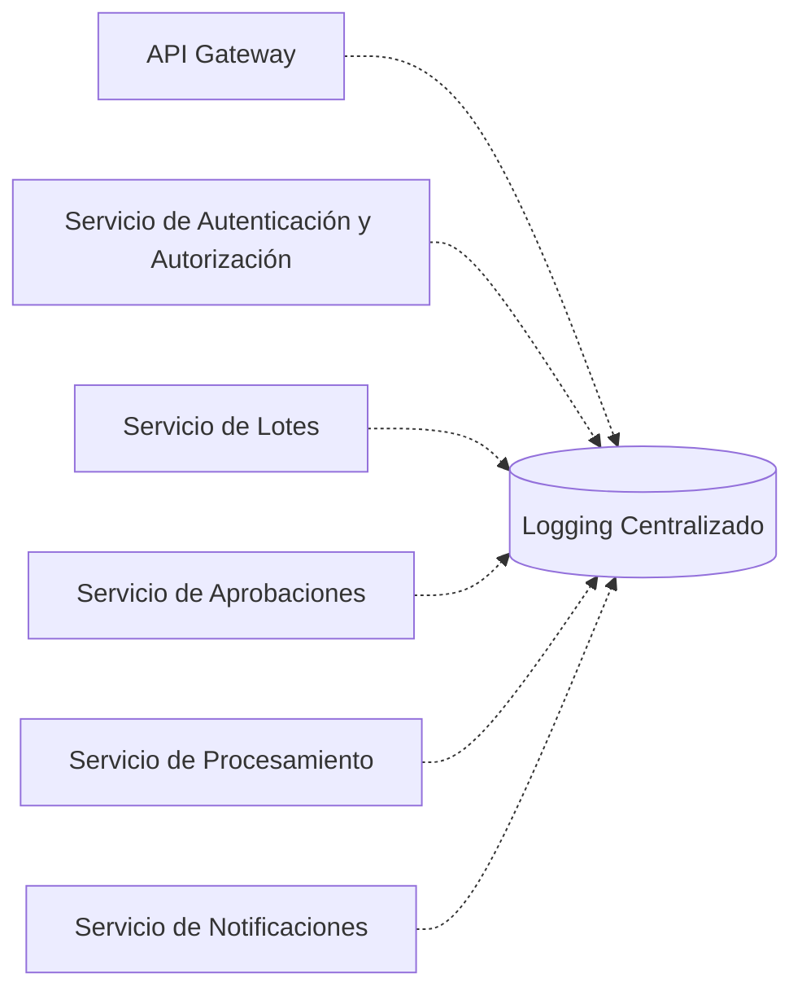
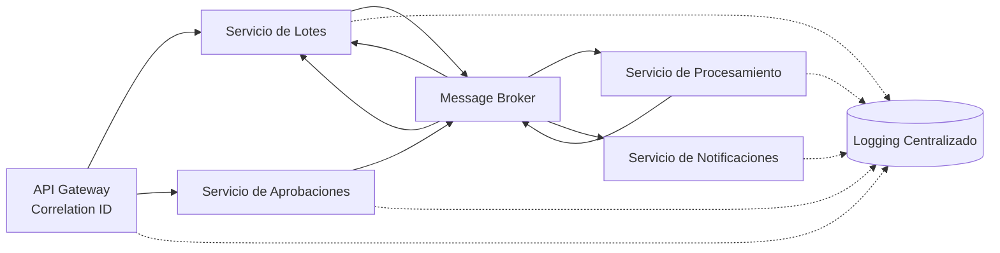
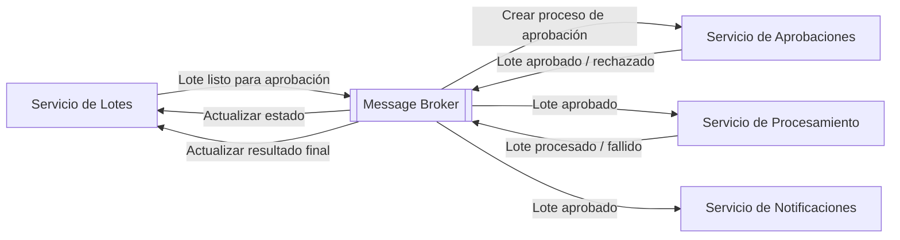
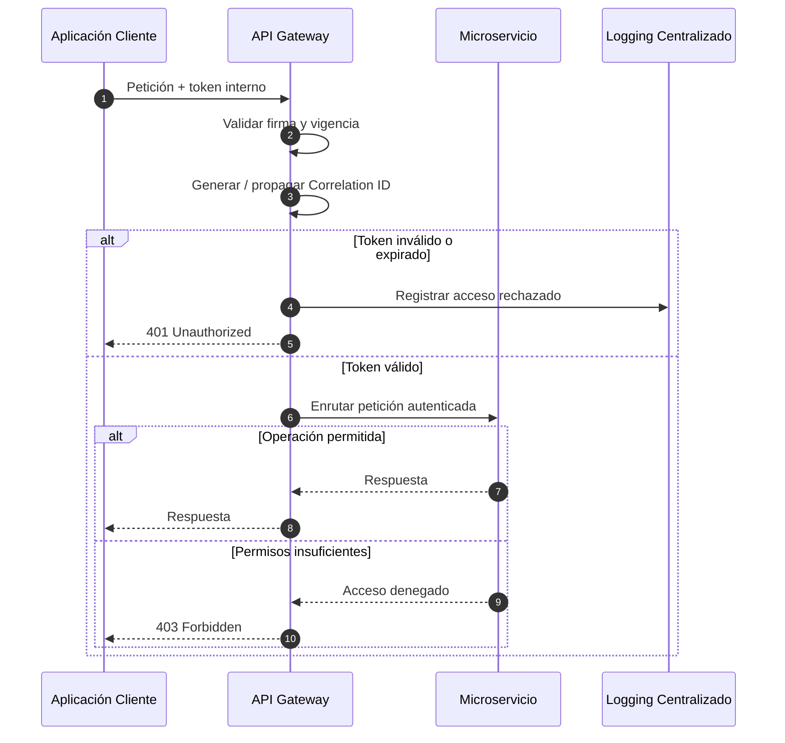
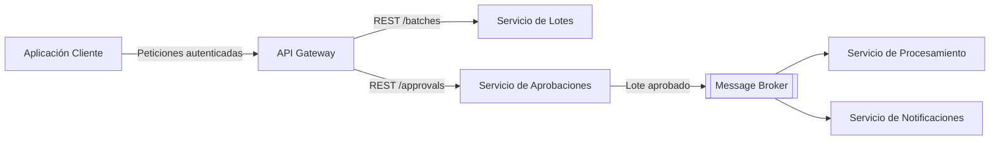

# 8. Definición y documentación del flujo de aprobación de 3 pasos

El sistema utiliza el esquema Maker-Checker-Authorizer para separar la preparación, revisión y autorización final de un lote.

El flujo de aprobación no se crea directamente por una acción del Maker. Primero, el Servicio de Lotes valida el archivo y, cuando el lote cumple las reglas de negocio, publica el evento:

```text
Lote listo para aprobación
```

El Servicio de Aprobaciones consume este evento, crea el `ApprovalProcess` correspondiente y deja el proceso preparado en la etapa `MAKER`.

---

## 8.1 Inicio del proceso de aprobación

El inicio del flujo ocurre después de que el Servicio de Lotes completa satisfactoriamente las validaciones del lote.

```text
Servicio de Lotes
        ↓
Lote listo para aprobación
        ↓
Message Broker
        ↓
Servicio de Aprobaciones
        ↓
Crear ApprovalProcess
        ↓
currentStep = MAKER
status = PENDING
```

Esta decisión mantiene separadas las responsabilidades:

- el Servicio de Lotes determina si el lote es válido;
- el Servicio de Aprobaciones administra quién participa en cada etapa y en qué orden.

---

## 8.2 Maker

El Maker realiza la primera acción humana dentro del proceso de aprobación.

Su responsabilidad es presentar o confirmar el lote para que continúe hacia la etapa de revisión.

Después de registrar correctamente la acción del Maker:

```text
currentStep = CHECKER
```

El usuario que actúa como Maker no puede participar posteriormente como Checker ni como Authorizer del mismo lote.

---

## 8.3 Checker

El Checker revisa el lote después de la acción del Maker.

Puede:

- aprobar y permitir que el proceso continúe hacia el Authorizer;
- rechazar el lote indicando el motivo correspondiente.

Debe ser un usuario diferente al Maker.

Si aprueba:

```text
currentStep = AUTHORIZER
```

Si rechaza:

```text
APPROVAL_PROCESS.status = REJECTED
```

y se publica el evento:

```text
Lote rechazado
```

para que el Servicio de Lotes actualice el estado e historial del lote.

---

## 8.4 Authorizer

El Authorizer realiza la decisión final del flujo de aprobación.

Debe ser un usuario diferente al Maker y al Checker.

Puede:

- aprobar definitivamente el lote;
- rechazarlo.

Si rechaza, el proceso se marca como `REJECTED` y se publica el evento `Lote rechazado`.

Si aprueba:

```text
currentStep = COMPLETED
APPROVAL_PROCESS.status = APPROVED
```

y se publica el evento:

```text
Lote aprobado
```

Este evento permite:

- actualizar el estado del lote;
- iniciar el procesamiento hacia el Core Bancario;
- iniciar el proceso de notificación a clientes o beneficiarios.

---

## 8.5 Regla de segregación de funciones

Para un mismo lote debe cumplirse:

```text
Maker != Checker
Maker != Authorizer
Checker != Authorizer
```

La validación se realiza antes de registrar las acciones de Checker y Authorizer.

Esta regla impide que un mismo usuario controle todas las etapas de aprobación de una operación.

---

## 8.6 Diagrama conceptual del flujo



---

## 8.7 Información registrada

Por cada acción del flujo de aprobación se conserva en el dominio de Aprobaciones:

- identificador del proceso;
- referencia externa del lote;
- identificador externo del usuario;
- etapa;
- decisión;
- fecha y hora;
- observación o motivo cuando corresponda.

Adicionalmente, el `Correlation ID` de la operación se propaga en las solicitudes, eventos y registros de auditoría para mantener trazabilidad distribuida.

El `Correlation ID` no se considera una relación de negocio ni una clave foránea entre microservicios.

---

# 9. Diseño de la estrategia de almacenamiento de archivos CSV

Los archivos CSV se almacenan fuera de la base de datos relacional del Servicio de Lotes.

La base de datos conserva únicamente los metadatos necesarios para relacionar cada lote con el archivo original almacenado externamente.

La estrategia propuesta busca:

- evitar almacenar archivos binarios o completos dentro de la base relacional;
- conservar el archivo original asociado al lote;
- permitir descarga posterior;
- mantener trazabilidad e integridad mediante checksum;
- controlar el acceso desde el Servicio de Lotes.

---

## 9.1 Flujo propuesto

El archivo original se conserva incluso cuando posteriormente alguna validación de negocio falla. Esto permite mantener evidencia del archivo recibido y facilita auditoría.

Antes de almacenarlo se realizan validaciones iniciales de seguridad y estructura mínima necesarias para aceptar la carga.



---

## 9.2 Metadatos del archivo

Se propone conservar:

```text
id
batch_id
original_name
storage_key
checksum
size_bytes
uploaded_at
uploaded_by
```

El `storage_key` permite localizar el objeto dentro del repositorio sin almacenar el archivo completo en la base de datos.

El `checksum` permite comprobar posteriormente que el archivo recuperado corresponde al archivo originalmente almacenado.

---

## 9.3 Estructura lógica del almacenamiento

Una organización conceptual puede ser:

```text
batches/
  {batchId}/
    original.csv
```

La aplicación no expone directamente la ubicación física del repositorio al usuario.

El Servicio de Lotes conserva la referencia y controla quién puede solicitar el archivo.

---

## 9.4 Descarga de archivos

El flujo de descarga será:

```text
Usuario
  ↓
Aplicación Cliente
  ↓
API Gateway
  ↓
Servicio de Lotes
  ↓
Validación de autorización
  ↓
Repositorio de Archivos CSV
```

El Servicio de Lotes valida previamente que el usuario tenga autorización para consultar el lote.

La descarga puede realizarse a través del propio servicio o mediante un enlace temporal controlado generado después de validar la autorización.

---

## 9.5 Decisión tecnológica

El enunciado permite utilizar almacenamiento en nube o un servidor FTP.

Para esta propuesta se selecciona:

```text
AWS S3
```

como implementación del `Repositorio de Archivos CSV`.

### Alternativa 1 — Servidor FTP

Ventajas:

- solución sencilla;
- ampliamente conocido;
- suficiente para intercambio básico de archivos.

Compromisos:

- requiere administrar directamente disponibilidad, espacio y estructura del servidor;
- el control de acceso y crecimiento depende de la infraestructura administrada.

### Alternativa 2 — Almacenamiento de objetos

Ventajas:

- almacenamiento independiente de las bases de datos;
- crecimiento sin modificar el esquema relacional;
- acceso controlado;
- identificación individual de cada archivo mediante una clave;
- facilidad para conservar archivos históricos.

### Decisión

Se propone AWS S3 porque se ajusta naturalmente al almacenamiento de archivos CSV independientes de la persistencia transaccional y facilita su recuperación controlada.

El modelo arquitectónico continúa utilizando el nombre genérico `Repositorio de Archivos CSV`; AWS S3 representa únicamente la tecnología propuesta para implementarlo.

---

# 10. Diseño de la estrategia de logging centralizado

Todos los componentes relevantes generan logs estructurados y los envían a un sistema centralizado.

La estrategia busca resolver un problema propio de las arquitecturas distribuidas: una sola operación puede atravesar múltiples servicios y eventos antes de finalizar.

El logging centralizado permite reconstruir ese recorrido sin depender de revisar manualmente los logs individuales de cada componente.

---

## 10.1 Componentes que generan logs



---

## 10.2 Tipos de registro

Se distinguen dos categorías principales.

### Logs técnicos

Permiten diagnosticar la ejecución del sistema.

Ejemplos:

- inicio y finalización de operaciones;
- errores;
- timeouts;
- fallos de comunicación;
- reintentos;
- consumo de eventos;
- respuestas de sistemas externos.

### Registros de auditoría

Permiten conocer quién realizó una acción relevante sobre el negocio.

Ejemplos:

- usuario que cargó un lote;
- Maker que presentó el lote;
- Checker que aprobó o rechazó;
- Authorizer que aprobó o rechazó;
- cambio de estado del lote;
- envío al Core Bancario;
- resultado del procesamiento.

Los registros de auditoría no sustituyen las entidades de dominio como `ApprovalAction`; ambos mecanismos se complementan.

---

## 10.3 Campos recomendados

```text
timestamp
level
service
correlationId
eventId
userId
action
batchId
transactionId
result
errorCode
message
```

Los campos se incluyen únicamente cuando corresponden a la operación registrada.

No se deben registrar en texto claro:

- contraseñas;
- tokens completos;
- llaves privadas;
- secretos;
- información sensible innecesaria.

---

## 10.4 Correlation ID

El API Gateway genera o propaga un identificador de trazabilidad para las operaciones iniciadas mediante una petición del usuario.

```text
Correlation ID
```

Este identificador acompaña la operación en:

- llamadas síncronas;
- mensajes y eventos;
- procesamiento;
- notificaciones;
- logs.

Cuando un servicio publica un evento como consecuencia de una operación existente, conserva el `Correlation ID` dentro de los metadatos del mensaje.



El `batchId` identifica permanentemente al lote dentro del negocio, mientras que el `Correlation ID` identifica una cadena concreta de ejecución distribuida. Por ello ambos conceptos no deben confundirse.

---

## 10.5 Tecnología propuesta

Se propone:

```text
ELK Stack
```

compuesto por:

```text
Elasticsearch
Logstash
Kibana
```

La elección se justifica porque permite:

- centralizar logs procedentes de varios servicios;
- indexar registros;
- buscar operaciones por `correlationId`, `batchId` o servicio;
- consultar errores;
- construir vistas para auditoría y diagnóstico.

En el Diagrama de Arquitectura General y en el Diagrama de Componentes se conserva el nombre conceptual `Logging Centralizado`; ELK Stack representa la implementación propuesta.

---

# 11. Explicación de la comunicación entre servicios

La arquitectura utiliza un enfoque híbrido.

Se utiliza comunicación síncrona cuando el usuario necesita una respuesta inmediata y mensajería asíncrona cuando una operación puede continuar mediante eventos sin bloquear el flujo original.

---

## 11.1 Comunicación síncrona

La comunicación síncrona se utiliza principalmente para las operaciones iniciadas directamente por el usuario:

```text
Aplicación Cliente
      ↓
API Gateway
      ↓
Servicio responsable
```

Las principales comunicaciones son:

```text
API Gateway → Servicio de Lotes
API Gateway → Servicio de Aprobaciones
```

Ejemplos:

- cargar un lote;
- consultar lotes;
- consultar historial;
- consultar contenido;
- descargar archivo;
- realizar acción Maker;
- realizar acción Checker;
- realizar acción Authorizer;
- rechazar una aprobación.

Se propone utilizar:

```text
REST sobre HTTPS
```

para estas interacciones.

El flujo de autenticación corporativa se maneja separadamente entre la Aplicación Cliente, el Proveedor de Identidad Corporativo y el Servicio de Autenticación y Autorización.

---

## 11.2 Comunicación asíncrona

Los eventos del negocio se transmiten mediante el Message Broker.



### Eventos principales

```text
Lote listo para aprobación
Lote aprobado
Lote rechazado
Lote procesado
Lote fallido
```

---

## 11.3 Comunicación con sistemas externos

El Servicio de Procesamiento se comunica directamente con:

```text
Core Bancario Externo
```

para enviar las transacciones aprobadas y recibir el resultado.

El Servicio de Notificaciones se comunica directamente con:

```text
Servicio Externo de Correo
```

para realizar los envíos.

Estas integraciones son responsabilidad exclusiva de sus respectivos servicios.

---

## 11.4 Tecnología de mensajería propuesta

Se propone:

```text
RabbitMQ
```

como implementación del `Message Broker`.

### Justificación

El escenario requiere:

- productores y consumidores independientes;
- entrega de mensajes a distintos servicios;
- confirmación de procesamiento;
- reintentos;
- manejo de mensajes fallidos;
- desacoplamiento entre aprobación, procesamiento y notificación.

Para eventos consumidos por más de un servicio, cada consumidor debe disponer de su propia cola lógica vinculada al evento correspondiente.

Por ejemplo, el evento:

```text
Lote aprobado
```

debe poder ser recibido independientemente por:

```text
Servicio de Lotes
Servicio de Procesamiento
Servicio de Notificaciones
```

sin que el consumo realizado por uno impida que los demás reciban el evento.

---

## 11.5 Manejo de fallos

La estrategia contempla:

- reintentos controlados;
- Dead Letter Queue;
- idempotencia de consumidores;
- identificadores únicos de evento;
- registro centralizado de errores.

### Reintentos

Los fallos temporales pueden reintentarse hasta un límite configurado.

Ejemplos:

```text
timeout del Core Bancario
indisponibilidad temporal del proveedor de correo
```

### Dead Letter Queue

Cuando un mensaje supera el máximo de intentos permitidos, se envía a una cola de mensajes fallidos para evitar ciclos infinitos y pérdida silenciosa de operaciones.

### Idempotencia

Los consumidores deben poder reconocer un evento ya procesado.

En particular, el Servicio de Procesamiento consulta el procesamiento asociado al `batchId` antes de enviar nuevamente el lote al Core Bancario.

Esto reduce el riesgo de ejecutar dos veces una operación debido a la entrega duplicada de un evento.

---

## 11.6 Consistencia entre servicios

Cada microservicio modifica únicamente su propia persistencia.

Por ejemplo, el Servicio de Procesamiento no actualiza directamente la BD de Lotes.

En su lugar:

```text
Servicio de Procesamiento
        ↓
Lote procesado / Lote fallido
        ↓
Message Broker
        ↓
Servicio de Lotes
        ↓
BD de Lotes
```

Esta estrategia mantiene el patrón `Database per Service` y utiliza consistencia eventual cuando un estado debe propagarse entre dominios.

---

# 12. Propuesta de API Gateway

El API Gateway funciona como punto de entrada para las operaciones de negocio expuestas por los microservicios al cliente.

Su objetivo es evitar que la aplicación cliente conozca o acceda directamente a las direcciones internas de los servicios.

---

## 12.1 Responsabilidades

El API Gateway será responsable de:

- recibir peticiones autenticadas;
- validar el token interno;
- verificar información básica de acceso incluida en el token;
- enrutar solicitudes;
- generar o propagar el `Correlation ID`;
- aplicar políticas de seguridad;
- aplicar límites de solicitudes;
- registrar accesos;
- ocultar las ubicaciones internas de los microservicios.

El Gateway no contiene reglas de negocio relacionadas con:

- validación de lotes;
- Maker-Checker-Authorizer;
- procesamiento bancario;
- notificaciones.

Estas responsabilidades permanecen dentro de los microservicios correspondientes.

---

## 12.2 Validación stateless del token

El API Gateway no consulta al Servicio de Autenticación y Autorización en cada petición.

La validación del token interno se realiza localmente utilizando la información necesaria para verificar su autenticidad y vigencia.



La renovación o emisión de nuevos tokens permanece bajo responsabilidad exclusiva del Servicio de Autenticación y Autorización.

---

## 12.3 Servicios expuestos a través del Gateway

El flujo principal del usuario utiliza el Gateway para acceder a:

```text
Servicio de Lotes de Transacciones
Servicio de Aprobaciones
```

Ejemplos conceptuales de rutas:

```text
/batches/*
/approvals/*
```

El Servicio de Procesamiento y el Servicio de Notificaciones no se exponen como parte del flujo principal del usuario.

Estos servicios reaccionan principalmente al evento:

```text
Lote aprobado
```

mediante el Message Broker.

El historial general del lote se consulta a través del Servicio de Lotes, que recibe mediante eventos las actualizaciones generadas por Aprobaciones y Procesamiento.

El intercambio inicial de la credencial corporativa con el Servicio de Autenticación y Autorización pertenece al flujo de identidad definido en el apartado correspondiente y no requiere que el Gateway consulte al servicio de autenticación en cada petición posterior.

---

## 12.4 Flujo conceptual de enrutamiento



Esto permite distinguir claramente entre:

```text
Servicios invocados directamente por el usuario
→ Lotes y Aprobaciones
```

y:

```text
Servicios reactivos a eventos
→ Procesamiento y Notificaciones
```

---

## 12.5 Políticas propuestas

### Rate limiting

El Gateway puede limitar la cantidad de solicitudes permitidas por usuario, cliente o intervalo de tiempo.

Esto protege los servicios internos frente a cargas excesivas o comportamientos anómalos.

### Trazabilidad

Cada solicitud recibe o conserva un:

```text
Correlation ID
```

que se propaga hacia el servicio destino y posteriormente hacia los eventos generados.

### Manejo de errores

El Gateway devuelve respuestas HTTP consistentes para errores de entrada y acceso.

Ejemplos:

```text
400 Bad Request
401 Unauthorized
403 Forbidden
404 Not Found
429 Too Many Requests
500 Internal Server Error
```

Los errores propios del dominio son definidos por el servicio responsable y propagados de forma controlada.

---

## 12.6 Tecnología propuesta

Se propone:

```text
Kong Gateway
```

como implementación del API Gateway.

### Justificación

La tecnología seleccionada debe cubrir principalmente:

- routing;
- validación de autenticación;
- rate limiting;
- políticas de acceso;
- logging;
- extensibilidad;
- observabilidad.

Kong se propone porque permite centralizar estas responsabilidades sin trasladar reglas de negocio al Gateway.

En los diagramas arquitectónicos se conserva el nombre genérico:

```text
API Gateway
```

mientras que Kong representa únicamente la implementación tecnológica propuesta.

---

## 12.7 Límites de responsabilidad

El API Gateway puede decidir:

```text
¿La petición posee un token válido?
¿A qué servicio debe dirigirse?
¿Debe aplicarse una política de límite de solicitudes?
```

pero no debe decidir:

```text
¿El lote tiene saldo suficiente?
¿Checker puede aprobar este lote?
¿El Core debe aceptar la transacción?
¿Debe reintentarse un correo?
```

Estas decisiones pertenecen a los microservicios responsables del dominio.
