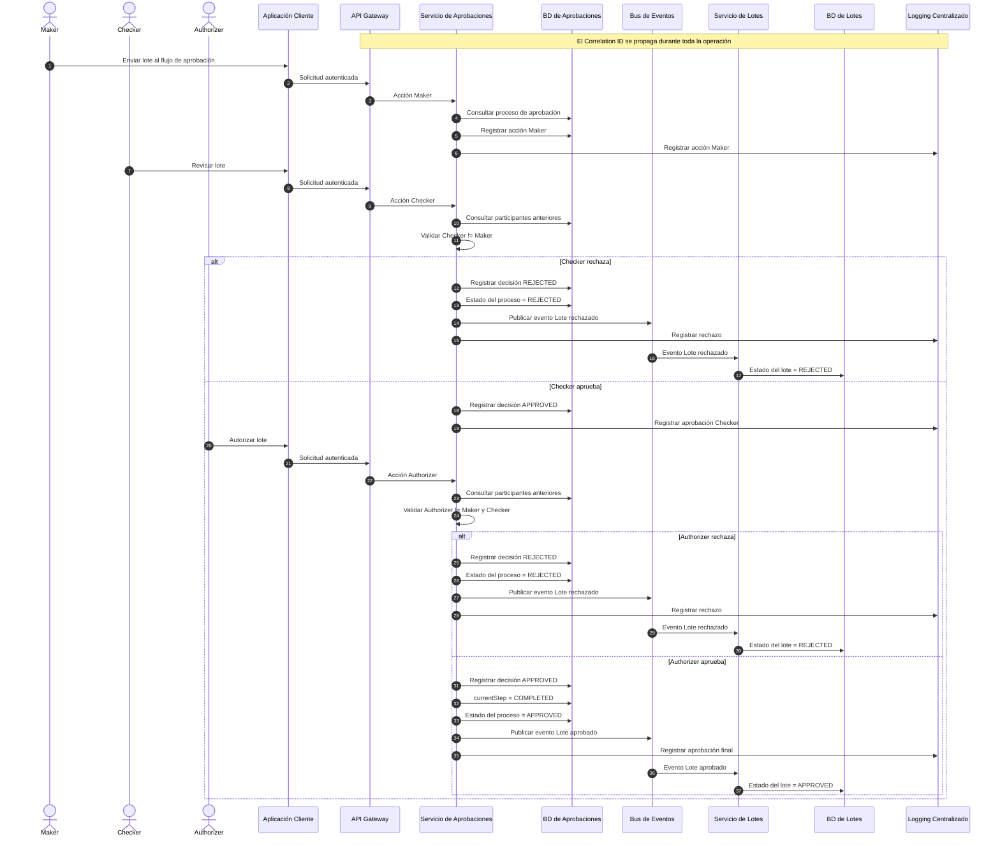
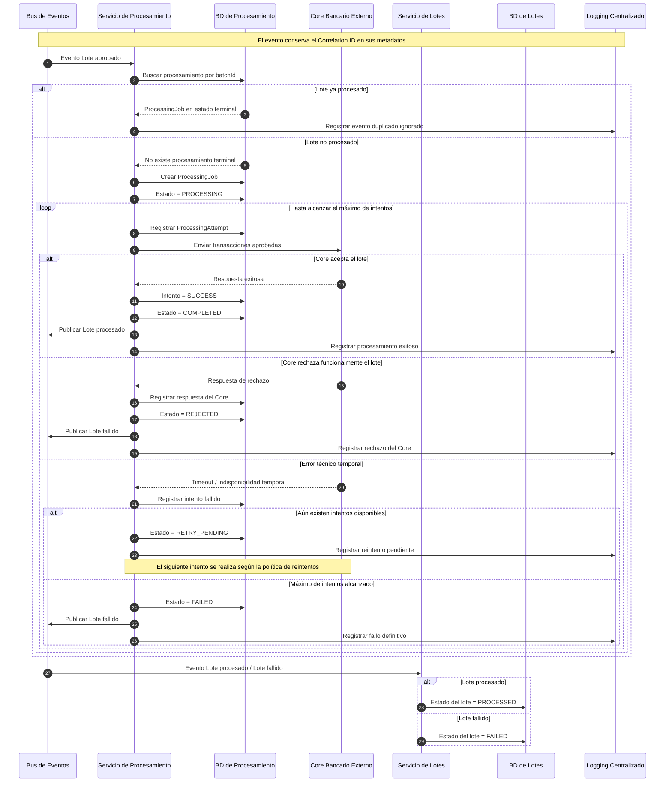
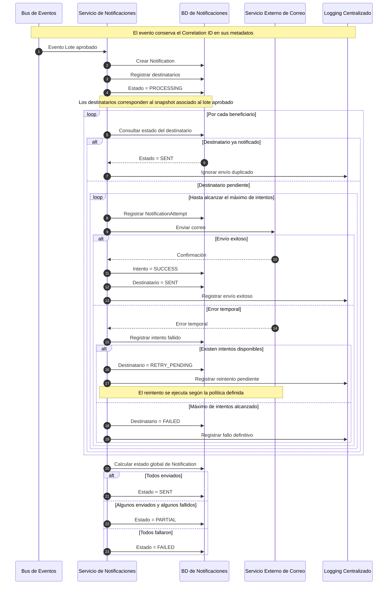

# 6. Diagramas de secuencia UML para los flujos críticos

Los siguientes diagramas representan los tres flujos críticos solicitados:

1. aprobación de transacciones mediante Maker-Checker-Authorizer;
2. envío de transacciones aprobadas al Core Bancario;
3. notificación a clientes o beneficiarios.

El identificador de trazabilidad (`Correlation ID`) se propaga en las solicitudes y en los eventos internos. Para mantener los diagramas legibles, no se muestra como parámetro en cada mensaje, pero forma parte del contexto de cada operación.

---

## 6.1 Secuencia UML — Aprobación de transacciones de tres pasos

El proceso de aprobación debe cumplir el esquema:

```text
Maker
  ↓
Checker
  ↓
Authorizer
````

Cada etapa debe ser realizada por un usuario distinto.

Si el Checker o el Authorizer rechazan el lote, el resultado debe comunicarse al Servicio de Lotes para actualizar su estado e historial.



### Resultado del flujo

Un lote únicamente se considera aprobado cuando:

```text
Maker registrado
        +
Checker aprobado
        +
Authorizer aprobado
```

Además:

```text
Maker != Checker
Maker != Authorizer
Checker != Authorizer
```

Si Checker o Authorizer rechazan el lote, se genera el evento:

```text
Lote rechazado
```

que permite actualizar el historial administrado por el Servicio de Lotes.

---

## 6.2 Secuencia UML — Envío al Core Bancario

El Servicio de Procesamiento comienza su trabajo al recibir el evento:

```text
Lote aprobado
```

Antes de enviar las transacciones al Core Bancario se verifica si el lote ya fue procesado anteriormente.

Esta validación evita que un evento duplicado provoque el envío del mismo lote más de una vez.



### Idempotencia

El atributo:

```text
PROCESSING_JOB.batch_id
```

es único dentro del Servicio de Procesamiento.

Esto permite verificar si el lote ya fue procesado antes de volver a enviarlo al Core Bancario.

La estrategia evita situaciones como:

```text
Evento Lote aprobado
        ↓
enviado dos veces por el Bus
        ↓
Core recibe el mismo lote dos veces
```

---

## 6.3 Secuencia UML — Notificación a clientes o beneficiarios

El Servicio de Notificaciones comienza su operación al recibir el evento:

```text
Lote aprobado
```

El envío de correos se realiza de forma independiente al procesamiento bancario.

De esta manera, un problema temporal en el servicio de correo no bloquea la aprobación ni el envío del lote al Core Bancario.



### Estados finales

El estado general de una notificación puede ser:

```text
PENDING
PROCESSING
SENT
PARTIAL
FAILED
```

Mientras que cada destinatario puede encontrarse en:

```text
PENDING
SENT
RETRY_PENDING
FAILED
```

Esto permite representar correctamente un lote con múltiples beneficiarios.

Por ejemplo:

```text
100 beneficiarios

98 enviados correctamente
2 fallidos

Estado general:
PARTIAL
```

---

## 6.4 Coherencia entre los tres diagramas

Los tres flujos se relacionan mediante eventos del negocio.

```text
Maker
  ↓
Checker
  ↓
Authorizer
  ↓
Lote aprobado
  ↓
Bus de Eventos
  ├──────────────→ Servicio de Procesamiento
  │                       ↓
  │                 Core Bancario
  │
  └──────────────→ Servicio de Notificaciones
                          ↓
                   Servicio de Correo
```

El Servicio de Lotes también recibe los cambios relevantes para mantener actualizado el historial:

```text
Lote rechazado
      ↓
REJECTED

Lote aprobado
      ↓
APPROVED

Lote procesado
      ↓
PROCESSED

Lote fallido
      ↓
FAILED
```

De esta manera, los diagramas de secuencia mantienen consistencia con el Diagrama de Arquitectura General y con los estados definidos en los modelos ER.

```

Un detalle: en **6.2**, cuando lo pases a Lucidchart, yo simplificaría visualmente el `loop` de reintentos si queda demasiado cargado. Lo importante es que aparezcan claramente **idempotencia → envío al Core → éxito/rechazo/error temporal → reintento → resultado final → actualización de Lotes**. Esa es la lógica que debemos conservar.
```
