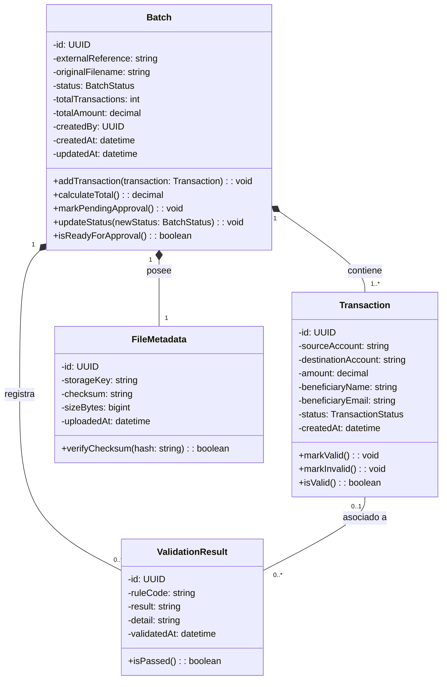
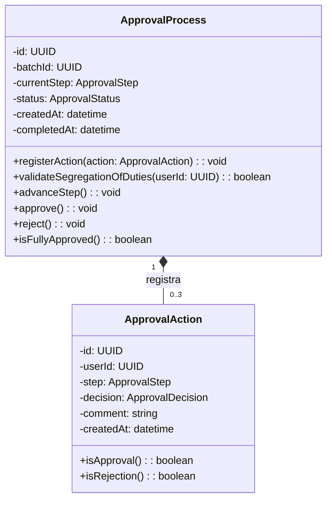
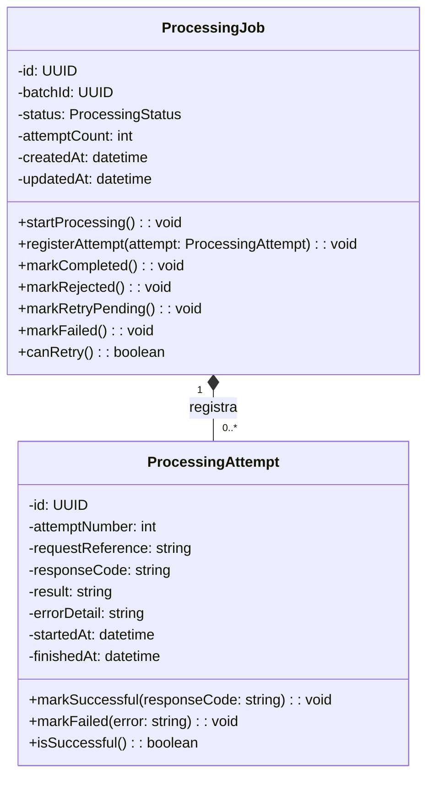
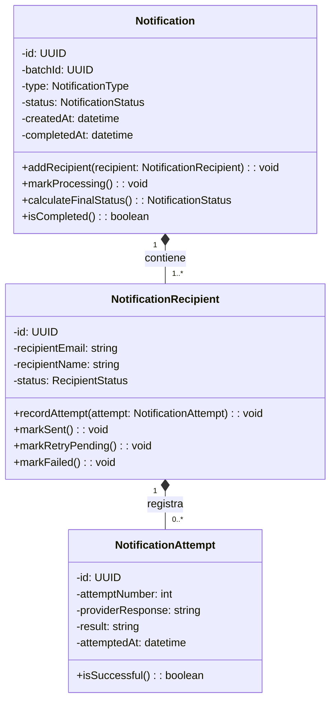

# 5. Diagrama de clases UML por cada microservicio

## 5.1 UML — Servicio de Autenticación y Autorización

```mermaid
classDiagram

    class User {
        -id: UUID
        -corporateSubject: string
        -encryptedName: string
        -encryptedEmail: string
        -status: UserStatus
        -createdAt: datetime
        -updatedAt: datetime

        +assignRole(role: Role): void
        +assignPermission(permission: OperationalPermission): void
        +suspend(): void
        +activate(): void
        +isActive(): boolean
    }

    class Role {
        -id: int
        -name: string
    }

    class OperationalPermission {
        -id: int
        -name: string
    }

    class UserSession {
        -id: UUID
        -sessionId: string
        -refreshUntil: datetime
        -isRevoked: boolean
        -createdAt: datetime
        -revokedAt: datetime

        +revoke(): void
        +isExpired(currentTime: datetime): boolean
        +canRefresh(currentTime: datetime): boolean
    }

    User "0..*" -- "0..*" Role : tiene asignado

    User "0..*" -- "0..*" OperationalPermission : posee

    User "1" *-- "0..*" UserSession : mantiene
````

### Responsabilidades del modelo

`User` representa al usuario interno relacionado con una identidad corporativa.

Los roles generales definidos inicialmente son:

```text
ADMIN
CLIENTE
```

Los permisos operacionales son:

```text
MAKER
CHECKER
AUTHORIZER
```

`UserSession` representa una sesión interna y mantiene el límite absoluto de renovación mediante `refreshUntil`.

No almacena el JWT completo. La sesión se identifica mediante `sessionId`.

La relación entre `User` y `UserSession` se modela mediante composición debido a que una sesión no tiene sentido dentro del dominio sin un usuario propietario.

`Role` y `OperationalPermission`, en cambio, existen independientemente y pueden ser utilizados por diferentes usuarios, por lo que se representan mediante asociaciones.

---

## 5.2 UML — Servicio de Lotes de Transacciones



### Responsabilidades del modelo

`Batch` funciona como la entidad principal del agregado y representa un lote completo de transacciones.

Su responsabilidad no consiste en decidir si el lote es aprobado o rechazado por un usuario. Esa lógica pertenece al Servicio de Aprobaciones.

Por esta razón no se incluyen métodos como:

```text
approve()
reject()
```

En cambio, el lote puede modificar su estado cuando recibe el resultado correspondiente del proceso.

`Transaction` representa cada operación contenida dentro del archivo.

`FileMetadata` conserva la información necesaria para localizar y verificar el archivo asociado al lote.

`ValidationResult` registra el resultado de las diferentes reglas de validación.

Puede representar validaciones generales del lote o validaciones asociadas a una transacción específica.

Las principales reglas consideradas son:

```text
AVAILABLE_BALANCE
TRANSACTION_LIMIT
VALID_ACCOUNT
FRAUD_PREVENTION
CSV_STRUCTURE
```

---

## 5.3 UML — Servicio de Aprobaciones



### Responsabilidades del modelo

`ApprovalProcess` representa el flujo completo de aprobación asociado a un lote.

El atributo:

```text
batchId
```

es una referencia externa al identificador del lote administrado por el Servicio de Lotes y no representa una relación directa entre bases de datos.

`ApprovalProcess` controla:

```text
MAKER
  ↓
CHECKER
  ↓
AUTHORIZER
```

y aplica la regla de segregación de funciones.

Para un mismo lote:

```text
Maker != Checker
Maker != Authorizer
Checker != Authorizer
```

`ApprovalAction` registra cada acción realizada durante el proceso.

Los pasos válidos son:

```text
MAKER
CHECKER
AUTHORIZER
```

Las decisiones son:

```text
SUBMITTED
APPROVED
REJECTED
```

La relación se representa mediante composición debido a que una acción de aprobación no tiene sentido fuera de su proceso correspondiente.

Se utiliza una multiplicidad:

```text
0..3
```

porque un proceso recién creado puede no tener todavía ninguna acción y puede registrar como máximo una acción principal por cada una de las tres etapas definidas.

---

## 5.4 UML — Servicio de Procesamiento



### Responsabilidades del modelo

`ProcessingJob` representa el procesamiento de un lote previamente aprobado.

El atributo:

```text
batchId
```

es una referencia externa al Servicio de Lotes.

Los posibles estados del procesamiento son:

```text
PENDING
PROCESSING
COMPLETED
REJECTED
RETRY_PENDING
FAILED
```

La diferencia entre los resultados es importante:

* `COMPLETED`: el Core Bancario aceptó el procesamiento;
* `REJECTED`: el Core respondió correctamente, pero rechazó la operación;
* `RETRY_PENDING`: ocurrió un fallo temporal y se permite otro intento;
* `FAILED`: ocurrió un fallo técnico definitivo.

`ProcessingAttempt` registra cada intento de comunicación con el Core Bancario.

La relación utiliza:

```text
0..*
```

porque un `ProcessingJob` puede existir antes de que se realice el primer intento.

La composición permite conservar el historial completo de intentos asociados a un mismo procesamiento.

---

## 5.5 UML — Servicio de Notificaciones



### Responsabilidades del modelo

`Notification` representa el proceso de notificación asociado a un lote aprobado.

El atributo:

```text
batchId
```

es una referencia externa hacia el lote correspondiente.

Una notificación contiene uno o más destinatarios.

Los posibles estados generales son:

```text
PENDING
PROCESSING
SENT
PARTIAL
FAILED
```

El estado:

```text
PARTIAL
```

permite representar situaciones donde algunos beneficiarios recibieron correctamente la notificación y otros presentaron errores.

Cada `NotificationRecipient` mantiene su propio estado:

```text
PENDING
SENT
RETRY_PENDING
FAILED
```

La información:

```text
recipientName
recipientEmail
```

se conserva dentro de este microservicio como una copia controlada de los datos necesarios para efectuar y auditar el envío.

Esto evita una dependencia permanente hacia el Servicio de Lotes.

`NotificationAttempt` registra cada intento realizado para un destinatario.

La relación entre destinatario e intentos se representa como:

```text
0..*
```

porque un destinatario puede existir antes de realizarse su primer intento de envío.
