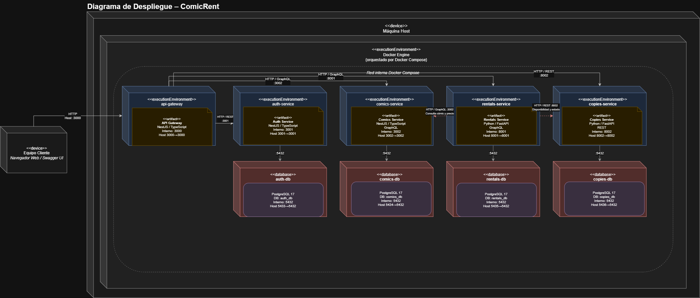
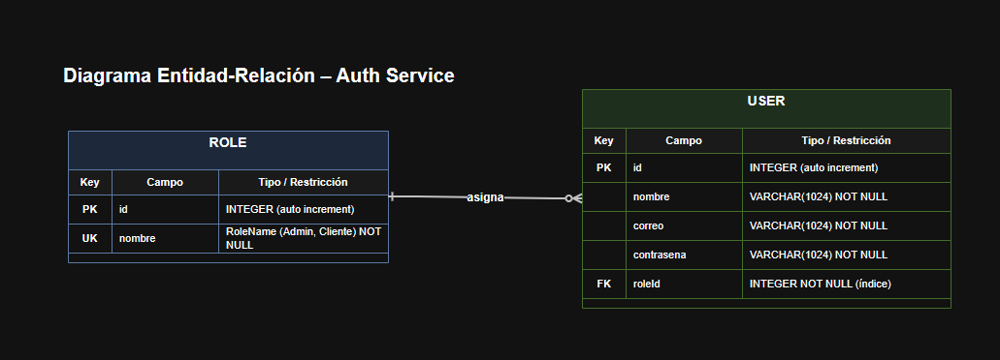
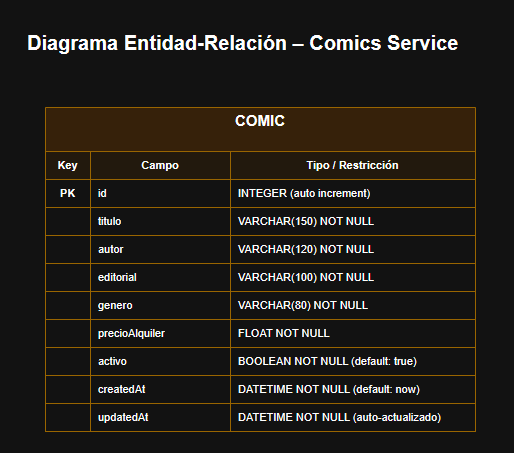
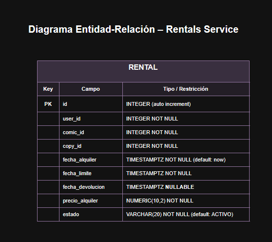
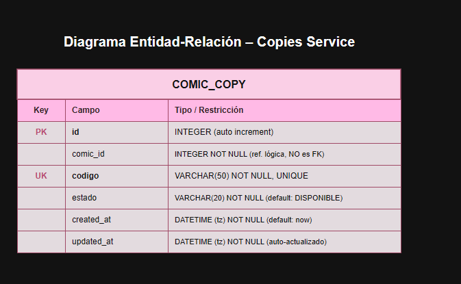

# ComicRent

Sistema distribuido para la administración de alquileres de cómics físicos, desarrollado para la **Práctica 4 — Diseño y toma de decisiones** del curso **Software Avanzado**.

**Sección:** B  
**Carné:** 202307705  

---

## Descripción

ComicRent permite registrar usuarios, administrar un catálogo de cómics, gestionar ejemplares físicos y realizar alquileres y devoluciones.

La solución utiliza una arquitectura de microservicios con un **API Gateway** como punto principal de entrada. Cada microservicio administra su propio dominio y su propia base de datos.

Los cuatro microservicios funcionales son:

- **Auth Service:** autenticación, autorización, usuarios y roles.
- **Comics Service:** catálogo de cómics y precio de alquiler.
- **Rentals Service:** creación, consulta y devolución de alquileres.
- **Copies Service:** administración de ejemplares físicos y disponibilidad.

Además, Rentals Service se comunica directamente con Comics Service y Copies Service para completar el flujo de alquiler.

---

## Arquitectura general


El flujo principal es:

```text
Usuario / Cliente
       |
       v
   API Gateway
       |
       +------> Auth Service
       |
       +------> Comics Service
       |
       +------> Rentals Service
       |
       +------> Copies Service
```

Durante un alquiler:

```text
Rentals Service
       |
       +------> Comics Service
       |        valida el cómic
       |        obtiene el precio
       |
       +------> Copies Service
                obtiene un ejemplar disponible
                lo marca como ALQUILADO
```

Cada microservicio posee su propia base de datos y no existen Foreign Keys físicas entre bases de datos de dominios diferentes.

---

## Tecnologías

| Componente | Tecnologías | Interfaz |
|---|---|---|
| API Gateway | NestJS, TypeScript | REST + Swagger/OpenAPI |
| Auth Service | NestJS, TypeScript, Prisma | REST |
| Comics Service | NestJS, TypeScript, Prisma, Apollo | GraphQL |
| Rentals Service | Python, FastAPI, Strawberry, SQLAlchemy | GraphQL |
| Copies Service | Python, FastAPI, SQLAlchemy | REST |
| Bases de datos | PostgreSQL 17 | SQL |
| Contenerización | Docker + Docker Compose | — |

La práctica utiliza al menos dos lenguajes de programación:

```text
TypeScript
Python
```

Y GraphQL se utiliza en dos microservicios:

```text
Comics Service
Rentals Service
```

---

## Estructura

```text
P4/
|
|-- api-gateway/
|
|-- services/
|   |-- auth-service/
|   |-- comics-service/
|   |-- rentals-service/
|   `-- copies-service/
|
|-- docs/
|   |-- diagramas/
|   |   |-- Arquitectura General.png
|   |   |-- DiagramaDespliegue.png
|   |   |-- ER-MicroservicioAuthService.png
|   |   |-- ER-MicroservicioComicService.png
|   |   |-- ER-MicroservicioCopiesService.png
|   |   `-- ER-MicroservicioRentalsService.png
|   |
|   |-- swagger/
|   |   `-- Contrato.json
|   |
|   `-- ManualTecnico.md
|
|-- .env.example
|-- .gitignore
|-- docker-compose.yml
`-- README.md
```

Cada servicio cuenta con su propio `Dockerfile`.

---

## Microservicios

### Auth Service

Responsable de:

- registro de usuarios;
- inicio de sesión;
- roles `Admin` y `Cliente`;
- validación de sesión;
- JWT;
- renovación de token;
- cifrado de datos sensibles.

Puerto:

```text
3001
```

Base de datos:

```text
auth_db
```

Endpoints internos principales:

```text
POST /auth/register
POST /auth/login
GET  /auth/validate
```

Los datos sensibles se almacenan cifrados mediante **AES-256-CBC**.

El JWT se guarda en una cookie HTTP-only:

```text
access_token
```

---

### Comics Service

Responsable de administrar:

- título;
- autor;
- editorial;
- género;
- precio de alquiler;
- estado activo.

Puerto:

```text
3002
```

Base:

```text
comics_db
```

GraphQL:

```text
http://localhost:3002/graphql
```

Operaciones:

```graphql
Query:
  comics
  comic(id)

Mutation:
  createComic(input)
```

---

### Rentals Service

Responsable de:

- crear alquileres;
- consultar alquileres;
- consultar alquileres por usuario;
- calcular fecha límite;
- registrar precio;
- gestionar devoluciones;
- coordinar Comics Service y Copies Service.

Puerto:

```text
8001
```

Base:

```text
rentals_db
```

GraphQL:

```text
http://localhost:8001/graphql
```

Operaciones:

```graphql
Query:
  rentals
  rental(id)
  rentalsByUser(userId)

Mutation:
  createRental(input)
  returnRental(id)
```

El cliente no determina directamente el precio ni el ejemplar asignado.

Rentals Service consulta:

```text
Comics Service -> precio y estado del cómic
Copies Service -> ejemplar disponible y estado
```

---

### Copies Service

Responsable de administrar los ejemplares físicos.

Estados:

```text
DISPONIBLE
ALQUILADO
```

Puerto:

```text
8002
```

Base:

```text
copies_db
```

Endpoints internos:

```text
POST  /copies
GET   /copies
GET   /copies/{copy_id}
GET   /copies/by-comic/{comic_id}
GET   /copies/available/by-comic/{comic_id}
PATCH /copies/{copy_id}/rent
PATCH /copies/{copy_id}/return
```

---

## API Gateway

El API Gateway es el punto principal de entrada del sistema.

Puerto:

```text
3000
```

URL:

```text
http://localhost:3000
```

Sus responsabilidades incluyen:

- centralizar las solicitudes externas;
- validar autenticación;
- aplicar roles;
- consumir Auth Service;
- consumir Comics Service;
- consumir Rentals Service;
- consumir Copies Service;
- transformar los contratos internos REST/GraphQL en una API pública REST;
- publicar el contrato OpenAPI.

---

## Swagger / Contrato de microservicios

Swagger UI:

```text
http://localhost:3000/docs
```

Contrato OpenAPI JSON:

```text
http://localhost:3000/docs-json
```

El contrato exportado se encuentra en:

```text
docs/swagger/Contrato.json
```

[Ver contrato OpenAPI](./docs/swagger/Contrato.json)

Swagger permite probar los endpoints directamente desde el navegador y conserva la cookie `access_token` después del login.

---

## API pública

### Authentication

| Método | Ruta | Descripción |
|---|---|---|
| POST | `/api/auth/register` | Registrar usuario |
| POST | `/api/auth/login` | Iniciar sesión |

### Comics

| Método | Ruta | Rol |
|---|---|---|
| GET | `/api/comics` | Admin / Cliente |
| GET | `/api/comics/{id}` | Admin / Cliente |
| POST | `/api/comics` | Admin |

### Rentals

| Método | Ruta | Rol |
|---|---|---|
| POST | `/api/rentals` | Admin / Cliente |
| GET | `/api/rentals/me` | Admin / Cliente |
| GET | `/api/rentals/{id}` | Admin o propietario |
| PATCH | `/api/rentals/{id}/return` | Admin o propietario |

### Copies

| Método | Ruta | Rol |
|---|---|---|
| GET | `/api/copies/by-comic/{comicId}` | Admin / Cliente |
| GET | `/api/copies/available/by-comic/{comicId}` | Admin / Cliente |
| POST | `/api/copies` | Admin |

---

## Bases de datos

Cada microservicio posee una base PostgreSQL independiente.

| Servicio | Base de datos | Puerto host | Puerto interno |
|---|---|---:|---:|
| Auth Service | `auth_db` | 5433 | 5432 |
| Comics Service | `comics_db` | 5434 | 5432 |
| Rentals Service | `rentals_db` | 5435 | 5432 |
| Copies Service | `copies_db` | 5436 | 5432 |

Volúmenes Docker:

```text
auth_db_data
comics_db_data
rentals_db_data
copies_db_data
```

Las referencias de datos entre microservicios son lógicas.

Por ejemplo:

```text
rentals.user_id
rentals.comic_id
rentals.copy_id
comic_copies.comic_id
```

no son Foreign Keys hacia bases de datos externas.

---

## Diagramas

### Arquitectura general


### Diagrama de despliegue



### ER — Auth Service



### ER — Comics Service



### ER — Rentals Service



### ER — Copies Service



---

## Configuración

Crear el archivo `.env` a partir de:

```text
.env.example
```

En PowerShell:

```powershell
Copy-Item .env.example .env
```

La plantilla contiene las variables necesarias para los cuatro servicios, sus bases de datos y el API Gateway.

Ejemplo de variables:

```env
AUTH_DB_USER=auth_user
AUTH_DB_PASSWORD=auth_password
AUTH_DB_NAME=auth_db
AUTH_DB_PORT=5433
AUTH_SERVICE_PORT=3001

AUTH_JWT_SECRET=REEMPLAZAR_CON_SECRETO_JWT
AUTH_ENCRYPTION_KEY=REEMPLAZAR_CON_LLAVE_HEXADECIMAL_DE_64_CARACTERES

JWT_EXPIRES_IN=60
JWT_REFRESH_TIME_SECONDS=60

COMICS_DB_USER=comics_user
COMICS_DB_PASSWORD=comics_password
COMICS_DB_NAME=comics_db
COMICS_DB_PORT=5434
COMICS_SERVICE_PORT=3002

RENTALS_DB_USER=rentals_user
RENTALS_DB_PASSWORD=rentals_password
RENTALS_DB_NAME=rentals_db
RENTALS_DB_PORT=5435
RENTALS_SERVICE_PORT=8001

RENTALS_COMICS_SERVICE_URL=http://comics-service:3002/graphql
RENTALS_COPIES_SERVICE_URL=http://copies-service:8002
RENTALS_HTTP_TIMEOUT_SECONDS=5

COPIES_DB_USER=copies_user
COPIES_DB_PASSWORD=copies_password
COPIES_DB_NAME=copies_db
COPIES_DB_PORT=5436
COPIES_SERVICE_PORT=8002

GATEWAY_PORT=3000
GATEWAY_AUTH_SERVICE_URL=http://auth-service:3001
GATEWAY_COMICS_SERVICE_URL=http://comics-service:3002/graphql
GATEWAY_RENTALS_SERVICE_URL=http://rentals-service:8001/graphql
GATEWAY_COPIES_SERVICE_URL=http://copies-service:8002
GATEWAY_HTTP_TIMEOUT_MS=5000
```

Para generar una llave hexadecimal aleatoria de 32 bytes:

```powershell
node -e "console.log(require('crypto').randomBytes(32).toString('hex'))"
```

El archivo `.env` real no debe subirse al repositorio.

---

## Ejecución

### Requisitos

- Docker Desktop.
- Docker Compose.
- Git.
- Navegador web.

Al utilizar Docker no es necesario instalar localmente todas las versiones de Node.js, Python o PostgreSQL utilizadas por cada servicio.

### Levantar todo el sistema

Desde `P4/`:

```powershell
docker compose --env-file .env up --build
```

En segundo plano:

```powershell
docker compose --env-file .env up -d --build
```

### Verificar contenedores

```powershell
docker compose ps
```

### Ver logs

```powershell
docker compose logs -f
```

Servicio específico:

```powershell
docker compose logs -f api-gateway
```

### Detener

```powershell
docker compose down
```

Para eliminar también los volúmenes:

```powershell
docker compose down -v
```

> `docker compose down -v` elimina también los datos persistidos.

---

## Flujo de prueba

La forma recomendada de probar la solución es utilizar:

```text
http://localhost:3000/docs
```

### 1. Registrar usuario

```http
POST /api/auth/register
```

Ejemplo:

```json
{
  "nombre": "Administrador ComicRent",
  "correo": "admin@comicrent.com",
  "contrasena": "Clave123!",
  "rol": "Admin"
}
```

### 2. Iniciar sesión

```http
POST /api/auth/login
```

```json
{
  "correo": "admin@comicrent.com",
  "contrasena": "Clave123!"
}
```

El navegador almacena:

```text
access_token
```

### 3. Crear cómic

```http
POST /api/comics
```

```json
{
  "titulo": "Batman: Año Uno",
  "autor": "Frank Miller",
  "editorial": "DC Comics",
  "genero": "Superheroes",
  "precioAlquiler": 25
}
```

### 4. Crear ejemplar

```http
POST /api/copies
```

```json
{
  "comicId": 1,
  "codigo": "BAT-001"
}
```

### 5. Crear alquiler

```http
POST /api/rentals
```

```json
{
  "comicId": 1,
  "dias": 7
}
```

El cliente no envía:

```text
userId
copyId
precioAlquiler
```

Estos datos son obtenidos automáticamente por la solución.

### 6. Consultar mis alquileres

```http
GET /api/rentals/me
```

### 7. Devolver

```http
PATCH /api/rentals/{id}/return
```

El alquiler pasa a `DEVUELTO` y el ejemplar vuelve a `DISPONIBLE`.

---

# Principios SOLID

La solución busca mantener responsabilidades separadas y componentes pequeños. A continuación se explica cada principio y cómo se evidencia en el código del proyecto.

## S — Single Responsibility Principle

**Un componente debe tener una responsabilidad principal y una única razón importante para cambiar.**

En ComicRent las responsabilidades se separaron en diferentes clases, módulos y microservicios.

Ejemplos:

```text
api-gateway/src/common/guards/gateway-auth.guard.ts
```

`GatewayAuthGuard` se encarga de verificar si existe una sesión válida.

```text
api-gateway/src/common/guards/gateway-role.guard.ts
```

`GatewayRoleGuard` se encarga exclusivamente de comprobar permisos por rol.

En Rentals también se separó la lógica de comunicación:

```text
services/rentals-service/app/clients/comics_client.py
services/rentals-service/app/clients/copies_client.py
```

`ComicsClient` conoce cómo consultar Comics Service, mientras que `CopiesClient` conoce cómo consumir Copies Service.

De esta manera `RentalsService` se concentra en las reglas y coordinación del alquiler en vez de contener todo el código HTTP.

---

## O — Open/Closed Principle

**El código debe estar abierto a extensión, pero cerrado a modificaciones innecesarias.**

La autorización del Gateway es un ejemplo.

Los controladores pueden declarar los roles permitidos utilizando:

```typescript
@Roles('Admin')
```

o:

```typescript
@Roles('Admin', 'Cliente')
```

El archivo:

```text
api-gateway/src/common/guards/gateway-role.guard.ts
```

lee los metadatos definidos por el decorador y ejecuta una validación genérica.

Esto permite agregar nuevas operaciones protegidas y diferentes combinaciones de roles sin modificar la lógica interna del guard en cada nuevo endpoint.

También el cliente del Gateway centraliza las operaciones de transporte. Los controladores pueden agregar nuevas operaciones utilizando los métodos existentes de comunicación sin duplicar la lógica de `fetch`, timeout y manejo básico de respuestas.

---

## L — Liskov Substitution Principle

**Una implementación que cumple un contrato debe poder utilizarse donde se espera dicho contrato sin alterar el comportamiento esperado del sistema.**

NestJS define el contrato:

```typescript
CanActivate
```

En el Gateway existen dos guards diferentes:

```text
GatewayAuthGuard
GatewayRoleGuard
```

y ambos implementan:

```typescript
implements CanActivate
```

Por ello NestJS puede utilizarlos en `@UseGuards(...)` mediante el mismo contrato, aunque internamente realicen tareas distintas.

Ejemplo:

```typescript
@UseGuards(
  GatewayAuthGuard,
  GatewayRoleGuard,
)
```

Cada guard respeta el contrato `canActivate()` y puede participar en el mecanismo estándar de guards del framework.

---

## I — Interface Segregation Principle

**Un consumidor no debería depender de operaciones que no necesita. Es preferible utilizar contratos pequeños y específicos.**

En Rentals Service no se creó un cliente gigante encargado de todos los microservicios.

Se separaron:

```text
ComicsClient
CopiesClient
```

`ComicsClient` expone únicamente la operación necesaria para consultar un cómic.

```python
ComicsClient.find_one(...)
```

`CopiesClient` contiene únicamente las operaciones que Rentals necesita del dominio de ejemplares:

```python
CopiesClient.find_available(...)
CopiesClient.mark_as_rented(...)
CopiesClient.mark_as_available(...)
```

En Python esta separación se implementó mediante clientes pequeños y específicos, sin obligar a Rentals a depender de operaciones de Comics o Copies que no utiliza.

---

## D — Dependency Inversion Principle

**Los componentes de alto nivel no deberían crear directamente todas sus dependencias; estas deben proporcionarse desde el exterior mediante mecanismos de abstracción o inyección.**

NestJS utiliza inyección de dependencias en el API Gateway.

Por ejemplo, `GatewayAuthGuard` recibe:

```typescript
constructor(
  private readonly client:
    MicroservicesClientService,
) {}
```

El guard no crea manualmente:

```typescript
new MicroservicesClientService(...)
```

La dependencia es proporcionada por el contenedor de NestJS.

De forma similar, `GatewayRoleGuard` recibe `Reflector` mediante el constructor.

Los controladores del Gateway también reciben `MicroservicesClientService` en lugar de crear el cliente por su cuenta.

Esto desacopla la construcción de dependencias de la lógica que las utiliza y permite reemplazar providers durante pruebas o futuras extensiones.

---

## Resumen SOLID

| Principio | Evidencia principal |
|---|---|
| SRP | Guards, clientes y servicios con responsabilidades separadas |
| OCP | Decorador `@Roles` + validación genérica de `GatewayRoleGuard` |
| LSP | `GatewayAuthGuard` y `GatewayRoleGuard` implementan `CanActivate` |
| ISP | `ComicsClient` y `CopiesClient` ofrecen contratos pequeños y específicos |
| DIP | Dependencias del Gateway proporcionadas mediante inyección de NestJS |

---

## Comunicación directa entre microservicios

Además del API Gateway, Rentals Service se comunica directamente con:

```text
Comics Service
Copies Service
```

### Rentals → Comics

Se utiliza para:

- comprobar que el cómic existe;
- verificar `activo`;
- obtener `precioAlquiler`.

### Rentals → Copies

Se utiliza para:

- buscar un ejemplar disponible;
- cambiar `DISPONIBLE -> ALQUILADO`;
- cambiar `ALQUILADO -> DISPONIBLE`.

La comunicación no requiere acceso directo a las bases de datos de otros servicios.

---

## Manejo básico de fallos distribuidos

Rentals Service incluye compensaciones básicas.

Ejemplo durante creación:

```text
Copies cambia ejemplar a ALQUILADO
        |
        v
Falla guardar Rental
        |
        v
Rentals solicita devolver la copia a DISPONIBLE
```

Durante devolución se utiliza la operación inversa si la actualización local falla después de haber liberado el ejemplar.

Esto reduce la posibilidad de dejar estados inconsistentes entre Rentals y Copies.

---

## Docker Compose

El archivo:

```text
docker-compose.yml
```

levanta:

```text
api-gateway

auth-service
auth-db

comics-service
comics-db

rentals-service
rentals-db

copies-service
copies-db
```

Son nueve contenedores de aplicación y persistencia.

Las bases utilizan `healthcheck`, y los servicios dependientes esperan a que su PostgreSQL correspondiente esté saludable antes de iniciar.

---

## Documentación técnica

El manual técnico completo se encuentra en:

[Manual Técnico](./docs/ManualTecnico.md)

Incluye información sobre:

- arquitectura;
- microservicios;
- bases de datos;
- Docker;
- variables de entorno;
- puertos;
- seguridad;
- Swagger;
- ejecución;
- comunicación entre servicios;
- pruebas;
- solución de problemas.

---

## Documentación disponible

```text
docs/
|
|-- ManualTecnico.md
|
|-- swagger/
|   `-- Contrato.json
|
`-- diagramas/
    |-- Arquitectura General.png
    |-- DiagramaDespliegue.png
    |-- ER-MicroservicioAuthService.png
    |-- ER-MicroservicioComicService.png
    |-- ER-MicroservicioCopiesService.png
    `-- ER-MicroservicioRentalsService.png
```

---

## Consideraciones

- El archivo `.env` con secretos reales no debe versionarse.
- `.env.example` funciona como plantilla.
- El API Gateway es el punto principal de entrada externo.
- Cada microservicio administra únicamente su propia base de datos.
- No existen Foreign Keys entre bases pertenecientes a microservicios distintos.
- El precio de un alquiler no es proporcionado por el cliente.
- El ejemplar físico se asigna utilizando Copies Service.
- El contrato público debe actualizarse si se agregan nuevas operaciones.
