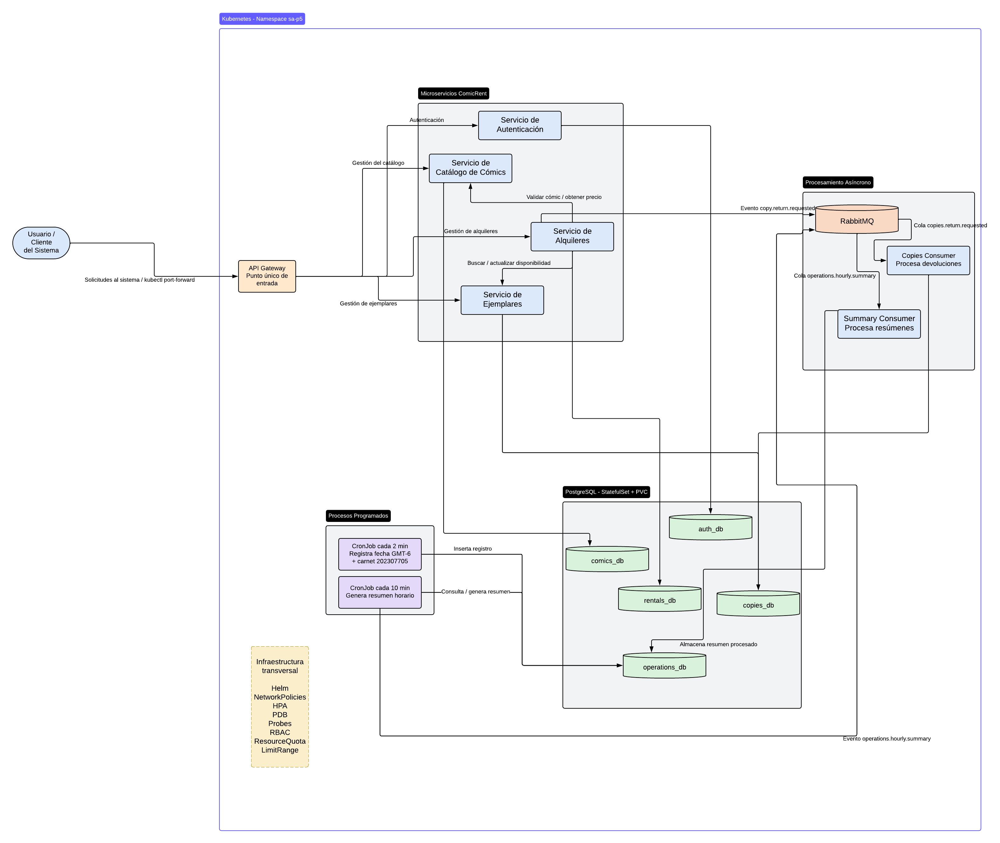

# Práctica 5 - Software Avanzado
## ComicRent - Kubernetes, Helm, RabbitMQ y Resiliencia

**Carnet:** 202307705  
**Curso:** Software Avanzado  
**Práctica:** 5  
**Proyecto base:** ComicRent  
**Entorno:** Kubernetes local con Minikube  
**Namespace de aplicación:** `sa-p5`

---

# 1. Descripción

La Práctica 5 extiende la arquitectura de microservicios desarrollada en la Práctica 4 del sistema **ComicRent**, incorporando mecanismos de despliegue, persistencia, comunicación asíncrona, aislamiento de red, seguridad, escalamiento, resiliencia y automatización utilizando Kubernetes y Helm.

La solución conserva los microservicios funcionales de la práctica anterior y agrega infraestructura específica para Kubernetes sin duplicar el código fuente de P4.

La arquitectura incluye:

- API Gateway.
- Auth Service.
- Comics Service.
- Rentals Service.
- Copies Service.
- Copies Consumer.
- PostgreSQL persistente.
- RabbitMQ persistente.
- Summary Consumer.
- CronJob de registro periódico.
- CronJob de resumen periódico.
- Helm como mecanismo de despliegue.
- NetworkPolicies.
- Horizontal Pod Autoscaler.
- PodDisruptionBudgets.
- ResourceQuota y LimitRange.
- ServiceAccounts y RBAC.
- Probes de salud.
- Pruebas de carga con k6.
- Scripts para build, upgrade, rollback y validación.

---

# 2. Arquitectura general



El **API Gateway es el único punto de entrada utilizado desde el exterior**.

Los microservicios internos utilizan Services de tipo `ClusterIP`.

Para pruebas locales se utiliza:

```bash
kubectl port-forward
```

por lo que no se requiere Ingress para la ejecución local de esta práctica.

---

# 3. Comunicación entre servicios

## 3.1 Comunicación síncrona

Se mantienen las siguientes comunicaciones autorizadas:

```text
Gateway -> Auth
Gateway -> Comics
Gateway -> Rentals
Gateway -> Copies

Rentals -> Comics
Rentals -> Copies
```

Estas comunicaciones son necesarias para los flujos de negocio provenientes de la Práctica 4.

---

## 3.2 Comunicación asíncrona

Se agregó RabbitMQ para implementar comunicación asíncrona.

El flujo principal agregado es:

```text
Rentals Service
      |
      | copy.return.requested
      v
RabbitMQ
      |
      v
copies.return.requested
      |
      v
Copies Consumer
      |
      v
PostgreSQL
```

Al devolver una renta:

1. `Rentals Service` publica un evento.
2. RabbitMQ almacena el mensaje en una cola durable.
3. `Copies Consumer` recibe el evento.
4. El consumer actualiza la copia correspondiente.
5. Se registra el `event_id` procesado.
6. Se realiza `COMMIT` en PostgreSQL.
7. Únicamente después del procesamiento exitoso se envía el `ACK`.

De esta forma se evita confirmar mensajes que todavía no han sido procesados correctamente.

---

# 4. Idempotencia

El consumer utiliza una tabla:

```text
processed_events
```

donde el `event_id` funciona como identificador único.

Si RabbitMQ vuelve a entregar un evento que ya fue procesado:

```text
event_id existente
      |
      v
no se ejecuta nuevamente la operación
      |
      v
ACK
```

Esto evita procesar dos veces la misma devolución.

---

# 5. Estructura del proyecto

```text
P5/
|
|-- README.md
|
|-- evidence/
|   `-- Documentacion.md
|
|-- helm/
|   `-- comicrent/
|       |
|       |-- Chart.yaml
|       |-- Chart.lock
|       |-- values.yaml
|       |-- values-dev.yaml
|       |-- values-prod.yaml
|       |-- values.example.yaml
|       |
|       |-- templates/
|       |
|       `-- charts/
|           |-- api-gateway/
|           |-- auth-service/
|           |-- comics-service/
|           |-- rentals-service/
|           |-- copies-service/
|           |-- copies-consumer/
|           |-- operations-jobs/
|           |-- postgresql-*.tgz
|           `-- rabbitmq-*.tgz
|
|-- jobs/
|   |-- Dockerfile
|   |-- requirements.txt
|   |-- db.py
|   |-- cron_tick.py
|   |-- cron_summary.py
|   `-- summary_consumer.py
|
|-- load-test/
|   `-- gateway-health.js
|
`-- scripts/
    |-- build-images.ps1
    |-- helm-version.ps1
    |-- helm-upgrade.ps1
    |-- helm-rollback.ps1
    `-- verify-cluster.ps1
```

El código fuente de los microservicios continúa ubicado en `P4`.

P5 contiene principalmente:

- Helm.
- Kubernetes.
- Scripts.
- Pruebas de carga.
- Jobs específicos de P5.
- Documentación.

---

# 6. Microservicios

| Componente | Puerto | Función |
|---|---:|---|
| API Gateway | 3000 | Punto de entrada |
| Auth Service | 3001 | Autenticación |
| Comics Service | 3002 | Gestión de cómics |
| Rentals Service | 8001 | Gestión de rentas |
| Copies Service | 8002 | Gestión de copias |
| Copies Consumer | - | Procesamiento asíncrono de devoluciones |
| Summary Consumer | - | Procesamiento de resúmenes |

---

# 7. PostgreSQL

PostgreSQL se despliega mediante Helm utilizando un `StatefulSet`.

La infraestructura incluye:

```text
StatefulSet
    |
    +-- PersistentVolumeClaim
    |
    +-- Service
    |
    `-- Headless Service
```

Servicios creados:

```text
comicrent-postgresql
comicrent-postgresql-hl
```

El servicio headless tiene:

```text
CLUSTER-IP: None
```

---

# 8. Bases de datos

Se utiliza una instancia PostgreSQL con cinco bases de datos lógicas:

```text
auth_db
comics_db
rentals_db
copies_db
operations_db
```

Esto permite conservar la separación lógica de datos entre microservicios y agregar una base independiente para los procesos propios de P5.

---

# 9. Persistencia

Los volúmenes utilizados son:

```text
PostgreSQL -> 2Gi
RabbitMQ   -> 1Gi
```

Pueden verificarse mediante:

```powershell
kubectl get pvc -n sa-p5
```

Resultado esperado:

```text
data-comicrent-postgresql-0   Bound
data-comicrent-rabbitmq-0     Bound
```

La persistencia fue validada eliminando el Pod de PostgreSQL y comprobando que los datos continuaban disponibles después de que el StatefulSet recreara el Pod.

---

# 10. RabbitMQ

RabbitMQ se despliega como dependencia Helm.

Servicios:

```text
comicrent-rabbitmq
comicrent-rabbitmq-headless
```

Colas principales:

```text
copies.return.requested
operations.hourly.summary
```

Ambas son durables.

Las colas pueden verificarse con:

```powershell
kubectl exec `
  -n sa-p5 `
  comicrent-rabbitmq-0 `
  -- rabbitmqctl list_queues `
  name `
  durable `
  messages_ready `
  messages_unacknowledged `
  consumers
```

Ejemplo:

```text
operations.hourly.summary   true   0   0   1
copies.return.requested     true   0   0   1
```

---

# 11. Prueba de consumer caído

La persistencia de mensajes de RabbitMQ fue probada deteniendo temporalmente el consumer:

```powershell
kubectl scale deployment comicrent-copies-consumer `
  --replicas=0 `
  -n sa-p5
```

Mientras el consumer estaba detenido se generaron devoluciones.

RabbitMQ acumuló los mensajes:

```text
messages_ready > 0
consumers = 0
```

Posteriormente se restauró el consumer:

```powershell
kubectl scale deployment comicrent-copies-consumer `
  --replicas=1 `
  -n sa-p5
```

Los mensajes pendientes fueron consumidos correctamente y las copias regresaron al estado disponible.

---

# 12. Helm

La aplicación utiliza un **chart padre** denominado:

```text
comicrent
```

que contiene subcharts para los componentes de la solución.

Dependencias principales:

```text
api-gateway
auth-service
comics-service
rentals-service
copies-service
copies-consumer
operations-jobs
postgresql
rabbitmq
```

---

# 13. Values por ambiente

Se incluyen:

```text
values.yaml
values-dev.yaml
values-prod.yaml
values.example.yaml
```

`values.yaml` contiene valores base.

`values-dev.yaml` contiene configuración para desarrollo.

`values-prod.yaml` contiene configuración orientada a producción.

`values.example.yaml` sirve como referencia para valores configurables y credenciales ficticias.

Los archivos permiten modificar parámetros como:

```text
replicaCount
image.tag
LOG_LEVEL
resources.requests
resources.limits
HPA
secrets
```

---

# 14. Funciones avanzadas de Helm

Los templates utilizan funciones de Helm tales como:

```text
define
include
range
if
else
required
default
quote
```

También se utiliza un helper propio:

```text
comicrent.extraLabels
```

para generar etiquetas adicionales mediante `range`.

---

# 15. Namespace

Todos los componentes de la aplicación se despliegan en:

```text
sa-p5
```

El namespace es creado por el propio chart:

```yaml
kind: Namespace
metadata:
  name: sa-p5
```

Por esta razón no es necesario crear el namespace manualmente antes de instalar la aplicación.

---

# 16. ConfigMaps y Secrets

Las configuraciones no sensibles se almacenan mediante:

```text
ConfigMap
```

Ejemplos:

```text
LOG_LEVEL
URLs de servicios
hosts
puertos
configuración RabbitMQ
```

La información sensible se almacena mediante:

```text
Secret
```

Ejemplos:

```text
contraseña PostgreSQL
contraseña RabbitMQ
JWT secret
encryption key
```

No deben almacenarse credenciales reales en el repositorio.

---

# 17. Reinicio por cambios de configuración

Los Deployments utilizan checksum de ConfigMap.

Ejemplo conceptual:

```yaml
annotations:
  checksum/config: {{ include (...) | sha256sum }}
```

Cuando cambia la configuración, Helm genera un nuevo checksum y Kubernetes realiza el rollout del Deployment afectado.

---

# 18. Instalación desde cero

## 18.1 Requisitos

Se requiere:

```text
Docker
kubectl
Minikube
Helm
k6
PowerShell
```

Para Minikube se recomienda disponer de al menos:

```text
4 GB de memoria
```

---

## 18.2 Iniciar Minikube

Ejemplo:

```powershell
minikube start `
  --memory=4096 `
  --cpus=4
```

Verificar:

```powershell
kubectl get nodes
```

---

# 19. Construcción de imágenes

Desde:

```text
P5/
```

ejecutar:

```powershell
.\scripts\build-images.ps1 `
  -Tag "1.0.0" `
  -LoadMinikube
```

Este script construye:

```text
comicrent/api-gateway:1.0.0
comicrent/auth-service:1.0.0
comicrent/comics-service:1.0.0
comicrent/rentals-service:1.0.0
comicrent/copies-service:1.0.0
comicrent/operations-jobs:1.0.0
```

`copies-consumer` utiliza la misma imagen de:

```text
comicrent/copies-service:1.0.0
```

pero ejecuta un comando diferente.

---

# 20. Publicación opcional en registry

El script también permite publicar las imágenes en un registry.

Primero:

```powershell
docker login
```

Después:

```powershell
.\scripts\build-images.ps1 `
  -Tag "1.0.0" `
  -Registry "docker.io/davidvela777" `
  -Push
```

También puede realizar build, push y carga a Minikube:

```powershell
.\scripts\build-images.ps1 `
  -Tag "1.0.0" `
  -Registry "docker.io/davidvela777" `
  -Push `
  -LoadMinikube
```

---

# 21. Descargar dependencias Helm

Ingresar a:

```powershell
cd .\helm\comicrent
```

Actualizar dependencias:

```powershell
helm dependency update . --skip-refresh
```

---

# 22. Validar el chart

```powershell
helm lint . -f values-dev.yaml
```

Resultado esperado:

```text
1 chart(s) linted, 0 chart(s) failed
```

---

# 23. Renderizar templates

Para verificar los manifests antes del despliegue:

```powershell
helm template comicrent . `
  -f values-dev.yaml `
  > rendered-check.yaml
```

Después de la validación:

```powershell
Remove-Item .\rendered-check.yaml
```

Los manifests renderizados no deben almacenarse en Git.

---

# 24. Instalación inicial

Desde:

```text
P5/helm/comicrent
```

ejecutar:

```powershell
helm install comicrent . `
  -f values-dev.yaml `
  --wait `
  --timeout 10m
```

El release de Helm se administra desde el namespace por defecto, mientras que los recursos de la aplicación son creados explícitamente dentro de:

```text
sa-p5
```

No utilizar:

```text
--create-namespace
```

ya que el namespace es creado por el propio chart.

---

# 25. Verificar el despliegue

Desde `P5`:

```powershell
.\scripts\verify-cluster.ps1
```

El script muestra:

```text
Namespace
Pods
Deployments
StatefulSets
Services
PVC
HPA
PDB
NetworkPolicies
ServiceAccounts
Roles
RoleBindings
CronJobs
ResourceQuota
LimitRange
métricas
colas RabbitMQ
Helm status
Helm history
```

---

# 26. Exponer el API Gateway

El Gateway utiliza:

```text
ClusterIP
```

Para acceder desde la máquina host:

```powershell
kubectl port-forward `
  service/comicrent-api-gateway `
  3100:3000 `
  -n sa-p5
```

La API queda disponible en:

```text
http://localhost:3100
```

Health:

```text
http://localhost:3100/health
```

Se utiliza `3100` en el host para evitar conflicto con posibles servicios locales que utilicen el puerto `3000`.

---

# 27. NetworkPolicies

La solución implementa aislamiento mediante NetworkPolicies.

Existe una política:

```text
comicrent-default-deny
```

que niega tráfico por defecto.

Posteriormente se agregan únicamente las comunicaciones necesarias.

Flujos autorizados principales:

```text
Gateway -> Auth
Gateway -> Comics
Gateway -> Rentals
Gateway -> Copies

Rentals -> Comics
Rentals -> Copies
Rentals -> RabbitMQ

Copies Consumer -> PostgreSQL
Copies Consumer -> RabbitMQ

Cron Tick -> PostgreSQL

Cron Summary -> PostgreSQL
Cron Summary -> RabbitMQ

Summary Consumer -> PostgreSQL
Summary Consumer -> RabbitMQ
```

También se permite DNS para que los Pods puedan resolver Services internos.

Puede verificarse mediante:

```powershell
kubectl get networkpolicy -n sa-p5
```

---

# 28. Seguridad

Cada workload utiliza un ServiceAccount dedicado.

Ejemplos:

```text
comicrent-api-gateway
comicrent-auth-service
comicrent-comics-service
comicrent-rentals-service
comicrent-copies-service
comicrent-copies-consumer
comicrent-cron-tick
comicrent-cron-summary
comicrent-summary-consumer
```

Cada componente posee su correspondiente configuración RBAC mediante:

```text
ServiceAccount
Role
RoleBinding
```

---

# 29. SecurityContext

Los contenedores de aplicación se ejecutan con restricciones como:

```yaml
runAsNonRoot: true
```

y:

```yaml
allowPrivilegeEscalation: false
readOnlyRootFilesystem: true
```

Además se eliminan capabilities innecesarias:

```yaml
capabilities:
  drop:
    - ALL
```

y se utiliza:

```text
seccompProfile: RuntimeDefault
```

---

# 30. Probes

Los componentes utilizan:

```text
startupProbe
readinessProbe
livenessProbe
```

Los servicios HTTP utilizan principalmente:

```text
/health
```

Los consumers utilizan probes `exec` para validar que el proceso y su configuración esencial estén disponibles.

Ejemplo de verificación:

```powershell
kubectl get deployment comicrent-copies-consumer `
  -n sa-p5 `
  -o yaml |
  Select-String `
  -Pattern "startupProbe:","readinessProbe:","livenessProbe:" `
  -Context 0,9
```

---

# 31. Horizontal Pod Autoscaler

El API Gateway posee un HPA configurado con:

```text
minReplicas: 1
maxReplicas: 2
CPU objetivo: 40%
```

Verificar:

```powershell
kubectl get hpa -n sa-p5
```

Ejemplo:

```text
comicrent-api-gateway   cpu: 2%/40%   1   2   1
```

---

# 32. ResourceQuota

El namespace posee límites globales mediante:

```text
comicrent-quota
```

Ejemplo de límites:

```text
requests.cpu: 2
requests.memory: 2Gi

limits.cpu: 4
limits.memory: 4Gi

pods: 20
persistentvolumeclaims: 5
services: 15
secrets: 15
```

Verificar:

```powershell
kubectl get resourcequota -n sa-p5
```

---

# 33. LimitRange

También se utiliza:

```text
comicrent-limits
```

para establecer recursos mínimos, máximos y valores predeterminados para contenedores.

Verificar:

```powershell
kubectl get limitrange -n sa-p5
```

---

# 34. PodDisruptionBudget

Los microservicios poseen PDB para evitar que una disrupción voluntaria elimine todas las instancias disponibles.

Ejemplo:

```text
comicrent-api-gateway
comicrent-auth-service
comicrent-comics-service
comicrent-rentals-service
comicrent-copies-service
```

Verificar:

```powershell
kubectl get pdb -n sa-p5
```

Con una sola réplica y:

```text
minAvailable: 1
```

es normal observar:

```text
ALLOWED DISRUPTIONS = 0
```

---

# 35. RollingUpdate

Los Deployments utilizan estrategia:

```yaml
strategy:
  type: RollingUpdate
  rollingUpdate:
    maxUnavailable: 0
    maxSurge: 1
```

Esto permite crear el nuevo Pod antes de retirar el anterior.

---

# 36. Prueba de actualización sin downtime

Durante la prueba se generaron solicitudes continuas contra el Service interno del Gateway mientras se ejecutaba un:

```text
helm upgrade
```

Se utilizó un Pod de prueba autorizado por NetworkPolicy.

Durante el rollout:

```text
nuevo Pod -> Ready
viejo Pod -> Terminating
```

Las solicitudes realizadas al Service permanecieron con:

```text
HTTP 200
```

durante todo el proceso.

La prueba interna contra el Service es utilizada para evitar que la terminación local de un proceso `kubectl port-forward` sea confundida con una caída real del servicio.

---

# 37. PodDisruptionBudget y RollingUpdate

Se utilizan ambos mecanismos con objetivos distintos:

```text
RollingUpdate
    -> controla la actualización de Deployments.

PodDisruptionBudget
    -> protege contra disrupciones voluntarias.
```

---

# 38. CronJob cada 2 minutos

Se ejecuta:

```text
*/2 * * * *
```

con zona horaria:

```text
America/Guatemala
```

El Job inserta periódicamente:

```text
fecha/hora GMT-6
carnet 202307705
```

en la base:

```text
operations_db
```

---

# 39. CronJob cada 10 minutos

Se ejecuta:

```text
*/10 * * * *
```

con:

```text
timeZone: America/Guatemala
```

Su flujo es:

```text
CronJob
   |
   v
consulta registros
   |
   v
genera resumen
   |
   v
RabbitMQ
   |
   v
Summary Consumer
   |
   v
PostgreSQL
```

El resumen es publicado mediante el routing key:

```text
operations.hourly.summary
```

---

# 40. Configuración de CronJobs

Ambos CronJobs utilizan:

```yaml
timeZone: "America/Guatemala"
concurrencyPolicy: Forbid
successfulJobsHistoryLimit: 3
failedJobsHistoryLimit: 3
```

y:

```yaml
backoffLimit: 2
```

Verificar:

```powershell
kubectl get cronjobs -n sa-p5
```

---

# 41. Pruebas de carga

La prueba de carga se encuentra en:

```text
P5/load-test/gateway-health.js
```

Se utiliza:

```text
k6
```

Antes de ejecutar la prueba se debe iniciar:

```powershell
kubectl port-forward `
  service/comicrent-api-gateway `
  3100:3000 `
  -n sa-p5
```

En otra terminal:

```powershell
k6 run .\load-test\gateway-health.js
```

---

# 42. Resultado de prueba de carga

En la prueba final se obtuvo aproximadamente:

```text
Solicitudes:        30,476
RPS:                253.86 req/s
p95:                536.72 ms
Errores HTTP:       0.00 %
Checks exitosos:    100 %
Máximo de VUs:      120
```

Durante la prueba el HPA escaló el Gateway de:

```text
1 réplica
```

a:

```text
2 réplicas
```

al superar el objetivo de CPU configurado en 40%.

---

# 43. Optimización de imágenes

Las imágenes utilizan Dockerfiles multi-stage y una imagen final reducida.

Resultados obtenidos:

| Servicio | Imagen anterior | Imagen optimizada |
|---|---:|---:|
| API Gateway | 497 MB Slim | 319 MB Alpine |
| Auth Service | 1.44 GB Slim | 1.33 GB Alpine |
| Comics Service | 1.53 GB Slim | 1.41 GB Alpine |
| Rentals Service | 293 MB Slim | 190 MB Alpine |
| Copies Service | 279 MB Slim | 176 MB Alpine |
| Operations Jobs | - | 94.7 MB Alpine |

También se evaluó Distroless en algunos servicios.

Por ejemplo:

```text
Rentals Alpine:      190 MB
Rentals Distroless:  196 MB
```

Para este caso se mantuvo Alpine por presentar un tamaño competitivo y mayor facilidad operativa.

---

# 44. Versionado Helm

El chart evolucionó de:

```text
comicrent-0.1.0
appVersion 1.0.0
```

a:

```text
comicrent-0.2.0
appVersion 1.1.0
```

La versión se encuentra en:

```text
P5/helm/comicrent/Chart.yaml
```

---

# 45. Script para cambio de versión

Desde `P5`:

```powershell
.\scripts\helm-version.ps1 `
  -ChartVersion "0.3.0" `
  -AppVersion "1.2.0"
```

El script:

1. Muestra la versión actual.
2. Modifica `Chart.yaml`.
3. Ejecuta `helm lint`.
4. Deja el chart preparado para un upgrade.

El cambio de versión y el despliegue se mantienen como operaciones separadas.

---

# 46. Upgrade automatizado

El script:

```text
scripts/helm-upgrade.ps1
```

automatiza:

```text
helm dependency update
helm lint
helm history
helm upgrade
kubectl rollout status
helm history
helm status
```

Uso:

```powershell
.\scripts\helm-upgrade.ps1
```

---

# 47. Historial Helm

Para visualizar el historial:

```powershell
helm history comicrent
```

Durante la práctica se generaron múltiples revisiones.

Entre ellas:

```text
revision 8
Rollback to 6

revision 9
comicrent-0.2.0
appVersion 1.1.0

revision 11
Upgrade complete
```

---

# 48. Rollback

El rollback puede ejecutarse mediante:

```powershell
.\scripts\helm-rollback.ps1 `
  -Revision 6
```

Internamente utiliza:

```text
helm rollback
```

seguido de:

```text
kubectl rollout status
helm history
helm status
```

Durante la práctica se realizó exitosamente un rollback que produjo una nueva revisión en el historial Helm.

---

# 49. Scripts disponibles

La carpeta:

```text
P5/scripts/
```

contiene:

| Script | Función |
|---|---|
| `build-images.ps1` | Construye, etiqueta, carga y opcionalmente publica imágenes |
| `helm-version.ps1` | Modifica de forma controlada la versión del chart |
| `helm-upgrade.ps1` | Ejecuta validación y actualización Helm |
| `helm-rollback.ps1` | Ejecuta rollback hacia una revisión |
| `verify-cluster.ps1` | Verifica integralmente el estado del clúster |

Los scripts permiten reproducir las operaciones utilizadas durante la práctica.

---

# 50. Verificación completa

Ejecutar:

```powershell
.\scripts\verify-cluster.ps1
```

Un despliegue saludable debe mostrar:

```text
API Gateway          1/1 Running
Auth Service         1/1 Running
Comics Service       1/1 Running
Rentals Service      1/1 Running
Copies Service       1/1 Running
Copies Consumer      1/1 Running
Summary Consumer     1/1 Running
PostgreSQL           1/1 Running
RabbitMQ             1/1 Running
```

Los Pods históricos de CronJob pueden mostrarse como:

```text
Completed
```

lo cual representa una ejecución exitosa.

---

# 51. Health Check

Con port-forward activo:

```powershell
Invoke-WebRequest `
  http://localhost:3100/health
```

Debe responder exitosamente.

---

# 52. Comandos útiles

## Pods

```powershell
kubectl get pods -n sa-p5
```

## Services

```powershell
kubectl get svc -n sa-p5
```

## PVC

```powershell
kubectl get pvc -n sa-p5
```

## HPA

```powershell
kubectl get hpa -n sa-p5
```

## PDB

```powershell
kubectl get pdb -n sa-p5
```

## NetworkPolicies

```powershell
kubectl get networkpolicy -n sa-p5
```

## CronJobs

```powershell
kubectl get cronjobs -n sa-p5
```

## ServiceAccounts

```powershell
kubectl get serviceaccounts -n sa-p5
```

## RBAC

```powershell
kubectl get roles -n sa-p5
kubectl get rolebindings -n sa-p5
```

## Recursos

```powershell
kubectl get resourcequota -n sa-p5
kubectl get limitrange -n sa-p5
```

## Métricas

```powershell
kubectl top pods -n sa-p5
```

## Helm

```powershell
helm status comicrent
helm history comicrent
```

---

# 53. Desinstalación

Para eliminar el release:

```powershell
helm uninstall comicrent
```

Debido a que el namespace forma parte del chart, debe verificarse posteriormente su estado:

```powershell
kubectl get namespace sa-p5
```

Para eliminar manualmente el namespace únicamente cuando se desee destruir completamente el entorno:

```powershell
kubectl delete namespace sa-p5
```

> Este comando es únicamente para limpieza completa del entorno y no forma parte del procedimiento normal de despliegue.

---

# 54. Decisiones de arquitectura

## API Gateway como único punto de entrada

Los microservicios no son publicados directamente hacia el exterior.

El Gateway centraliza el acceso y se utiliza:

```text
kubectl port-forward
```

para pruebas locales.

---

## Comunicación interna

La existencia de comunicación directa entre determinados microservicios es intencional y corresponde a dependencias del flujo de negocio.

Las NetworkPolicies funcionan como una lista explícita de comunicaciones autorizadas.

---

## RabbitMQ

RabbitMQ se utiliza únicamente en los flujos donde se necesita desacoplamiento y procesamiento asíncrono.

No reemplaza todas las comunicaciones síncronas entre microservicios.

---

## PostgreSQL

Se utiliza un único servidor PostgreSQL persistente con cinco bases de datos lógicas.

Esto mantiene la separación de información por dominio sin requerir cinco motores PostgreSQL independientes dentro del clúster local.

---

## HPA

El Gateway utiliza:

```text
minReplicas: 1
maxReplicas: 2
targetCPUUtilizationPercentage: 40
```

lo que permite demostrar escalamiento horizontal dentro de los recursos disponibles en Minikube.

---

# 55. Conclusión

La Práctica 5 transforma la solución de microservicios de ComicRent en una arquitectura desplegable mediante Kubernetes y Helm.

La implementación incorpora:

```text
Helm
Kubernetes
PostgreSQL persistente
RabbitMQ
procesamiento asíncrono
ACK posterior al procesamiento
idempotencia
NetworkPolicies
RBAC
SecurityContext
Health Probes
HPA
PDB
ResourceQuota
LimitRange
CronJobs
Rolling Updates
Zero Downtime
Load Testing
Versionado
Upgrade
Rollback
automatización mediante scripts
```

El resultado es una solución reproducible, persistente, aislada y preparada para demostrar mecanismos fundamentales de operación y resiliencia en Kubernetes.