# Práctica 6 — ComicRent desplegado en GKE

## 1. Objetivo y decisiones aplicadas

La plataforma de la Práctica 5 se desplegó en un clúster Kubernetes administrado de Google Cloud. Se reutilizó el chart de `P5\\helm\\comicrent`; P6 contiene únicamente configuración cloud, scripts y evidencias.

Las aclaraciones del auxiliar prevalecen sobre las diferencias del PDF:

| Decisión | Implementación |
|---|---|
| Proveedor cloud | Google Cloud Platform / GKE Standard |
| Nodos | 1 nodo `e2-standard-2`, aunque el PDF menciona 2 nodos |
| Registro | Artifact Registry privado, no Docker Hub público |
| Bases de datos | 3 proyectos Neon con 5 bases lógicas |
| PostgreSQL | Fuera de GKE, en Neon |
| RabbitMQ | Dentro de GKE con PVC y StorageClass del proveedor |
| Entrada pública | Solo API Gateway como `LoadBalancer` |
| Servicios internos | Auth, Comics, Rentals, Copies y RabbitMQ como `ClusterIP` |

## 2. Estado actual de la demostración

- Proyecto GCP: `comicrent-p6-2026`.
- Clúster: `comicrent-gke-p6`.
- Zona: `us-central1-a`.
- Node pool: `default-pool`, pausado temporalmente con 0 nodos para evitar consumo innecesario.
- Namespace: `sa-p6`.
- Artifact Registry: `us-central1-docker.pkg.dev/comicrent-p6-2026/comicrent`.
- StorageClass usada por RabbitMQ: `standard-rwo`.
- API pública: [http://136.119.74.33:3000/docs](http://136.119.74.33:3000/docs).
- El clúster y sus configuraciones permanecen conservados; únicamente se redujo el node pool a 0 nodos.
- Mientras el node pool esté en 0, los Pods no pueden ejecutarse y la API pública no estará disponible. El registro privado, Secrets, PVC, Helm release y Neon no se eliminaron.

### Captura: clúster visible en la consola de GCP

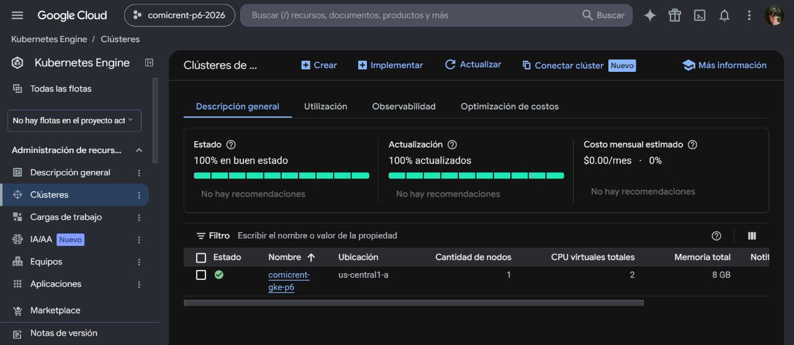

### Captura: detalle del clúster

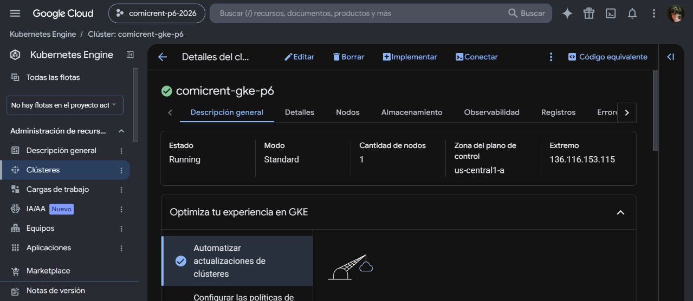

### Captura: node pool y máquina utilizada

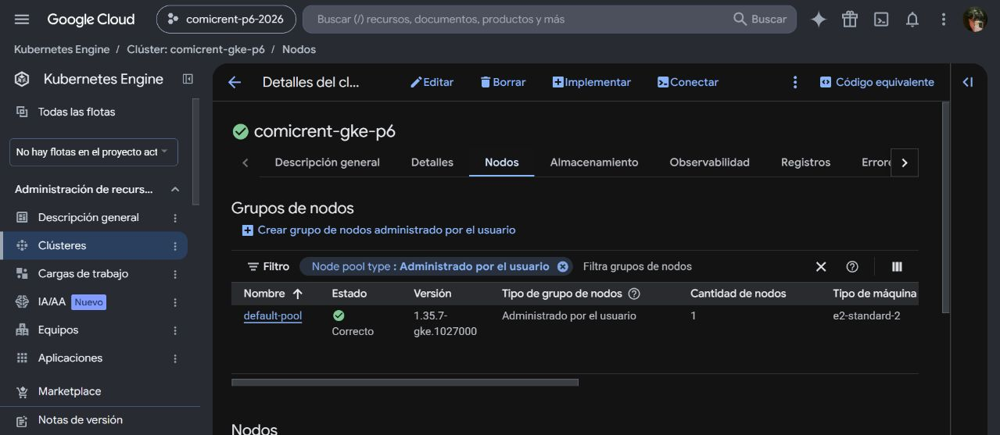

## 3. Estructura de P6

```text
P6/
├── k8s/
│   ├── values-gke-prod.yaml
│   └── values-gke-secret.example.yaml
├── scripts/
│   ├── _common.ps1
│   ├── 00-validate-local.ps1
│   ├── 00-authenticate-gcloud.ps1
│   ├── 01-build-and-push-images.ps1
│   ├── 02-create-gke-cluster.ps1
│   ├── 03-generate-secrets.ps1
│   ├── 04-deploy-gke-prod.ps1
│   ├── 05-destroy-gke-resources.ps1
│   └── 06-collect-evidence.ps1
├── evidence/
└── README.md
```

No se duplicó el chart completo de P5. Se reutiliza:

```text
C:\Users\Vela\Desktop\SA\LAB\PRACTICAS\P5\helm\comicrent
```

Los cambios mínimos en P5 permiten desactivar PostgreSQL interno mediante `postgresql.enabled=false` y conectar los microservicios a los Secrets externos de Neon. P5 continúa usando PostgreSQL local por defecto.

## 4. Dockerfiles de producción

Se crearon y probaron los Dockerfiles multi-stage:

```text
P4\api-gateway\Dockerfile.prod
P4\services\auth-service\Dockerfile.prod
P4\services\comics-service\Dockerfile.prod
P4\services\rentals-service\Dockerfile.prod
P4\services\copies-service\Dockerfile.prod
P5\jobs\Dockerfile.prod
```

Los servicios Node utilizan las etapas `deps`, `build` y `prod`. El job Python utiliza etapas de construcción y runtime. Las imágenes finales ejecutan con usuario no root cuando la tecnología lo permite y solo contienen los artefactos necesarios.

### Comando exacto de validación local

Ejecutado desde la raíz del proyecto:

```powershell
Set-Location C:\Users\Vela\Desktop\SA\LAB\PRACTICAS
.\P6\scripts\00-validate-local.ps1 -Tag "1.0.0-gke"
```

Este comando construye las seis imágenes localmente, ejecuta `helm dependency build`, `helm lint` y `helm template`. No crea recursos cloud.

Resultados guardados:

- [functional-check.txt](evidence/functional-check.txt)
- [helm-status.txt](evidence/helm-status.txt)

## 5. Autenticación y configuración de GCP

La cuenta usada fue `jds.vela77@gmail.com`, con el proyecto `comicrent-p6-2026` enlazado a la cuenta de prueba gratuita de GCP.

### Comandos exactos

```powershell
gcloud auth login
gcloud auth application-default login
gcloud config set project comicrent-p6-2026
gcloud services enable container.googleapis.com artifactregistry.googleapis.com
gcloud auth configure-docker us-central1-docker.pkg.dev --quiet
gcloud config get-value project
gke-gcloud-auth-plugin --version
```

El resultado de `gcloud config get-value project` fue:

```text
comicrent-p6-2026
```

El plugin de autenticación de GKE quedó instalado y respondió con su versión `Kubernetes v0.1.0-gke.3-75-ge286783f0`.

## 6. Artifact Registry privado

Se creó el repositorio privado `comicrent` en `us-central1`. Se publicaron las imágenes de los microservicios, jobs y RabbitMQ.

### Comandos exactos

```powershell
Set-Location C:\Users\Vela\Desktop\SA\LAB\PRACTICAS
.\P6\scripts\01-build-and-push-images.ps1 `
  -ProjectId "comicrent-p6-2026" `
  -Region "us-central1" `
  -Repository "comicrent" `
  -Tag "1.0.0-gke"

gcloud artifacts repositories list `
  --project=comicrent-p6-2026 `
  --location=us-central1

gcloud artifacts docker images list `
  us-central1-docker.pkg.dev/comicrent-p6-2026/comicrent `
  --include-tags
```

### Captura: repositorio privado

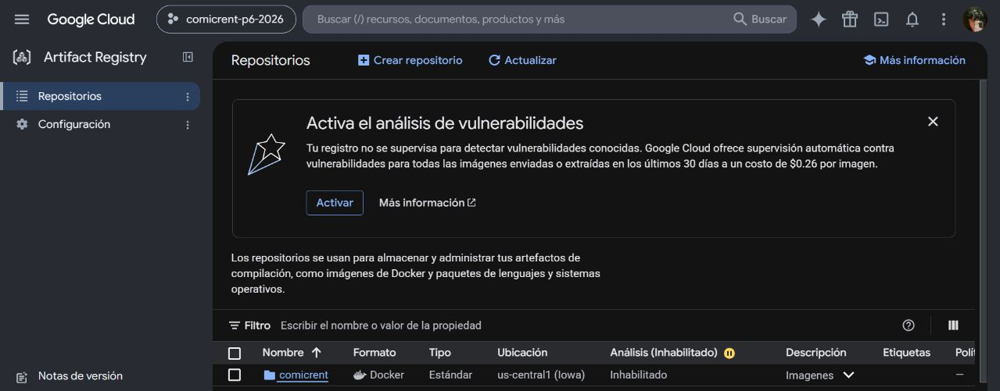

### Captura: imágenes publicadas

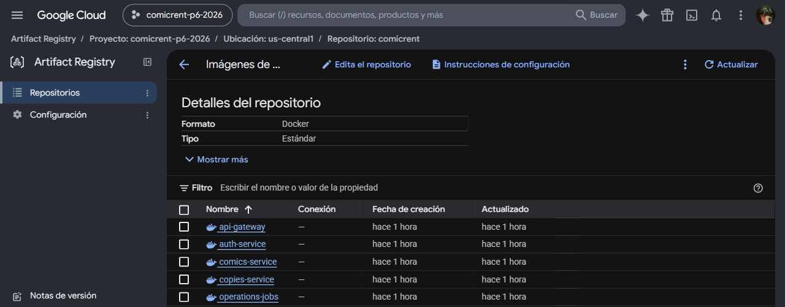

En el repositorio aparecen:

```text
api-gateway
auth-service
comics-service
copies-service
operations-jobs
rabbitmq
rentals-service
```

## 7. Creación del clúster GKE

El clúster se creó con un solo nodo debido a la aclaración del auxiliar. Se habilitó NetworkPolicy, alias IP y disco persistente balanceado de 20 GiB.

### Comando exacto

```powershell
Set-Location C:\Users\Vela\Desktop\SA\LAB\PRACTICAS
.\P6\scripts\02-create-gke-cluster.ps1 `
  -ProjectId "comicrent-p6-2026" `
  -Region "us-central1" `
  -Zone "us-central1-a" `
  -ClusterName "comicrent-gke-p6" `
  -MachineType "e2-standard-2" `
  -NodeCount 1
```

Después se verificó la conexión:

```powershell
gcloud container clusters get-credentials comicrent-gke-p6 `
  --zone=us-central1-a `
  --project=comicrent-p6-2026

kubectl get nodes -o wide
kubectl get storageclass
```

## 8. Bases de datos Neon

Se utilizaron tres proyectos Neon independientes, todos en el plan Free y en `AWS US East 2 (Ohio)`:

| Proyecto Neon | ID | Bases utilizadas |
|---|---|---|
| `comicrent-neon-auth-p6` | `silent-frost-23687495` | `auth_db` |
| `comicrent-neon-catalog-p6` | `silent-mode-47278928` | `comics_db`, `copies_db` |
| `comicrent-neon-operations-p6` | `twilight-cherry-83337673` | `rentals_db`, `operations_db` |

Las URLs de conexión no se escriben en el repositorio. Se guardaron en el Secret de Kubernetes correspondiente.

### Capturas de los tres proyectos

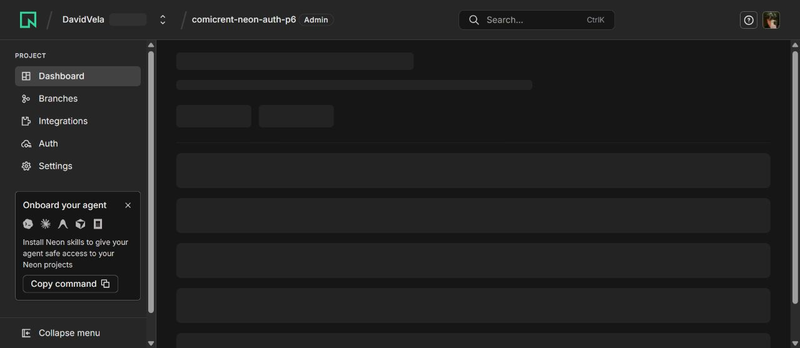

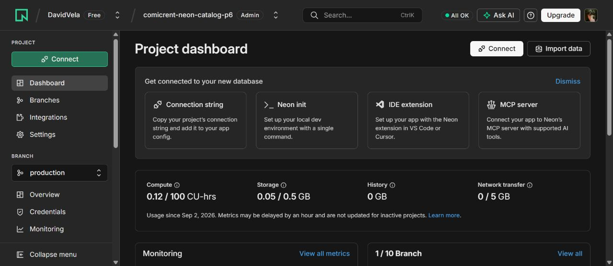

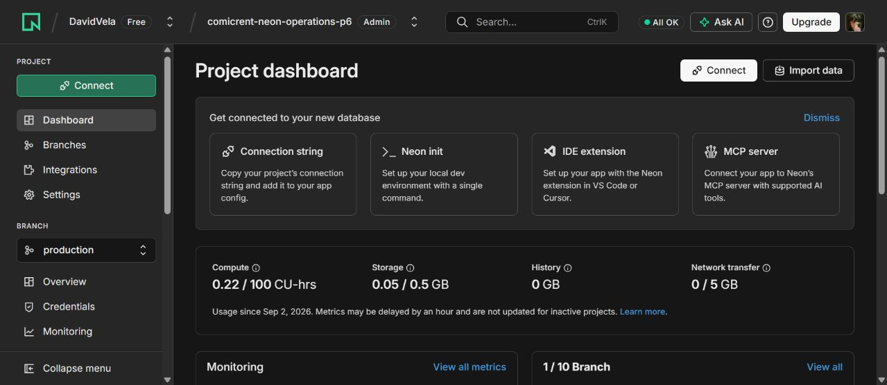

### Capturas de las cinco bases lógicas

Las capturas muestran el nombre de la base y la cadena de conexión con la contraseña ocultada por Neon.

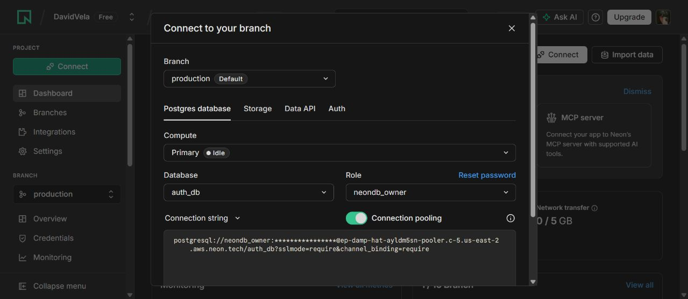

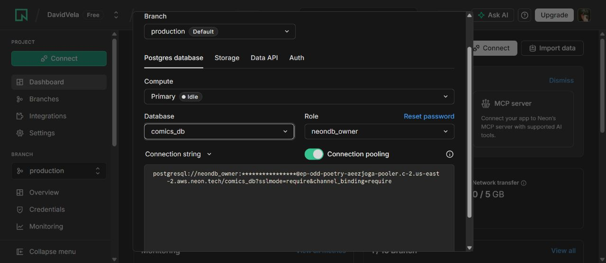

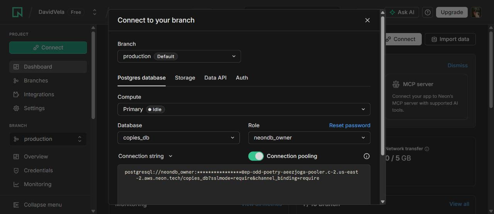

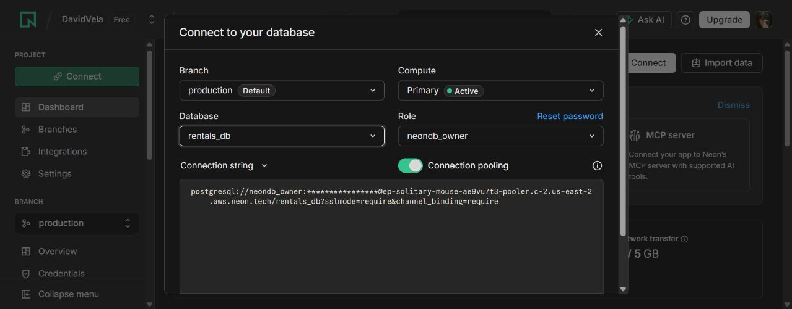

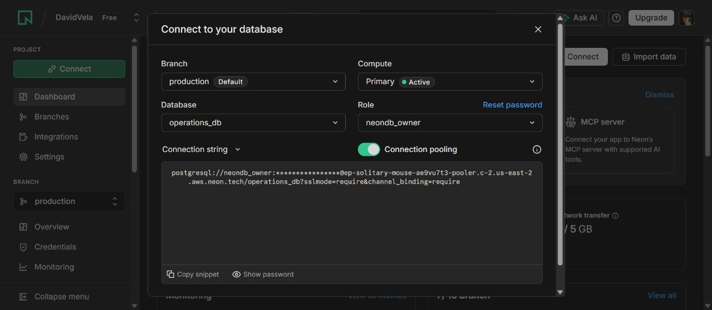

La distribución aplicada es:

```text
Neon Project 1 -> auth_db
Neon Project 2 -> comics_db + copies_db
Neon Project 3 -> rentals_db + operations_db
```

## 9. Secrets de Kubernetes

Las credenciales no se versionaron. El script solicita las URLs de Neon y los secretos directamente en la terminal, sin imprimirlos ni guardarlos en archivos.

### Comando exacto

```powershell
Set-Location C:\Users\Vela\Desktop\SA\LAB\PRACTICAS
.\P6\scripts\03-generate-secrets.ps1
```

El script solicita, en este orden:

```text
Neon Project 1 - URL de auth_db
Neon Project 2 - URL de comics_db
Neon Project 3 - URL de rentals_db
Neon Project 2 - URL de copies_db
Neon Project 3 - URL de operations_db
Password de RabbitMQ
JWT secret
Encryption key
```

Luego se verificó únicamente la existencia de los Secrets:

```powershell
kubectl get secrets -n sa-p6
kubectl describe secret comicrent-database-secret -n sa-p6
kubectl describe secret comicrent-rabbitmq-secret -n sa-p6
kubectl describe secret comicrent-auth-secret -n sa-p6
```

### Captura: lista de Secrets y ConfigMaps

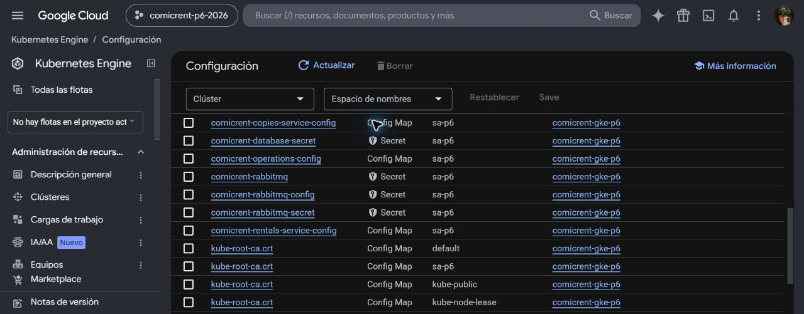

### Captura: Secret de bases de datos

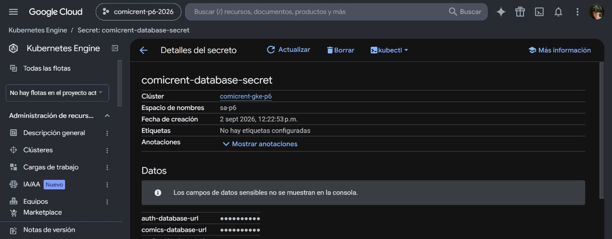

### Captura: Secret de RabbitMQ

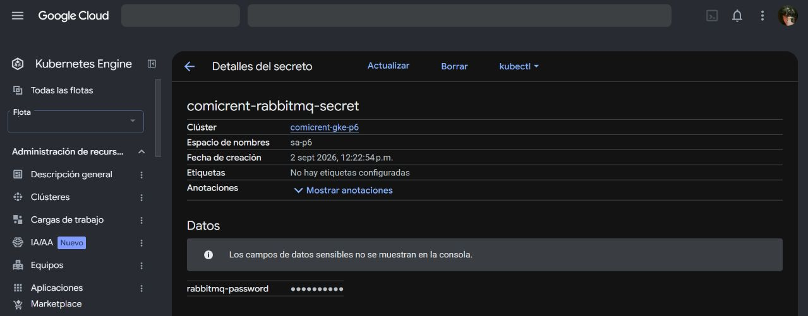

### Captura: Secret de Auth

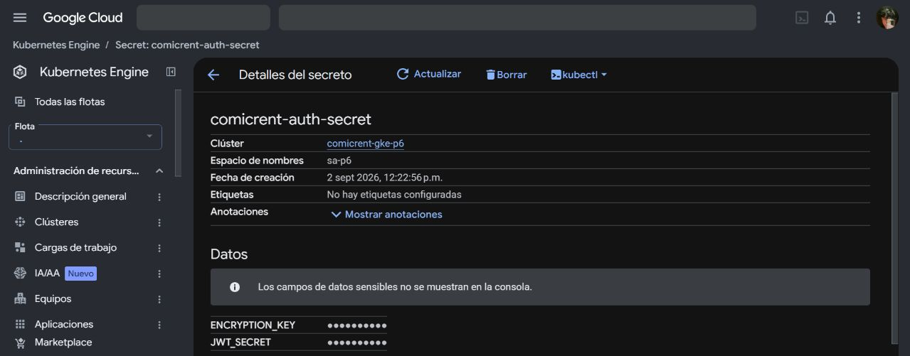

La consola de GCP indica que los campos sensibles no se muestran. Esto es intencional: se demuestra que los Secrets existen sin publicar contraseñas, URLs ni claves.

## 10. StorageClass y persistencia de RabbitMQ

RabbitMQ permanece dentro de GKE. Su StatefulSet utiliza un PVC dinámico de GKE:

```text
PVC: data-comicrent-rabbitmq-0
Estado: Bound
StorageClass: standard-rwo
Provisioner: pd.csi.storage.gke.io
Tipo: pd-balanced
```

### Comandos exactos

```powershell
kubectl get pvc -n sa-p6
kubectl get storageclass
kubectl describe pvc data-comicrent-rabbitmq-0 -n sa-p6
```

### Captura: PVC de RabbitMQ

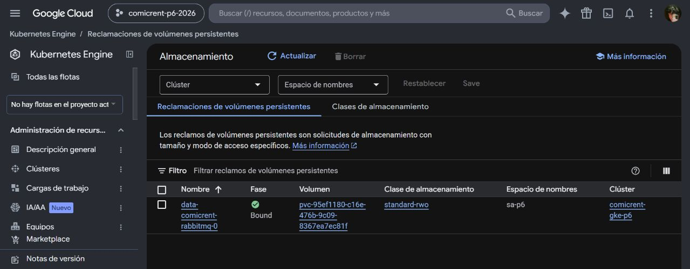

### Captura: StorageClasses de GKE

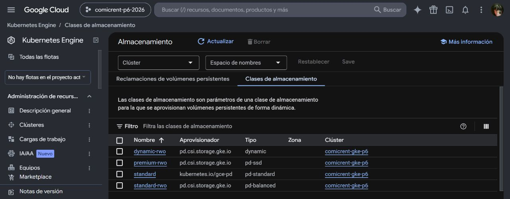

El despliegue no inventa el nombre de la clase: `04-deploy-gke-prod.ps1` consulta las StorageClasses reales del clúster y utiliza la clase predeterminada disponible.

## 11. Despliegue Helm de la plataforma

Se reutilizó el chart padre de P5 y se aplicaron los valores cloud de P6:

```text
P5\helm\comicrent
P6\k8s\values-gke-prod.yaml
```

PostgreSQL del chart quedó deshabilitado para producción cloud. Las aplicaciones utilizan las URLs de Neon mediante `comicrent-database-secret`.

### Comando exacto ejecutado

```powershell
Set-Location C:\Users\Vela\Desktop\SA\LAB\PRACTICAS
.\P6\scripts\04-deploy-gke-prod.ps1 `
  -ProjectId "comicrent-p6-2026" `
  -Region "us-central1" `
  -Zone "us-central1-a" `
  -ClusterName "comicrent-gke-p6" `
  -Repository "comicrent" `
  -Tag "1.0.0-gke" `
  -Namespace "sa-p6" `
  -NoHelmWait
```

Comandos de comprobación Helm:

```powershell
helm dependency build C:\Users\Vela\Desktop\SA\LAB\PRACTICAS\P5\helm\comicrent
helm lint C:\Users\Vela\Desktop\SA\LAB\PRACTICAS\P5\helm\comicrent `
  --values C:\Users\Vela\Desktop\SA\LAB\PRACTICAS\P6\k8s\values-gke-prod.yaml
helm list -n sa-p6
```

## 12. Workloads desplegados

La plataforma conserva los componentes funcionales de P5:

```text
comicrent-api-gateway
comicrent-auth-service
comicrent-comics-service
comicrent-rentals-service
comicrent-copies-service
comicrent-copies-consumer
comicrent-summary-consumer
comicrent-rabbitmq
comicrent-cron-summary
comicrent-cron-tick
```

### Comandos exactos

```powershell
kubectl get pods -n sa-p6 -o wide
kubectl get deployments -n sa-p6
kubectl get statefulsets -n sa-p6
kubectl get cronjobs -n sa-p6
kubectl get events -n sa-p6 --sort-by=.lastTimestamp
```

### Captura: workloads en la consola de GKE

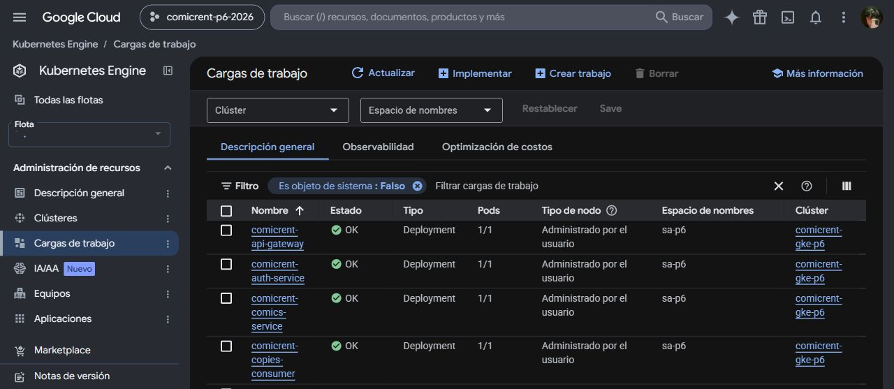

También se conserva la captura de vista compacta:

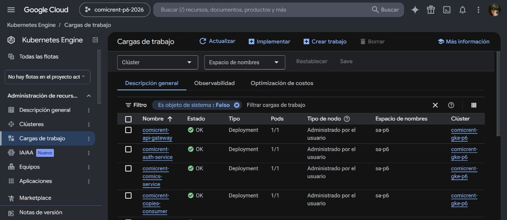

## 13. Services y exposición pública

El único punto público es el Gateway:

```text
comicrent-api-gateway   LoadBalancer   136.119.74.33:3000
```

Los demás servicios son internos:

```text
comicrent-auth-service
comicrent-comics-service
comicrent-rentals-service
comicrent-copies-service
comicrent-rabbitmq
```

### Comandos exactos

```powershell
kubectl get svc -n sa-p6
kubectl get endpoints -n sa-p6
kubectl get svc comicrent-api-gateway -n sa-p6 -w
```

### Captura: LoadBalancer e internos

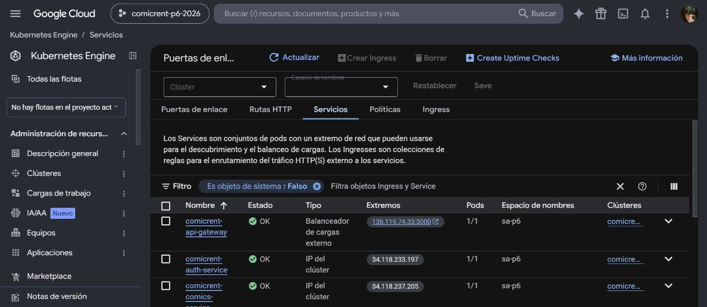

## 14. Pruebas desde internet

### Comandos exactos

```powershell
Invoke-WebRequest http://136.119.74.33:3000/health
Invoke-WebRequest http://136.119.74.33:3000/docs
Invoke-WebRequest http://136.119.74.33:3000/docs-json
```

Swagger quedó disponible en:

[http://136.119.74.33:3000/docs](http://136.119.74.33:3000/docs)

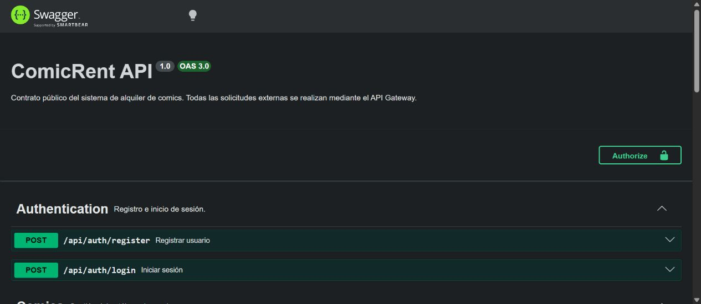

### Respuesta HTTP pública comprobada

La petición se realizó desde fuera del clúster con `Invoke-WebRequest`. El resultado exacto quedó guardado en [public-health.txt](evidence/public-health.txt):

```text
URL: http://136.119.74.33:3000/health
StatusCode: 200
Body:
{"service":"api-gateway","status":"ok"}
```

La captura de Swagger demuestra visualmente la interfaz pública y la captura de Services demuestra la IP del LoadBalancer. El archivo anterior conserva la respuesta HTTP exacta y reproducible.

### Flujo funcional comprobado

1. Registro y login de usuario administrador.
2. Creación de comic.
3. Creación de ejemplar.
4. Registro y login de cliente.
5. Creación de alquiler.
6. Devolución del alquiler.
7. Publicación de `copy.return.requested` en RabbitMQ.
8. Copies Consumer procesa el evento, hace commit y luego ACK.
9. Cron Summary publica `operations.hourly.summary`.
10. Summary Consumer guarda el resumen en `operations_db`.

Evidencias textuales:

- [public-health.txt](evidence/public-health.txt)
- [functional-check.txt](evidence/functional-check.txt)
- [async-check.txt](evidence/async-check.txt)
- [async-and-rbac.txt](evidence/async-and-rbac.txt)

Comandos de verificación asíncrona:

```powershell
kubectl logs deployment/comicrent-copies-consumer -n sa-p6 --tail=100
kubectl logs deployment/comicrent-summary-consumer -n sa-p6 --tail=100
kubectl exec statefulset/comicrent-rabbitmq -n sa-p6 -- `
  rabbitmqctl list_queues name consumers messages
```

## 15. Seguridad y operación Kubernetes

Se mantuvieron los controles de P5:

```text
Default Deny NetworkPolicies
Allowlists entre servicios
RBAC y ServiceAccounts
Readiness/Liveness probes
HPA
PDB
ResourceQuota
LimitRange
```

### Comandos exactos

```powershell
kubectl get hpa,pdb,networkpolicy,resourcequota,limitrange -n sa-p6
kubectl get serviceaccounts,roles,rolebindings -n sa-p6
kubectl describe networkpolicy -n sa-p6
```

Resultados adicionales: [scaling-and-security.txt](evidence/scaling-and-security.txt) y [async-and-rbac.txt](evidence/async-and-rbac.txt).

## 16. Preguntas teóricas del enunciado

### 1. Diferencia entre clúster administrado y clúster local

En un clúster administrado el proveedor mantiene el plano de control, su disponibilidad y parte de las actualizaciones e integraciones de red. El estudiante sigue administrando namespaces, workloads, imágenes, Secrets, políticas, recursos y costos. En un clúster local el estudiante instala y mantiene prácticamente todos los componentes.

### 2. Qué hace un Service `LoadBalancer`

Un Service `LoadBalancer` solicita al proveedor un balanceador externo y una dirección pública. GKE conecta ese balanceador con los Pods seleccionados por el Service. ComicRent usa este tipo únicamente en API Gateway; los demás servicios usan `ClusterIP`.

### 3. Qué es un registro de contenedores

Es un repositorio que almacena y distribuye imágenes versionadas. GKE necesita descargar las imágenes desde un registro accesible porque las imágenes locales de la laptop no existen dentro del clúster. Artifact Registry privado permite controlar el acceso mediante IAM y evita publicar las imágenes de la aplicación.

### 4. Qué administra GCP y qué administra el estudiante

GCP administra el plano de control de GKE, la integración con balanceadores y la provisión de discos. El estudiante define el node pool, las imágenes, el despliegue Helm, Secrets, NetworkPolicies, RBAC, recursos, pruebas, permisos y limpieza.

### 5. Costos y formas de reducirlos

Los costos potenciales corresponden principalmente al nodo, disco persistente, balanceador/IP pública, almacenamiento del registro y uso de Neon. Se reducen usando un nodo como indicó el auxiliar, una sola réplica, disco pequeño, una sola región, planes gratuitos y eliminación final de recursos. Durante la prueba se utilizó el crédito gratuito de GCP.

## 17. Evidencia de facturación

La cuenta de GCP muestra:

```text
Crédito de prueba gratuita: USD 300
Días restantes mostrados en la consola: 90
Proyecto: comicrent-p6-2026
```

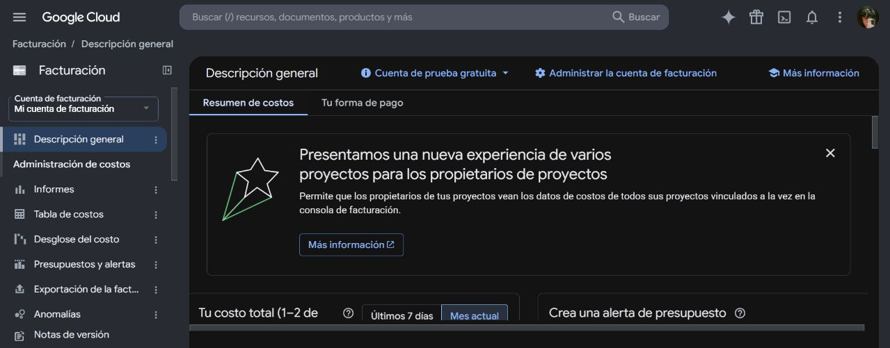

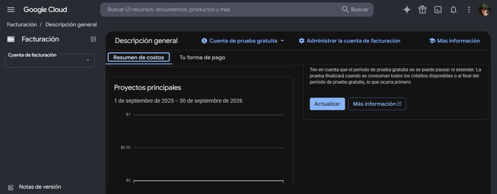

### Monto observado en Billing

Después de actualizarse Billing, la vista de resumen reportó para el periodo `1–2 de septiembre de 2026`:

```text
Costo bruto: USD 0.25
Ahorros/créditos: USD 0.25
Costo total después de créditos: USD 0.00
Costo total previsto: aún no disponible por falta de suficiente uso
```

En el informe detallado, GCP también mostró:

```text
Costo del periodo 1–2 de septiembre de 2026: USD 0.00
Crédito de prueba restante mostrado: USD 299.89 de USD 300.00
Proyección mensual: no disponible por falta de historial suficiente
```

Para la entrega se reporta como costo facturable observado `USD 0.00`; el resumen mostró `USD 0.25` de consumo bruto cubierto completamente por créditos. El crédito restante y el costo del periodo son métricas distintas de Billing y pueden actualizarse con retraso.

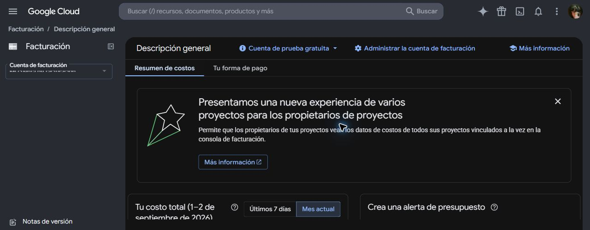

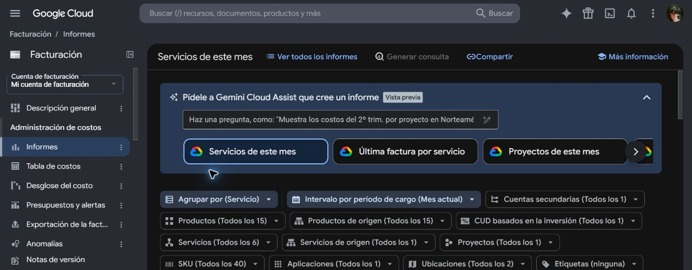

## 18. Pausa temporal del node pool para controlar costos

Después de completar las pruebas se ejecutó el siguiente comando. Esta operación no elimina el clúster ni sus configuraciones:

```powershell
gcloud container clusters resize comicrent-gke-p6 `
  --node-pool=default-pool `
  --num-nodes=0 `
  --zone=us-central1-a `
  --project=comicrent-p6-2026 `
  --quiet
```

La operación terminó correctamente y no quedaron VMs del node pool activas. Los PDB se restauraron a sus valores originales después del drenado.

Para volver a levantar la plataforma cuando se autorice continuar, se debe ejecutar:

```powershell
gcloud container clusters resize comicrent-gke-p6 `
  --node-pool=default-pool `
  --num-nodes=1 `
  --zone=us-central1-a `
  --project=comicrent-p6-2026 `
  --quiet
```

Después se verifica la recuperación con:

```powershell
kubectl get nodes
kubectl get pods -n sa-p6
kubectl get svc -n sa-p6
```

GKE volverá a crear la VM y Kubernetes programará nuevamente los Pods usando la misma configuración, Secrets, PVC e imágenes privadas. Debe esperarse a que RabbitMQ recupere su PVC y a que los probes estén saludables antes de probar la API pública.

## 19. Limpieza final — todavía no ejecutada

Por ahora no se elimina el clúster ni el registro porque la demostración continúa. Cuando se autorice la limpieza, el comando preparado es:

```powershell
Set-Location C:\Users\Vela\Desktop\SA\LAB\PRACTICAS
.\P6\scripts\05-destroy-gke-resources.ps1 `
  -ProjectId "comicrent-p6-2026" `
  -Region "us-central1" `
  -Zone "us-central1-a" `
  -ClusterName "comicrent-gke-p6" `
  -DeleteArtifactRegistry `
  -ConfirmDestroy
```

Ese comando no debe ejecutarse hasta recibir confirmación explícita. Después de usarlo se debe verificar:

```powershell
gcloud container clusters list --project=comicrent-p6-2026
gcloud artifacts repositories list --project=comicrent-p6-2026 --location=us-central1
gcloud compute disks list --project=comicrent-p6-2026
gcloud compute addresses list --project=comicrent-p6-2026
gcloud compute forwarding-rules list --project=comicrent-p6-2026
```

Los proyectos Neon se eliminarían manualmente solo si se autoriza expresamente, porque el script no los borra para evitar pérdida accidental de datos.

## 20. Archivos de evidencia

Los resultados de comandos están en:

- [pods.txt](evidence/pods.txt)
- [services.txt](evidence/services.txt)
- [storage.txt](evidence/storage.txt)
- [scaling-and-security.txt](evidence/scaling-and-security.txt)
- [async-and-rbac.txt](evidence/async-and-rbac.txt)
- [helm-status.txt](evidence/helm-status.txt)
- [public-health.txt](evidence/public-health.txt)
- [functional-check.txt](evidence/functional-check.txt)
- [async-check.txt](evidence/async-check.txt)

Los valores reales de Secrets y las URLs completas de Neon no forman parte del repositorio.
