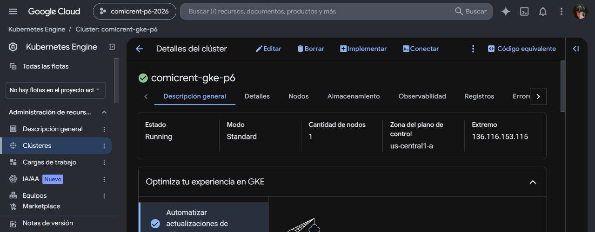
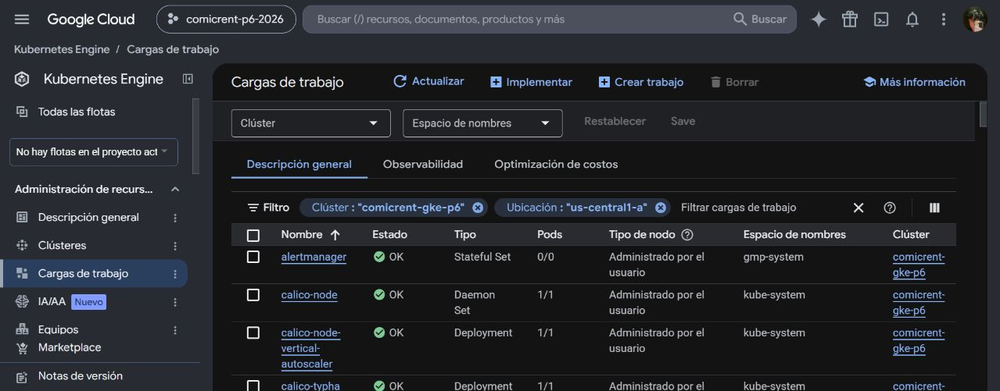
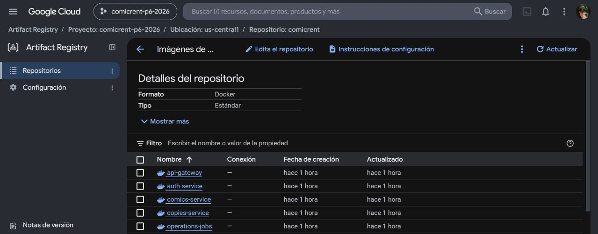

# Capturas de evidencia de P6

Estas capturas corresponden al despliegue real de ComicRent en GKE. No contienen
Secret values, contrasenas ni URLs privadas de Neon.

## Swagger publico

Demuestra que el API Gateway esta expuesto mediante la URL publica y que el
contrato OAS 3.0 incluye autenticacion, comics, copies, rentals y health.

## Cluster GKE

Demuestra el cluster administrado `comicrent-gke-p6` en modo Standard, zona
`us-central1-a`, con 1 nodo y estado `Running`.

## Cargas de trabajo

Demuestra la vista de cargas de trabajo del cluster GKE. El detalle completo de
los Pods de `sa-p6` se conserva en `pods.txt`.

## Artifact Registry privado

Demuestra el repositorio Docker privado `comicrent` con las imagenes de la
plataforma y RabbitMQ.

## Evidencias complementarias

- `public-health.txt`: respuestas HTTP publicas.
- `functional-check.txt`: registro, login, comic, ejemplar, alquiler y devolucion.
- `async-check.txt`: procesamiento de `copy.return.requested` y resumen horario.
- `storage.txt`: PVC y StorageClass `standard-rwo`.
- `scaling-and-security.txt`: HPA, PDB, NetworkPolicies, RBAC y limites.
- `services.txt`: Gateway `LoadBalancer` y servicios internos `ClusterIP`.
