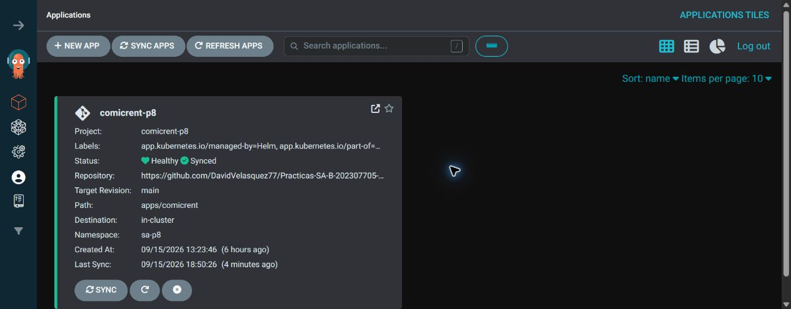
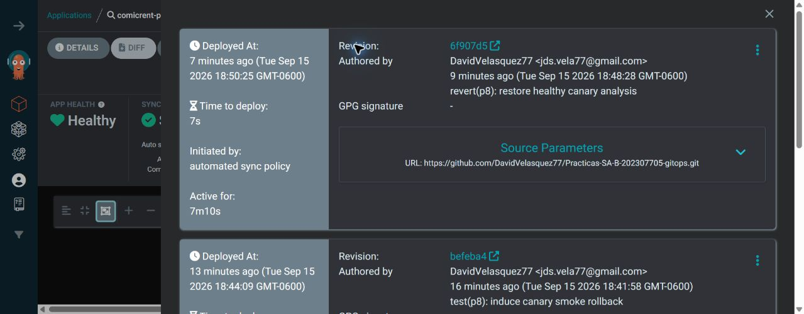
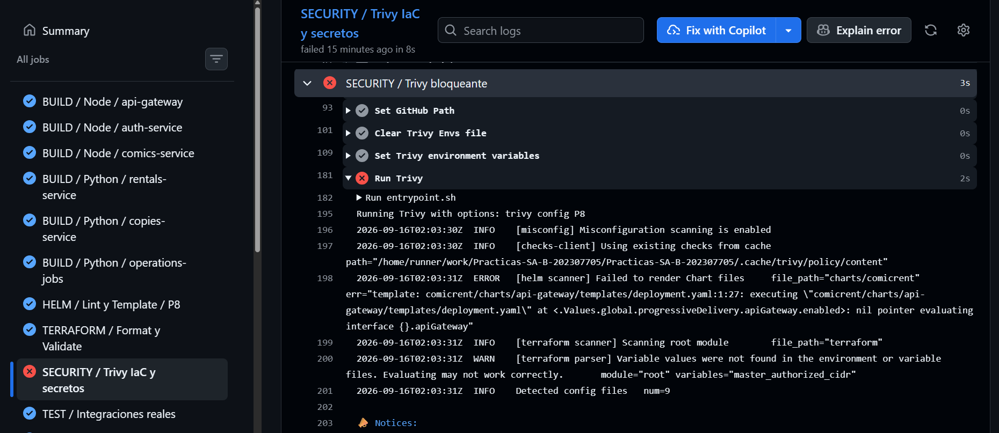
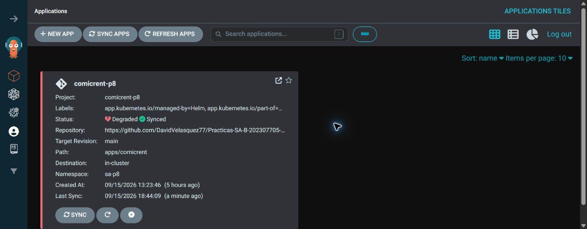

# Práctica 8 — GitOps, entrega Canary y seguridad de la cadena de suministro

## Documentación técnica

### Objetivo

ComicRent evoluciona la Práctica 7 a un flujo GitOps reproducible. Terraform crea la plataforma desde cero; el repositorio de código valida y publica imágenes; el repositorio GitOps conserva el estado deseado; ArgoCD es el único componente que aplica cambios de aplicación al clúster.

### Flujo y puntos de validación

Un Pull Request al repositorio de código ejecuta p8-ci.yml, que compila los servicios, ejecuta las pruebas disponibles, valida los charts con helm lint y helm template, verifica Terraform y realiza el análisis de seguridad con Trivy. Si alguna validación falla, el Pull Request no puede fusionarse.

Al crear un release con versionamiento semántico, por ejemplo v0.8.5, se ejecuta p8-release.yml. Este workflow construye las imágenes, genera el SBOM en formato SPDX, analiza las imágenes con Trivy, bloquea vulnerabilidades críticas, firma las imágenes con Cosign y las publica en GHCR.

Después de publicar las imágenes, el workflow genera un Pull Request en el repositorio GitOps para actualizar los tags de las imágenes. El pipeline no contiene credenciales del clúster ni ejecuta kubectl apply, kubectl set image o helm upgrade. Por tanto, el repositorio GitOps conserva el estado deseado de la aplicación.

Cuando se fusiona el cambio en el repositorio GitOps, ArgoCD detecta la nueva revisión y sincroniza los manifiestos de apps/comicrent con el clúster. La aplicación de ArgoCD se llama comicrent-p8 y está registrada en el namespace argocd. ArgoCD es el único componente autorizado para aplicar los manifiestos de la aplicación.

Durante la sincronización, Kyverno valida los recursos mediante las políticas de admisión: no se permiten imágenes con tag latest, se exigen límites de CPU y memoria, los contenedores deben ejecutarse como usuario no root y las imágenes deben contar con una firma válida de Cosign. Los secretos se almacenan en el repositorio como SealedSecrets cifrados.

El servicio api-gateway se despliega como un recurso Rollout con estrategia Canary: 10 % → 25 % → 50 % → 100 %. En los pasos del 10 %, 25 % y 50 %, Argo Rollouts ejecuta el AnalysisTemplate api-gateway-smoke, que utiliza k6 contra el endpoint /health. La promoción requiere una tasa de errores igual a cero y un percentil 95 menor de 500 ms.

Si el análisis falla, Argo Rollouts marca la promoción como RolloutAborted, detiene el avance y conserva el ReplicaSet estable. Si todas las validaciones son satisfactorias, la promoción finaliza con el 100 % del tráfico en la nueva versión.


### Decisiones de diseño y controles

Terraform administra GKE, namespaces, ResourceQuota, LimitRange, RBAC, ArgoCD, Argo Rollouts, Kyverno, Sealed Secrets y el `Application`. El chart Helm conserva los recursos de la aplicación: Rollouts, Services, ConfigMaps, HPA, probes, NetworkPolicies y AnalysisTemplate. Así, `terraform destroy` elimina la plataforma y `terraform apply -auto-approve` la reconstruye sin creación manual.

El repositorio GitOps es independiente y no contiene workflows. Sus secretos son `SealedSecret` con `encryptedData`; la clave privada de Sealed Secrets queda fuera de Git y se restaura desde Terraform. Las imágenes usan tags SemVer y nunca `latest`.

Terraform instala cuatro políticas Kyverno en modo `Enforce`: `p8-disallow-latest`, `p8-require-resources`, `p8-require-nonroot` y `p8-verify-cosign`. Trivy bloquea el PR antes de GitOps; Kyverno vuelve a validar la admisión cuando ArgoCD crea Pods.





La validación del 15 de septiembre de 2026 dejó `comicrent-p8` en `Synced/Healthy`, el Rollout en `10/10` y las políticas activas. Los datos reproducibles están en [`evidence/live-validation-2026-09-15.txt`](evidence/live-validation-2026-09-15.txt).

## Tecnologías y controles implementados

### Terraform

Terraform construye la infraestructura necesaria para ejecutar ComicRent en GKE. Desde Terraform se crean el clúster, los namespaces `argocd`, `argo-rollouts`, `kyverno` y `sa-p8`, además de las cuotas, límites de recursos y permisos RBAC.

Terraform también instala ArgoCD, Argo Rollouts, Kyverno y Sealed Secrets mediante recursos declarativos. Finalmente, aplica el chart de bootstrap que crea el `AppProject` y la aplicación `comicrent-p8` dentro del namespace `argocd`. La aplicación no se despliega manualmente con Helm ni con kubectl.

Por esta razón, el entorno puede reconstruirse ejecutando:

```bash
terraform destroy
terraform apply -auto-approve
```
### Helm
El chart principal de ComicRent contiene un chart por microservicio y valores diferenciados por ambiente. El ambiente utilizado en GKE se define en values-gke.yaml.
Los charts generan los servicios, ConfigMaps, HPA, probes, NetworkPolicies, ServiceAccounts y recursos de ejecución de las aplicaciones. El api-gateway se genera como kind: Rollout cuando está habilitada la entrega progresiva.
El pipeline ejecuta helm lint y helm template para verificar que los charts puedan renderizarse correctamente antes de aceptar los cambios.

### Trivy

Trivy analiza la configuración IaC, los manifiestos y las imágenes de los contenedores. El pipeline se detiene cuando encuentra vulnerabilidades CRITICAL o HIGH en la configuración, y cuando encuentra vulnerabilidades CRITICAL en las imágenes publicadas.
La evidencia del bloqueo provocado deliberadamente se encuentra en el Pull Request #15 y en el run de GitHub Actions enlazado en la tabla de evidencias.

### Cosign
Cosign firma las imágenes publicadas en GHCR utilizando identidad OIDC de GitHub Actions. Después de firmar, el mismo pipeline verifica la firma y guarda el resultado como evidencia.
La firma evita que una imagen diferente o no autorizada sea utilizada durante el despliegue.

### Sealed Secrets
Los secretos del repositorio GitOps no contienen contraseñas en texto plano. Se almacenan como recursos SealedSecret utilizando el campo encryptedData.
La clave privada que permite descifrar esos valores permanece fuera del repositorio y es restaurada por Terraform al reconstruir el clúster. ArgoCD sincroniza los SealedSecret y el controlador los convierte en secretos utilizables por los Pods.

### Kyverno

Kyverno aplica las políticas de admisión del clúster en modo Enforce. Terraform instala las siguientes políticas:
1. Rechazar imágenes con la etiqueta latest.
2. Exigir solicitudes y límites de CPU y memoria.
3. Exigir ejecución sin privilegios de root.
4. Verificar la firma Cosign de las imágenes.
Si un manifiesto incumple alguna política, Kubernetes rechaza su creación. Esto evita que una configuración insegura llegue al entorno de ejecución.

### ArgoCD

ArgoCD implementa el modelo GitOps. La aplicación comicrent-p8, ubicada en el namespace argocd, observa el repositorio GitOps independiente y compara continuamente el estado deseado con el estado real del clúster.
Cuando se fusiona un Pull Request del repositorio GitOps, ArgoCD sincroniza automáticamente los cambios. También realiza selfHeal y prune, por lo que corrige desviaciones y elimina recursos que ya no están declarados.
Los workflows no tienen kubeconfig ni ejecutan comandos de despliegue contra el clúster. Su responsabilidad termina al publicar imágenes y abrir el Pull Request que actualiza los tags del repositorio GitOps.

### Argo Rollouts
Argo Rollouts controla la entrega progresiva del api-gateway mediante una estrategia Canary. La nueva revisión recibe progresivamente el 10%, 25%, 50% y finalmente el 100% del tráfico.
Después de cada porcentaje se ejecuta el AnalysisTemplate api-gateway-smoke. Si el análisis falla, el Rollout se aborta y conserva la revisión estable. Si todos los análisis son exitosos, la revisión nueva alcanza el paso final 10/10.
El fallo Canary registrado en befeba4 demuestra la reversión automática. El commit 6f907d5 restauró la versión sana y ArgoCD volvió a mostrar la aplicación como Synced/Healthy

## Informe de incidente — bloqueo de Trivy en un Pull Request

**Qué ocurrió.** Se creó deliberadamente el archivo [`P8/incident/trivy-critical.yaml`](incident/trivy-critical.yaml) en la rama `incident/p8-trivy-critical`. El manifiesto usa `nginx:latest`, `privileged: true` y no declara límites de recursos. El commit `8067b7a` se publicó en el Pull Request [#15](https://github.com/DavidVelasquez77/Practicas-SA-B-202307705/pull/15) para dejar evidencia permanente del fallo.

**Cómo se detectó.** El run [35046489034](https://github.com/DavidVelasquez77/Practicas-SA-B-202307705/actions/runs/35046489034) ejecutó `SECURITY / Trivy IaC y secretos` y terminó en 8 segundos con `Process completed with exit code 1`. Trivy señaló el manifiesto `incident/trivy-critical.yaml` y sus hallazgos de seguridad; los demás jobs de build, Helm, Terraform e imágenes terminaron correctamente.

**Cómo se contuvo.** La comprobación fallida dejó el PR sin posibilidad de fusión. Como el PR no llegó al repositorio GitOps, ArgoCD no sincronizó ningún cambio y no se creó una nueva revisión en el clúster. La evidencia visible queda en la pestaña Checks del [PR #15](https://github.com/DavidVelasquez77/Practicas-SA-B-202307705/pull/15) y en los logs del [job de Trivy](https://github.com/DavidVelasquez77/Practicas-SA-B-202307705/actions/runs/35046489034/job/104637311969?pr=15).

**Tiempo e impacto.** La puerta de seguridad detectó y rechazó el cambio en 8 segundos. El impacto en usuarios fue cero: la versión estable de ComicRent nunca se modificó.

**Control preventivo.** Se mantiene `exit-code: 1` para severidades `CRITICAL,HIGH`, branch protection para exigir las comprobaciones y la validación posterior de Cosign/Kyverno. El archivo de prueba permanece en la rama y el PR abierto como evidencia del incidente; no debe fusionarse.

Como evidencia adicional de la entrega progresiva, el commit GitOps `befeba4` provocó un `AnalysisRun Failed` (`checks 0%`, `http_req_failed 100%`) y Argo Rollouts abortó el Canary. El commit `6f907d5` restauró la versión sana; ArgoCD volvió a `Synced/Healthy` y el Rollout a `10/10`. El registro está en [`evidence/canary-incident-2026-09-15.txt`](evidence/canary-incident-2026-09-15.txt).




## Evidencias de seguridad y entrega

- CI correcto: [`evidence/github-actions-ci.png`](evidence/github-actions-ci.png).
- Release con SBOM, Trivy y Cosign: [`evidence/github-actions-release.png`](evidence/github-actions-release.png).
- Reporte de cadena de suministro: [`evidence/supply-chain.txt`](evidence/supply-chain.txt).
- Políticas activas: [`evidence/policies-active.txt`](evidence/policies-active.txt).
- Rechazo por firma Kyverno: [`evidence/kyverno-cosign-rejected.txt`](evidence/kyverno-cosign-rejected.txt).
- Incidente Trivy: [PR #15](https://github.com/DavidVelasquez77/Practicas-SA-B-202307705/pull/15), [run fallido](https://github.com/DavidVelasquez77/Practicas-SA-B-202307705/actions/runs/35046489034), [job con logs](https://github.com/DavidVelasquez77/Practicas-SA-B-202307705/actions/runs/35046489034/job/104637311969?pr=15) y [`evidence/trivy-incident-2026-09-15.txt`](evidence/trivy-incident-2026-09-15.txt).


## capturas


### 1. Terraform

```bash
terraform validate
```

.
```bash
terraform plan
```

.

```bash
terraform apply -auto-approve
```
.


### 2. Releases Helm y políticas Kyverno

Desde cualquier carpeta con `kubectl` configurado:

```bash
helm list -A
```
.


```bash
kubectl get clusterpolicies
```
.


### 3. ArgoCD y Rollout

```bash
kubectl -n argocd get applications -o custom-columns="NAME:.metadata.name,SYNC:.status.sync.status,HEALTH:.status.health.status,REVISION:.status.sync.revision"
```
.

.

```bash
kubectl get rollout comicrent-api-gateway-rollout -n sa-p8 -o custom-columns="NAME:.metadata.name,PHASE:.status.phase,STEP:.status.currentStepIndex,REPLICAS:.status.replicas,AVAILABLE:.status.availableReplicas"
```

La salida permite comprobar la fase del Rollout, el paso de promoción y las réplicas disponibles. La evidencia visual final se encuentra en [`argocd-details-final.png`](evidence/argocd-details-final.png).

### 4. Secretos sellados e imágenes versionadas

```bash
kubectl -n sa-p8 get sealedsecret
```
.


```bash
kubectl get pods -n sa-p8 -o custom-columns="NAME:.metadata.name,IMAGE:.spec.containers[0].image,STATUS:.status.phase"
```
.


### 5. Análisis del Canary

La prueba de carga independiente quedó anulada por indicación del auxiliar. k6 se conserva como validación interna del `AnalysisTemplate` durante la promoción Canary.

Para revisar los análisis registrados:

```bash
kubectl -n sa-p8 get analysisruns
kubectl -n sa-p8 describe analysisrun <nombre-del-analysisrun>
```

Durante una promoción correcta, los umbrales son `http_req_failed: rate==0` y `p(95)<500ms`. En el incidente inducido se observa el resultado fallido en [`canary-incident-2026-09-15.txt`](evidence/canary-incident-2026-09-15.txt) y el resumen persistente está en [`k6-summary.json`](evidence/k6-summary.json).
### 6. Capturas desde GitHub

- CI correcto:!
.


- Release:
 .

## Construcción desde cero

Después de autenticar Google Application Default Credentials:

```powershell
cd C:\Users\Vela\Desktop\SA\LAB\PRACTICAS\P8\terraform
terraform init
terraform apply -auto-approve
```

Para comprobar reproducibilidad se puede ejecutar `terraform destroy` y después el mismo `terraform apply -auto-approve`. No se crea la aplicación manualmente: Terraform instala ArgoCD y declara el `Application`; ArgoCD aplica el repositorio GitOps.

## Tabla de enlaces

| Ítem | Enlace o dato requerido |
|---|---|
| Repositorio GitOps | [Repositorio GitOps](https://github.com/DavidVelasquez77/Practicas-SA-B-202307705-gitops) |
| Aplicación en ArgoCD | `comicrent-p8` — namespace `argocd` |
| Ejecución exitosa del pipeline | [GitHub Actions run 35036158704](https://github.com/DavidVelasquez77/Practicas-SA-B-202307705/actions/runs/35036158704) |
| Reversión automática | [Evidencia pública del AnalysisRun y RolloutAborted](https://github.com/DavidVelasquez77/Practicas-SA-B-202307705/blob/main/P8/evidence/canary-rollback.md) |
| Despliegue rechazado por políticas de seguridad | [Evidencia directa del rechazo de Kyverno](https://github.com/DavidVelasquez77/Practicas-SA-B-202307705/blob/main/P8/evidence/kyverno-cosign-rejected.txt) |
| Bloqueo por vulnerabilidad crítica | [PR #15 bloqueado por Trivy](https://github.com/DavidVelasquez77/Practicas-SA-B-202307705/pull/15) |
| Imagen firmada | `ghcr.io/davidvelasquez77/comicrent-api-gateway:v0.8.5` |
| Reporte de prueba de carga | Actividad anulada por indicación del auxiliar. La evidencia k6 utilizada por el Canary está en [k6-summary.json](https://github.com/DavidVelasquez77/Practicas-SA-B-202307705/blob/main/P8/evidence/k6-summary.json) |
| Video demostrativo | [VIDEO](https://drive.google.com/drive/folders/1NNW1jA8_96pVT-5LVOULQtkVdL1ywZbk?usp=sharing) |


### Video demostrativo

- **00:00–00:30:** Presentación del proyecto y objetivo del flujo GitOps.
- **00:30–01:10:** Repositorio de código y workflows de GitHub Actions.
- **01:10–01:40:** Ejecución exitosa del pipeline.
- **01:40–02:10:** Imagen en GHCR, SBOM, Trivy y firma con Cosign.
- **02:10–02:45:** Repositorio GitOps, charts Helm y SealedSecrets.
- **02:45–03:25:** ArgoCD `comicrent-p8` en estado `Healthy` y `Synced`.
- **03:25–04:10:** Argo Rollouts y promoción Canary `10 % → 25 % → 50 % → 100 %`.
- **04:10–05:15:** Fallo inducido, `AnalysisRun` fallido y `RolloutAborted`.
- **05:15–05:50:** Restauración de la versión estable y recuperación del estado saludable.
- **05:50–06:20:** Rechazo de recursos mediante políticas de Kyverno.
- **06:20–06:50:** Pull Request bloqueado por vulnerabilidad crítica detectada por Trivy.
- **06:50–07:20:** Evidencia de Terraform y cierre del flujo completo.

