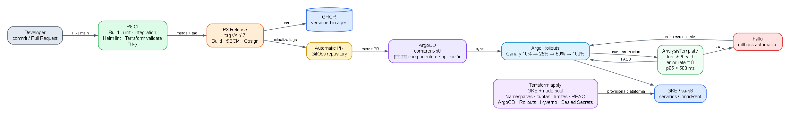
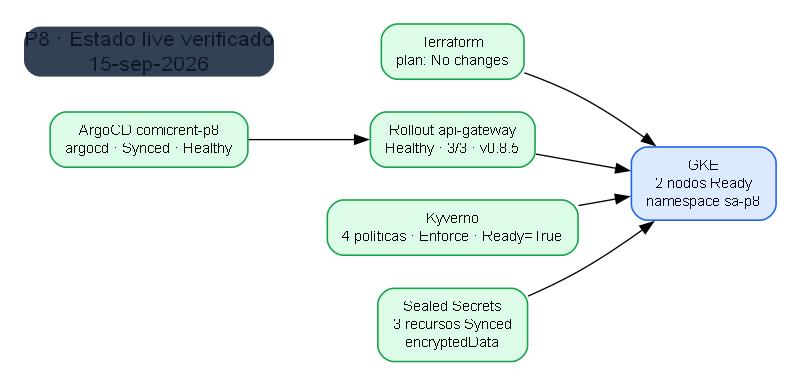
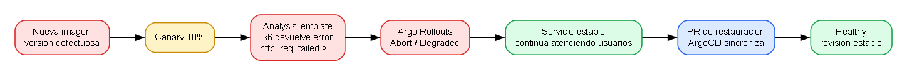

# Documentación técnica — ComicRent P8

## Objetivo y flujo implementado

La Práctica 8 evoluciona el CI/CD de la Práctica 7 hacia GitOps. El repositorio de código contiene los microservicios, charts, pruebas y workflows. El repositorio GitOps independiente contiene el estado declarativo de la aplicación. ArgoCD observa ese repositorio y es el único componente que aplica la aplicación al clúster.

El desarrollador crea un Pull Request o integra cambios en `main`. `p8-ci.yml` ejecuta compilación, pruebas unitarias, integración efímera con Docker Compose, `helm lint`, render de Helm, `terraform validate` y análisis Trivy. La publicación se realiza únicamente mediante un tag SemVer como `v0.8.5`. `p8-release.yml` construye las imágenes `Dockerfile.prod`, las publica en GHCR, genera un SBOM SPDX, ejecuta Trivy bloqueando vulnerabilidades `CRITICAL`, firma cada imagen con Cosign keyless y verifica la firma. Al terminar, el workflow abre un Pull Request que solo modifica los tags de `values-gke.yaml` en el repositorio GitOps.

Después de aprobar y fusionar ese Pull Request, ArgoCD sincroniza `apps/comicrent` en el namespace `sa-p8`. El workflow no tiene kubeconfig y no ejecuta `kubectl apply`, `kubectl set image` ni `helm upgrade` contra el clúster. Terraform instala ArgoCD, Argo Rollouts, Kyverno y Sealed Secrets, además de crear la única `Application` `comicrent-p8` en el namespace `argocd`.

## Infraestructura y seguridad

Terraform administra el ciclo de vida completo de GKE, el node pool, los namespaces `argocd`, `argo-rollouts`, `kyverno` y `sa-p8`, el `ResourceQuota`, el `LimitRange`, los roles y bindings RBAC, y los releases Helm de la plataforma. El chart de la aplicación contiene los servicios, configuraciones, probes, HPA, NetworkPolicies y Rollout; no crea la infraestructura que pertenece a Terraform.

Kyverno mantiene cuatro políticas en modo `Enforce`: prohíbe la etiqueta `latest`, exige límites de CPU y memoria, exige ejecución sin privilegios de root y verifica la firma Cosign de las imágenes GHCR. Las credenciales no se guardan en `values` ni en un `Secret` plano. El repositorio GitOps versiona solamente `SealedSecret` con `encryptedData`; la clave privada de Sealed Secrets se conserva fuera de Git y Terraform la restaura al reconstruir el clúster.

## Entrega progresiva y validación

El `api-gateway` se declara como `kind: Rollout` cuando `global.progressiveDelivery.apiGateway.enabled` está activo. La estrategia Canary usa los porcentajes `10%`, `25%`, `50%` y `100%`. Después de cada uno de los tres primeros porcentajes se ejecuta el `AnalysisTemplate` `api-gateway-smoke`, que crea un Job k6 contra `comicrent-api-gateway-canary.sa-p8.svc.cluster.local`.

La promoción requiere cero solicitudes fallidas (`http_req_failed: rate==0`) y un percentil 95 menor de 500 ms (`http_req_duration: p(95)<500`). Si el análisis falla, Argo Rollouts aborta la revisión nueva y conserva el ReplicaSet estable. La evidencia de la prueba inducida muestra un `AnalysisRun Failed`, el aborto de la revisión y la restauración posterior mediante Pull Request. La validación de integración se ejecuta antes de publicar las imágenes en el entorno efímero de CI; el análisis Canary valida la imagen candidata dentro del clúster.

La separación de responsabilidades permite reconstruir la plataforma con `terraform apply`, mantener el repositorio como fuente de verdad y detectar drift mediante la sincronización automática y `selfHeal` de ArgoCD. La validación final del 15 de septiembre de 2026 confirmó Terraform sin cambios, ArgoCD `Synced/Healthy`, Rollout `Healthy`, cuatro políticas Kyverno activas y tres `SealedSecret` sincronizados.
