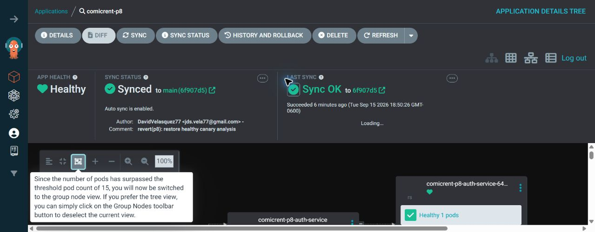

# Evidencia de reversión automática del Canary

## Contexto

Se publicó deliberadamente el commit GitOps [`befeba4`](https://github.com/DavidVelasquez77/Practicas-SA-B-202307705-gitops/commit/befeba4e04c0f41ef71af7cce5edeafefe87475d). La revisión del `api-gateway` utilizó el identificador `incident-canary-fail-20260915` y el `AnalysisTemplate` consultó intencionalmente un endpoint inválido.

ArgoCD sincronizó el cambio porque el repositorio GitOps es la fuente de verdad. No se ejecutó `kubectl apply`, `kubectl set image` ni `helm upgrade` desde GitHub Actions.

## Detección del fallo

Argo Rollouts creó la revisión `6ffc9b9789` y la dejó en el primer paso del Canary. El análisis asociado terminó en estado `Failed`:

```text
AnalysisRun: comicrent-api-gateway-rollout-6ffc9b9789-2-1
Estado: Failed
Job: 6d0a2ac2-dcce-4a1e-846f-d6a0179f9872.k6-smoke-health.1
Métrica: k6-smoke-health
Resultado: failed (1) > failureLimit (0)
checks: 0.00% (0 de 10)
http_req_failed: 100.00% (10 de 10)
```

El resultado provocó que Argo Rollouts abortara automáticamente la promoción:

```text
Rollout: comicrent-api-gateway-rollout
Estado durante el fallo: Degraded
Paso: 0
RolloutAborted: Metric k6-smoke-health Failed
ReplicaSet Canary: 6ffc9b9789
ReplicaSet estable conservado: 696d66b484
```


La aplicación estable continuó atendiendo tráfico. ArgoCD mostró `Synced/Degraded` porque Git todavía declaraba la revisión defectuosa, mientras Rollouts impedía que recibiera el 100 % del tráfico.

## Restauración

Se restauró el manifiesto correcto mediante el commit [`6f907d5`](https://github.com/DavidVelasquez77/Practicas-SA-B-202307705-gitops/commit/6f907d53ed859f58fc8286d53a588ced62f5b448). ArgoCD sincronizó el estado corregido y el Rollout terminó así:

```text
ArgoCD: Synced / Healthy
Rollout: Healthy
Paso final: 10/10
Current pod hash: 696d66b484
Stable pod hash: 696d66b484
```




## Resultado e impacto

La validación fallida ocurrió antes de completar el primer porcentaje del Canary. La versión estable no fue reemplazada y no hubo interrupción para los usuarios. La reversión automática fue ejecutada por **Argo Rollouts**; ArgoCD se encargó de sincronizar tanto el cambio defectuoso como la restauración declarada en Git.

## Evidencia reproducible

- [Commit defectuoso `befeba4`](https://github.com/DavidVelasquez77/Practicas-SA-B-202307705-gitops/commit/befeba4e04c0f41ef71af7cce5edeafefe87475d)
- [Commit de restauración `6f907d5`](https://github.com/DavidVelasquez77/Practicas-SA-B-202307705-gitops/commit/6f907d53ed859f58fc8286d53a588ced62f5b448)
- [Registro detallado del análisis](./canary-incident-2026-09-15.txt)
