# Guía de evidencias P9 — completada

Las pruebas principales están ejecutadas y sus capturas están en P9/evidence/capturas. Esta guía relaciona cada requisito del enunciado con el archivo de evidencia que se debe abrir. Los archivos p9-*.txt resumen salidas; salidas.txt conserva los comandos y parte de sus transcripciones. No vuelvas a ejecutar terraform destroy para producir estas capturas.

| Requisito | Evidencia guardada | Qué demuestra |
|---|---|---|
| Diagrama del bootstrap y reconstrucción | [PNG](evidence/Diagrama/DIAGRAMA-RebuildDR-comicrent-p9.png), también incrustado en [README](README.md#flujo-de-bootstrap-y-recuperación) | Distingue el inicio manual del flujo automatizado, el orden Terraform/ArgoCD y los recursos persistentes requeridos para recuperar la plataforma y los datos. |
| App-of-apps de ArgoCD | [Captura](evidence/capturas/terminal-p9-app-of-apps.png), [salidas.txt](salidas.txt) | comicrent-p9, ruta GitOps apps/p9, raíz Synced/Healthy y siete Applications hijas principales sincronizadas y sanas. |
| Backend remoto de Terraform | [Captura](evidence/capturas/terminal-p9-terraform-remote-state.png) | Estados separados p9/seed y p9/app y recursos que conserva cada estado. |
| Schedule Velero y destino externo | [Captura](evidence/capturas/terminal-p9-velero-schedule.png), [p9-bootstrap.txt](evidence/p9-bootstrap.txt) | Schedule cada seis horas, retención de siete días, BSL Available y bucket GCS externo. |
| Continuidad de secretos | [Estado de Sealed Secrets](evidence/capturas/terminal-p9-rto-measured.png), [metadatos de Secret Manager](evidence/p9-secret-custody.txt), [salida de estados](salidas.txt) | Dos versiones de llave habilitadas fuera del clúster; bootstrap y planes seed/app terminan sin fallos ni cambios pendientes. Solo se muestran nombres y metadatos, nunca los valores. |
| Dato existente antes del backup | [Captura](evidence/capturas/terminal-p9-marker-before-backup.png) | Fila P9-BEFORE-BACKUP-20260922-215517 sembrada en PostgreSQL antes del backup. |
| Backup y pérdida controlada | [Backup](evidence/capturas/terminal-p9-backup-completed.png), [pérdida y RPO](evidence/capturas/terminal-p9-data-loss-rpo.png) | Backup Completed, cero errores/advertencias; dos filas borradas de la tabla de prueba; RPO 00:08:00.9834611. |
| Restauración de contenido | [Restore y PVR](evidence/capturas/terminal-p9-restore-data-verified.png), [dato en base activa](evidence/capturas/terminal-p9-restore-active-db.png), [p9-backup-restore.txt](evidence/p9-backup-restore.txt) | Velero restauró volúmenes; se leyó la fila previa desde el PVC recuperado y luego se verificó el mismo marcador en auth_db activa. La fila posterior al backup se perdió, como corresponde al RPO. |
| Pérdida de nodo | [Captura](evidence/capturas/terminal-p9-node-drain-pdb.png), [p9-node-drain.txt](evidence/p9-node-drain.txt) | El PDB protegió el gateway; el nodo fue drenado y descordonado; /health respondió HTTP 200 y el nodo volvió a Ready. |
| Reconstrucción completa | [Transcripción del simulacro final](evidence/p9-reconstruction-20260923-175941.txt), [resumen con marcas exactas](evidence/p9-reconstruction.txt), [capturas de apoyo de una ejecución anterior](evidence/capturas/) | La transcripción es la evidencia autoritativa del simulacro final: `app` se destruyó y reconstruyó sin intervención manual en los finalizers; ArgoCD sincronizó, Velero recuperó el marcador y este se verificó en la base activa. RTO exacto 00:31:48.361 y RPO 00:03:00.542. |

## Interpretación del RTO/RPO

El simulacro completo final midió RTO de **00:31:48.361** (objetivo 02:00:00) y RPO de **00:03:00.542** (objetivo 06:00:00). El RTO termina después de reconstruir la plataforma, restaurar PostgreSQL desde el backup y comprobar el marcador en `auth_db` activa. El wrapper eliminó ArgoCD sin intervención manual de finalizers. Un ensayo anterior de pérdida controlada midió RPO de **00:08:00.983**; se conserva por separado y no se mezcla con el resultado final. Los seis campos, marcas UTC y límites están explicados en [INFORME-DR.md](INFORME-DR.md).

## Capturas reunidas

### Terraform, ArgoCD y servicios base

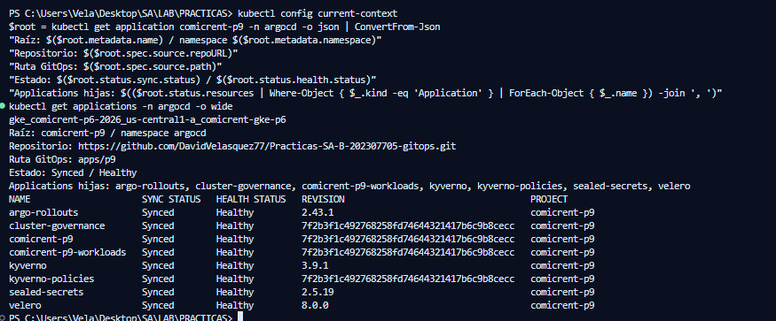

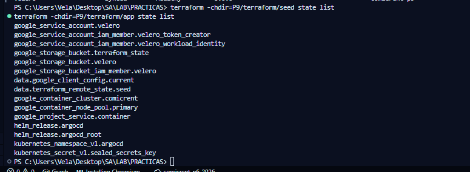

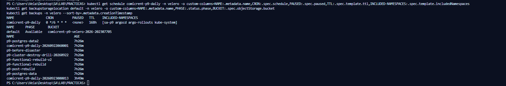

### Backup, pérdida y recuperación de datos

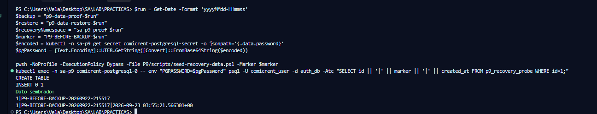

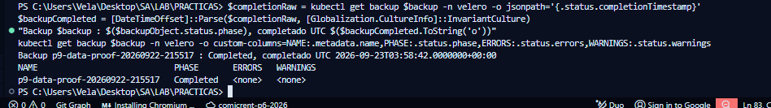

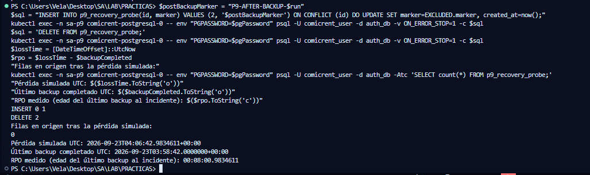

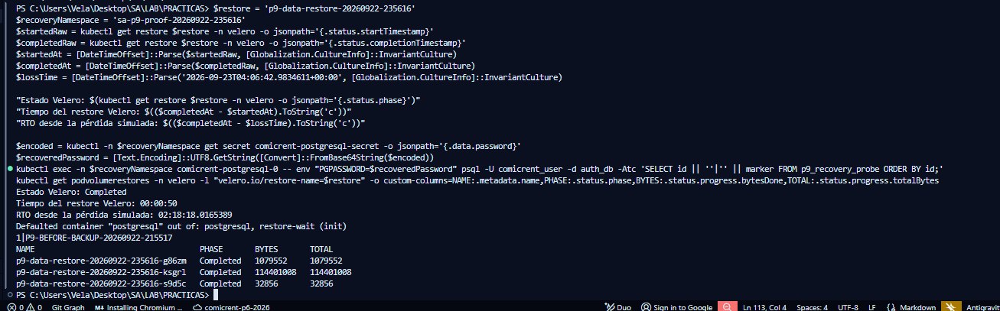

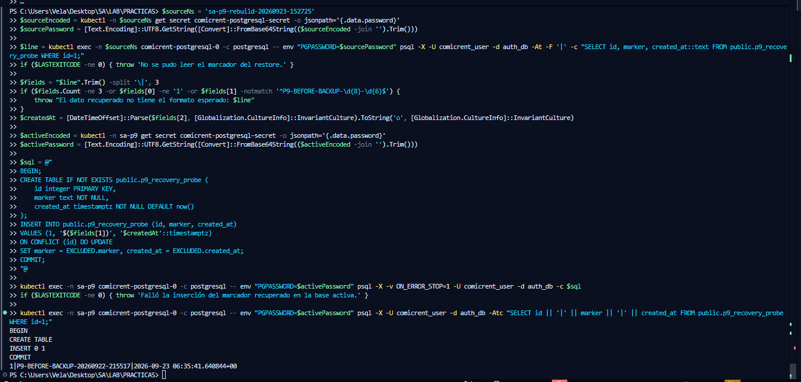

### Continuidad y reconstrucción

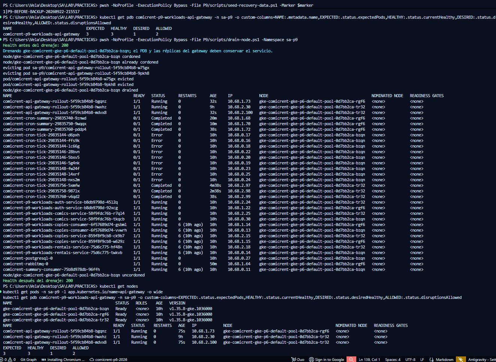

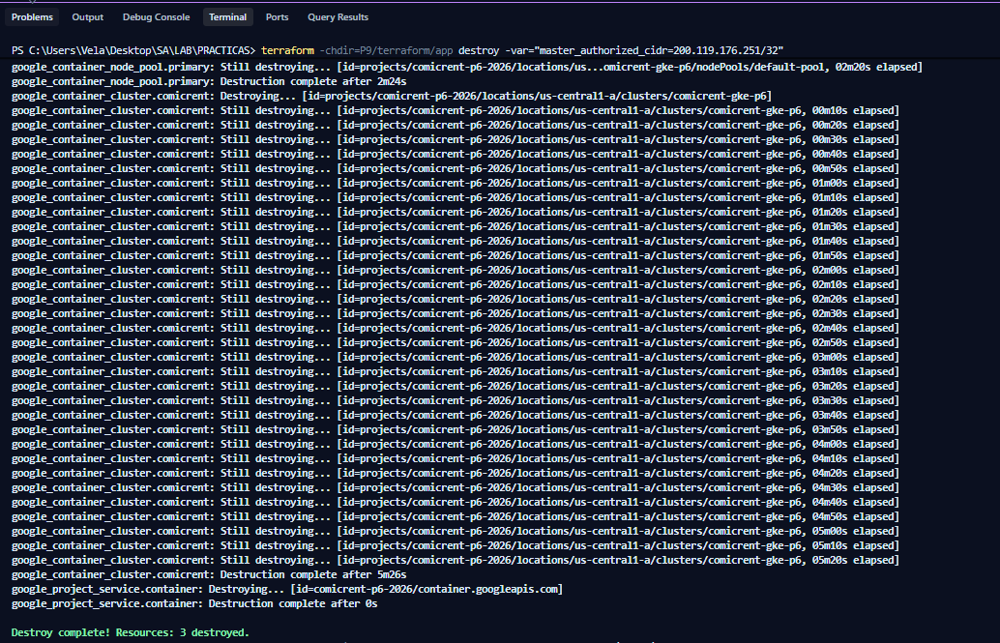

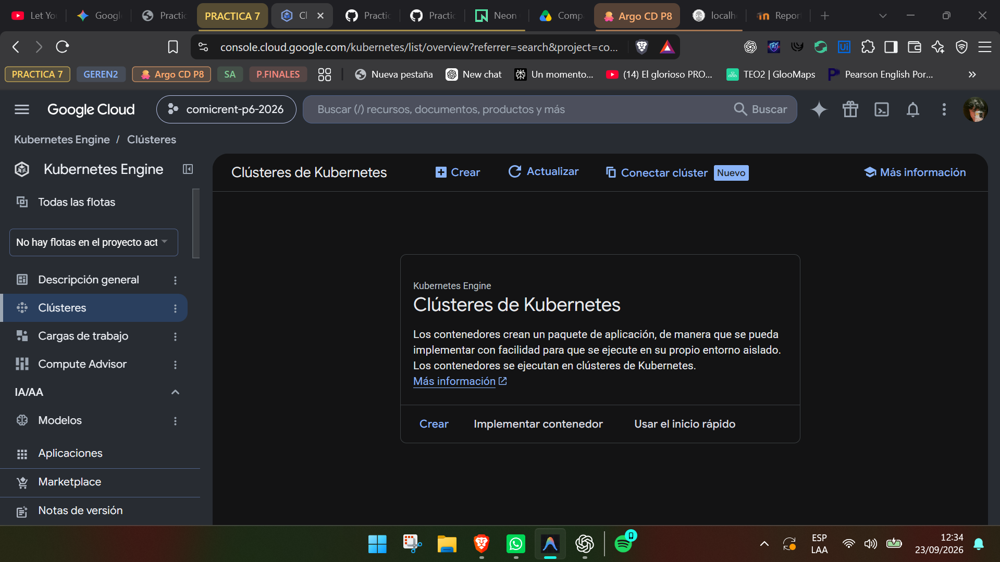

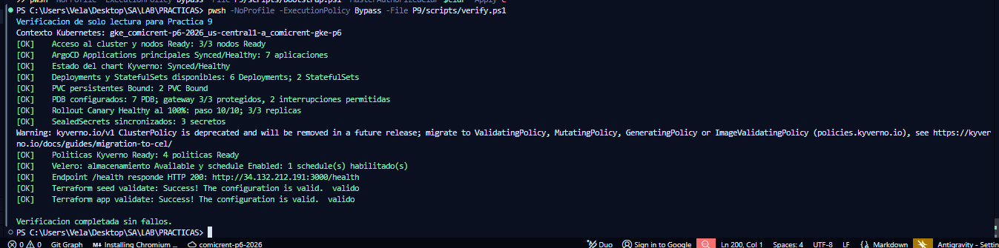

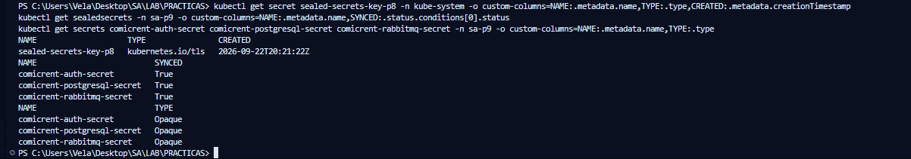
## Video

La tabla del README conserva el enlace a la carpeta pública de Drive y un minutaje planificado. Cuando el video esté grabado, reemplaza el enlace de carpeta por el enlace directo al archivo y ajusta cada marca de tiempo a la duración real.
