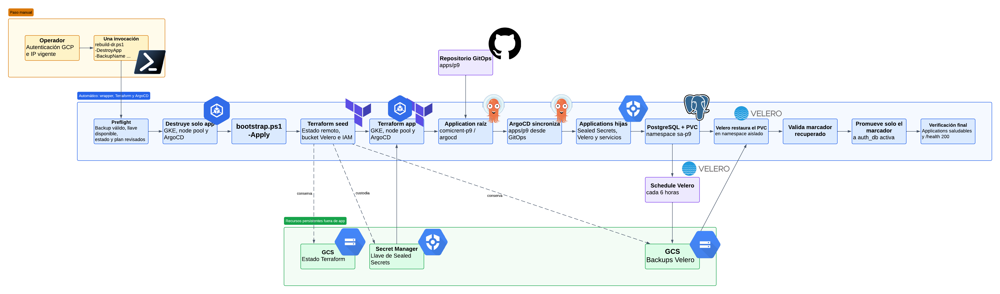

# Práctica 9 — Continuidad operativa y recuperación ante desastres

Esta práctica evoluciona la plataforma de la P8 en el mismo repositorio y conserva el repositorio GitOps existente. Se probó la reconstrucción del clúster desde Terraform, la reconciliación de la plataforma mediante ArgoCD y la recuperación de un dato persistente desde un backup Velero. La evidencia y los límites medidos se registran aquí y en INFORME-DR.md.

## Flujo de bootstrap y recuperación

Antes del bootstrap, el operador necesita acceso autenticado a GCP y la IP pública autorizada. La llave TLS persistente de Sealed Secrets queda en Google Secret Manager, fuera del clúster; durante la primera inicialización, el bootstrap carga allí la llave desde archivos protegidos locales si todavía no existe una versión. En reconstrucciones posteriores, Terraform la recupera desde Secret Manager. El bootstrap ejecuta Terraform seed y app; ArgoCD instala después el resto desde GitOps. En el simulacro DR, `rebuild-dr.ps1` orquesta la destrucción, el bootstrap y la restauración de PostgreSQL en un namespace aislado; valida el marcador antes de promoverlo a la base activa.

Terraform seed conserva el bucket de estado, el bucket de Velero y las versiones de la llave en Secret Manager. Terraform app administra GKE, el node pool, ArgoCD, la llave TLS recuperada desde Secret Manager y la aplicación raíz comicrent-p9. El recurso Kubernetes Secret también queda guardado en el estado remoto `p9/app`; restringe el acceso IAM a operadores autorizados. ArgoCD crea las aplicaciones restantes desde apps/p9; los workflows de CI no despliegan al clúster. La recuperación de datos es una operación posterior del runbook y no reemplaza el volumen activo.

## Tabla obligatoria 4.1

| Ítem | Enlace o dato requerido |
|---|---|
| Repositorio GitOps | [Practicas-SA-B-202307705-gitops](https://github.com/DavidVelasquez77/Practicas-SA-B-202307705-gitops) |
| Aplicación raíz en ArgoCD | comicrent-p9, namespace argocd; evidencia en [app-of-apps](evidence/capturas/terminal-p9-app-of-apps.png) |
| Punto de entrada del bootstrap | [P9/scripts/bootstrap.ps1](scripts/bootstrap.ps1); desde la raíz: pwsh -NoProfile -ExecutionPolicy Bypass -File P9/scripts/bootstrap.ps1 -MasterAuthorizedCidr "$cidr" -Apply |
| Backend remoto de Terraform | GCS gs://comicrent-p9-tf-2026-202307705; prefijos p9/seed y p9/app; [configuración](terraform/seed/main.tf) y [estado](evidence/capturas/terminal-p9-terraform-remote-state.png) |
| Schedule de Velero | comicrent-p9-daily, 0 */6 * * *, retención 168 h; destino gs://comicrent-p9-velero-2026-202307705; [evidencia](evidence/capturas/terminal-p9-velero-schedule.png) |
| Custodia de llave Sealed Secrets | Google Secret Manager; dos secretos con versión `ENABLED`, acceso IAM acotado y comprobación del bootstrap en [evidence/p9-secret-custody.txt](evidence/p9-secret-custody.txt) |
| Reconstrucción cronometrada | [Transcripción autoritativa del simulacro final con RTO exacto](evidence/p9-reconstruction-20260923-175941.txt), [resumen](evidence/p9-reconstruction.txt); las [capturas de destroy](evidence/capturas/terminal-p9-app-destroyed.png) y [verificación](evidence/capturas/terminal-p9-rto-measured.png) son de apoyo y corresponden a una ejecución anterior. |
| Restauración de datos | [Resumen de backup/restores](evidence/p9-backup-restore.txt), [restore en PVC aislado](evidence/capturas/terminal-p9-restore-data-verified.png) y marcador recuperado en base activa descrito en [la transcripción DR](evidence/p9-reconstruction-20260923-175941.txt) |
| Prueba de pérdida de nodo | [Salida](evidence/p9-node-drain.txt) y [captura del drain](evidence/capturas/terminal-p9-node-drain-pdb.png) |
| RTO y RPO | Objetivos: RTO 2 h, RPO 6 h. Simulacro completo más reciente: RTO **00:31:48.361** y RPO **00:03:00.542**, ambos dentro del objetivo. Ensayo previo de pérdida controlada: RPO **00:08:00.983**. Véase [INFORME-DR.md](INFORME-DR.md) para marcas UTC, método y limitaciones. |
| Video demostrativo | [Carpeta pública de Drive](https://drive.google.com/drive/folders/1BHltEYPaxrY5N5DHOxgjQ9M68JNSRkEb?usp=sharing). Minutaje planificado para un video de aproximadamente 6 min: 00:00 arquitectura y alcance; 00:45 Terraform `seed`/`app` y reconstrucción; 01:40 ArgoCD app-of-apps y estado de las aplicaciones; 02:30 schedule y backup de Velero en GCS; 03:20 pérdida controlada y restauración del marcador; 04:35 drenaje del nodo, PDB y HTTP 200; 05:25 resultados RTO/RPO y límites observados. Ajustar al minutaje real y sustituir por el enlace directo al archivo al subir el video. |

## Implementación y decisiones

- **Estado e infraestructura:** P9/terraform/seed usa el backend GCS remoto con locking y prefijo p9/seed; conserva los buckets con prevent_destroy. P9/terraform/app usa p9/app; destruye y reconstruye GKE, el node pool y el bootstrap mínimo de ArgoCD sin destruir seed.
- **GitOps:** Terraform instala ArgoCD y crea comicrent-p9. La raíz apunta al repositorio GitOps, ruta apps/p9, y ArgoCD reconcilia las Applications hijas. Velero, Kyverno, Sealed Secrets, Argo Rollouts y las cargas se declaran en GitOps. Se conserva el flujo P8 de Trivy, SBOM, Cosign, políticas de admisión y promoción Canary.
- **Respaldos:** Velero programa respaldos cada seis horas, conserva cada backup siete días, incluye volúmenes persistentes mediante FSB/Kopia y escribe en el bucket GCS externo. Workload Identity otorga acceso al bucket.
- **Datos verificables:** un ensayo controlado anterior creó el marcador `P9-BEFORE-BACKUP-20260922-215517`, completó un backup, insertó una segunda fila, borró ambas filas de la tabla de prueba y restauró el backup; solo volvió la fila previa. En la reconstrucción completa más reciente, Velero restauró el marcador `P9-BEFORE-BACKUP-20260923-170945` desde `p9-final-dr-20260923-175716` en un namespace aislado, y el runbook lo promovió a la tabla de prueba de `auth_db` activa. Esto prueba la ruta de recuperación del dato de validación, no la restauración integral de cada registro de negocio.
- **Secretos:** los SealedSecrets quedaron sincronizados después de reconstruir. Terraform seed crea dos secretos persistentes de Google Secret Manager y limita `Secret Accessor`/`Secret Version Adder` al principal que ejecuta el bootstrap. En la primera configuración, si no hay versiones, el script carga la llave desde archivos protegidos locales; después, Terraform la recupera de Secret Manager. Un operador sustituto necesita permisos GCP para ejecutar Terraform y leer esos secretos. La llave no se copia al repositorio.
- **Resiliencia:** los PDB, réplicas, anti-afinidad y probes permiten drenar un nodo y conservar HTTP 200 en /health.
- **RTO/RPO:** el simulacro completo final midió RTO de `00:31:48.361` y RPO de `00:03:00.542`, dentro de las metas de 2 h y 6 h. El wrapper actualizado eliminó ArgoCD y sus finalizers sin intervención manual; la reconstrucción, restore y promoción del marcador terminaron correctamente. El ensayo anterior de pérdida controlada midió RPO de `00:08:00.983`; ambos resultados se mantienen separados en el informe.

## Bootstrap y comprobación

Desde C:\Users\Vela\Desktop\SA\LAB\PRACTICAS, con GCP autenticado. Solo la primera carga a Secret Manager requiere los archivos originales en la ruta protegida local; las reconstrucciones posteriores usan las versiones persistidas:

~~~powershell
$publicIp = (Invoke-RestMethod 'https://api.ipify.org').Trim()
$cidr = "$publicIp/32"
pwsh -NoProfile -ExecutionPolicy Bypass -File P9/scripts/bootstrap.ps1 -MasterAuthorizedCidr $cidr -Apply
pwsh -NoProfile -ExecutionPolicy Bypass -File P9/scripts/verify.ps1
~~~

Para comprobar recursos GitOps, storage y persistencia sin modificar el clúster:

~~~powershell
kubectl get applications -n argocd -o wide
kubectl get pods,pvc,pdb -n sa-p9
kubectl get backupstoragelocation,schedule -n velero
~~~

Una ejecución verificada del bootstrap quedó con 3/3 nodos Ready, siete Applications principales Synced/Healthy, dos PVC Bound, el Rollout Canary Healthy al 100%, tres SealedSecrets sincronizados, cuatro políticas Kyverno Ready, Velero Available y /health en HTTP 200. La salida está en [salidas.txt](salidas.txt); la captura es de apoyo de una ejecución anterior. Para el simulacro final, usa la [transcripción completa](evidence/p9-reconstruction-20260923-175941.txt).

## Restauración controlada de PostgreSQL

El runbook [scripts/restore-data.ps1](scripts/restore-data.ps1) restaura el volumen de PostgreSQL a un namespace aislado, espera a que el PVC y el pod estén listos, y consulta auth_db.p9_recovery_probe. Esta separación permite validar los datos antes de promoverlos. En el simulacro documentado se promovió únicamente la fila de prueba a la base activa; no se sobrescribió el volumen PostgreSQL completo en producción.

Sigue el [runbook de recuperación](RUNBOOK-DR.md) para reconstruir y restaurar datos. Consulta [GUIA_EVIDENCIAS.md](GUIA_EVIDENCIAS.md) para el índice de capturas y salidas, e [INFORME-DR.md](INFORME-DR.md) para los seis campos requeridos por la plantilla 4.2.
