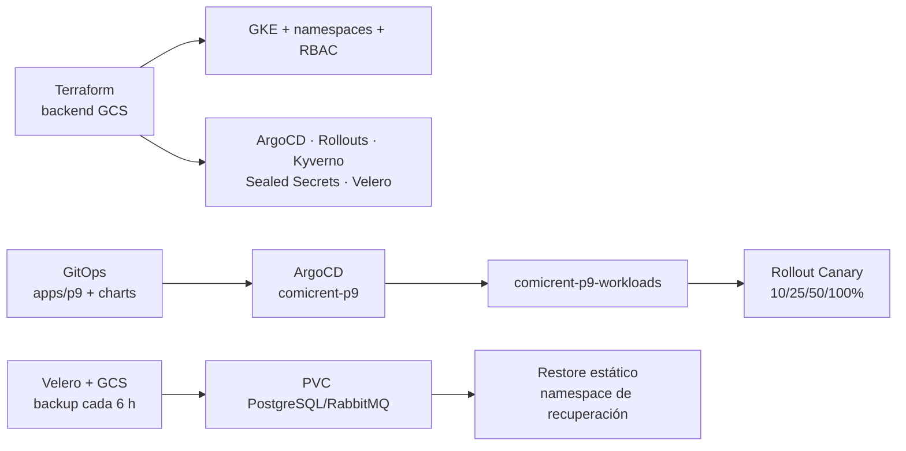

# Práctica 9 — Continuidad operativa de ComicRent

Esta entrega evoluciona la plataforma de la Práctica 8 sin cambiar su repositorio GitOps ni su flujo de despliegue progresivo. La reconstrucción completa se realiza con Terraform y, después del bootstrap, ArgoCD vuelve a crear las aplicaciones desde Git. Los datos persistentes se respaldan fuera del clúster con Velero sobre Google Cloud Storage.

## Alcance implementado

- **Bootstrap reproducible:** `P9/terraform/seed` conserva el backend, el bucket de Velero y su IAM; `P9/terraform/app` crea únicamente GKE, el node pool, ArgoCD y la Application raíz `comicrent-p9`. Desde esa Application, ArgoCD crea namespaces, cuotas, límites, RBAC, Velero, Argo Rollouts, Kyverno, Sealed Secrets y las aplicaciones desde GitOps.
- **Estado remoto:** `seed` y `app` usan el backend GCS `comicrent-p9-tf-2026-202307705` con prefijos independientes (`p9/seed` y `p9/app`), versionado y locking por generación del backend.
- **GitOps acumulativo:** el repositorio GitOps mantiene `apps/p9/application.yaml` y la aplicación hija `comicrent-p9-workloads`, que apunta a `apps/comicrent` en la rama `p9-continuidad-operativa`.
- **Datos persistentes:** PostgreSQL y RabbitMQ usan StatefulSet y PVC (`standard-rwo`) en `sa-p9`. La clave TLS de Sealed Secrets se conserva fuera de Git y se inyecta mediante Terraform durante cada reconstrucción.
- **Backups externos:** ArgoCD instala Velero mediante un Application GitOps. Velero usa Workload Identity, el bucket `comicrent-p9-velero-2026-202307705`, Kopia/FSB para volúmenes, versionado y una Schedule cada seis horas (`comicrent-p9-daily`).
- **Resiliencia:** PDB, réplicas, anti-affinity y probes se aplican a los servicios. El gateway conserva servicio durante el drenaje de un nodo.
- **Despliegue seguro:** se mantienen Argo Rollouts Canary `10% → 25% → 50% → 100%`, AnalysisTemplate, Kyverno, Trivy, SBOM, Cosign y Sealed Secrets de P8.

## Flujo de reconstrucción



## Tabla obligatoria 4.1 — Evidencia P9

| Ítem | Enlace o dato |
|---|---|
| Repositorio de código | [Practicas-SA-B-202307705](https://github.com/DavidVelasquez77/Practicas-SA-B-202307705/tree/p9-continuidad-operativa) |
| Repositorio GitOps | [Practicas-SA-B-202307705-gitops](https://github.com/DavidVelasquez77/Practicas-SA-B-202307705-gitops/tree/p9-continuidad-operativa) |
| Bootstrap único | [`P9/scripts/bootstrap.ps1`](scripts/bootstrap.ps1) — ejecutar `pwsh -File P9/scripts/bootstrap.ps1 -Apply` desde la raíz del repositorio |
| Aplicación raíz en ArgoCD | `comicrent-p9` en namespace `argocd`; aplicación hija `comicrent-p9-workloads` |
| Estado Synced/Healthy | [`evidence/p9-bootstrap.txt`](evidence/p9-bootstrap.txt) |
| Backend remoto y locking | `gs://comicrent-p9-tf-2026-202307705` con prefijos `p9/seed` y `p9/app`; configuración en [`terraform/seed/main.tf`](terraform/seed/main.tf) y [`terraform/app/main.tf`](terraform/app/main.tf) |
| Backup externo | [`evidence/p9-backup-restore.txt`](evidence/p9-backup-restore.txt) — `p9-functional-rebuild-v2`, Completed, 0 errores, 0 warnings |
| Restauración de datos | [`evidence/p9-backup-restore.txt`](evidence/p9-backup-restore.txt) — `p9-evidence-restore-v2`, PVC PostgreSQL y marcador `P9-REAL-DATA-20260922-RERUN` recuperados |
| Prueba de reconstrucción | [`evidence/p9-bootstrap.txt`](evidence/p9-bootstrap.txt) — GKE RUNNING, tres nodos Ready y aplicaciones reconciliadas |
| Prueba de fallo de nodo | [`evidence/p9-node-drain.txt`](evidence/p9-node-drain.txt) — drain, PDB, réplicas Ready y HTTP 200 antes/después |
| Schedule de backup | `comicrent-p9-daily`, `0 */6 * * *`, almacenamiento `default` Available |
| RTO/RPO | RTO objetivo: ≤ 2 h para reconstruir plataforma y reconciliar aplicaciones. RPO objetivo: ≤ 6 h por la Schedule; se ejecutó además un backup manual antes de la prueba. |
| Video demostrativo | Agregar URL directa al archivo de video y minutaje cuando se publique. |

## Ejecución

### 1. Bootstrap

Desde la raíz del repositorio de código y con `P9/terraform/app/local.auto.tfvars` configurado (el bootstrap adopta el archivo de P8 si existe):

```powershell
pwsh -ExecutionPolicy Bypass -File P9/scripts/bootstrap.ps1 -Apply
```

El script inicializa y aplica primero `seed` y después `app`. `app` instala únicamente ArgoCD y crea la Application raíz; ArgoCD hace el resto mediante el app-of-apps. No hay un paso manual intermedio.

### 2. Verificación

```powershell
pwsh -ExecutionPolicy Bypass -File P9/scripts/verify.ps1
kubectl get applications -n argocd -o wide
kubectl get pods,pvc,pdb -n sa-p9
kubectl get backupstoragelocation,schedule -n velero
```

Se espera `Synced/Healthy` para ambas Applications, pods Ready, PVC Bound, PDB activos, BSL `Available` y Schedule `Enabled`.

### 3. Backup y restauración

```powershell
pwsh -ExecutionPolicy Bypass -File P9/scripts/backup.ps1 -Name p9-manual
pwsh -ExecutionPolicy Bypass -File P9/scripts/restore-data.ps1 `
  -BackupName p9-manual `
  -RestoreName p9-static-restore `
  -RecoveryNamespace sa-p9-recovery
```

La restauración usa un namespace estático y excluye el StatefulSet para que Velero complete primero el `PodVolumeRestore` del PVC. El script copia el secreto generado por Sealed Secrets sin `ownerReferences`, espera PostgreSQL y consulta `auth_db.p9_recovery_probe`. En una recuperación real, los recursos restaurados se revisan y luego se promueven mediante GitOps; no se hace `kubectl apply` desde CI.

Para producir el dato de prueba antes del backup:

```powershell
pwsh -ExecutionPolicy Bypass -File P9/scripts/seed-recovery-data.ps1 -Marker P9-REAL-DATA-YYYYMMDD
```

### 4. Tolerancia a fallo

```powershell
pwsh -ExecutionPolicy Bypass -File P9/scripts/drain-node.ps1 `
  -Namespace sa-p9 `
  -HealthUrl http://<EXTERNAL-IP>:3000/health
```

El script cordona y drena un nodo, verifica el PDB y las réplicas del gateway, des-cordona el nodo y comprueba nuevamente HTTP 200.

## Decisiones de diseño

1. `seed` es persistente y nunca se destruye durante una reconstrucción. `app` crea el clúster, el node pool, ArgoCD y la Application raíz; ArgoCD es el único componente que aplica los manifiestos y charts restantes.
2. Los dos estados remotos, el bucket de Terraform y el bucket de Velero están fuera del clúster; la pérdida de GKE no elimina el estado ni los backups.
3. La clave de Sealed Secrets se conserva en una ruta local protegida y se carga como recurso Terraform. Por eso los secretos cifrados de Git siguen descifrables después de reconstruir el clúster.
4. PostgreSQL conserva un PVC y una política PDB apropiada; RabbitMQ conserva su PVC y su secreto cifrado. Los servicios stateless tienen réplicas, anti-affinity y probes.
5. El backup de volúmenes usa FSB/Kopia con `EnableCSI`; no se depende de snapshots zonales que desaparecerían con el clúster.
6. La estrategia Canary y sus análisis de P8 permanecen intactos. Una versión defectuosa se aborta antes de 100% y conserva el ReplicaSet estable.

## Archivos de evidencia

- [`evidence/p9-bootstrap.txt`](evidence/p9-bootstrap.txt)
- [`evidence/p9-backup-restore.txt`](evidence/p9-backup-restore.txt)
- [`evidence/p9-node-drain.txt`](evidence/p9-node-drain.txt)
- [`scripts/bootstrap.ps1`](scripts/bootstrap.ps1)
- [`scripts/backup.ps1`](scripts/backup.ps1)
- [`scripts/restore-data.ps1`](scripts/restore-data.ps1)
- [`scripts/drain-node.ps1`](scripts/drain-node.ps1)
